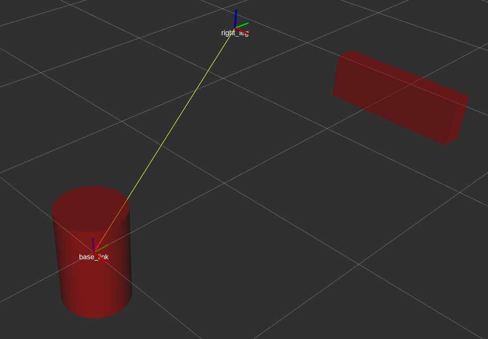
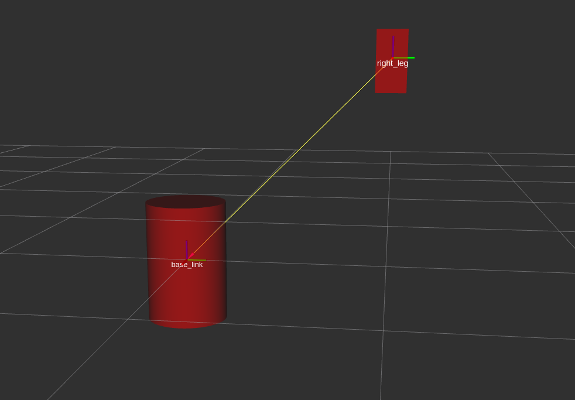
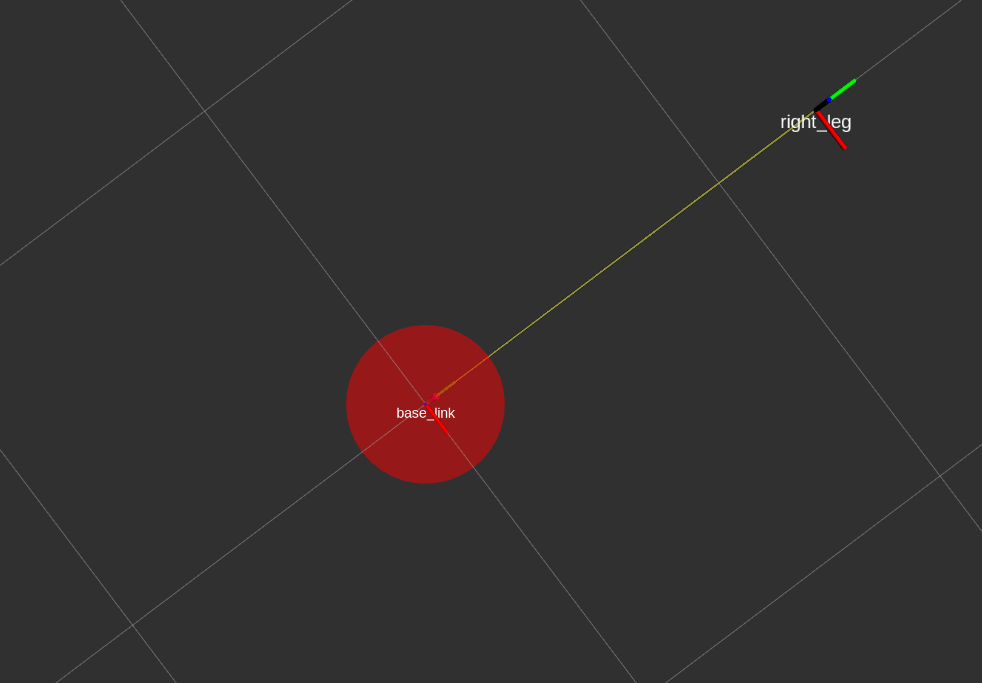
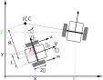
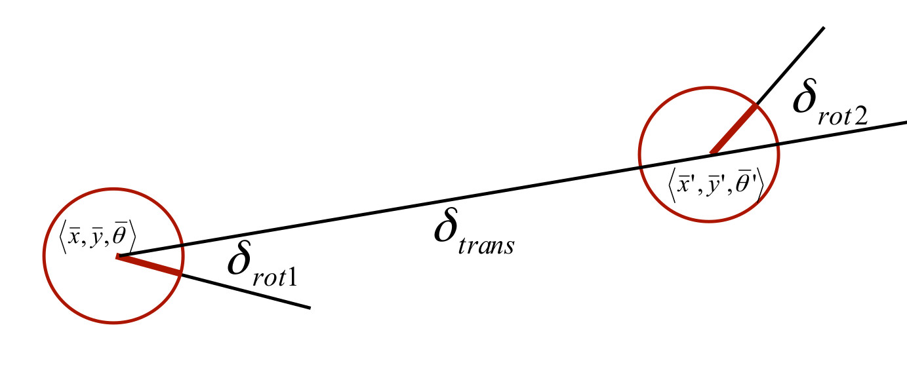
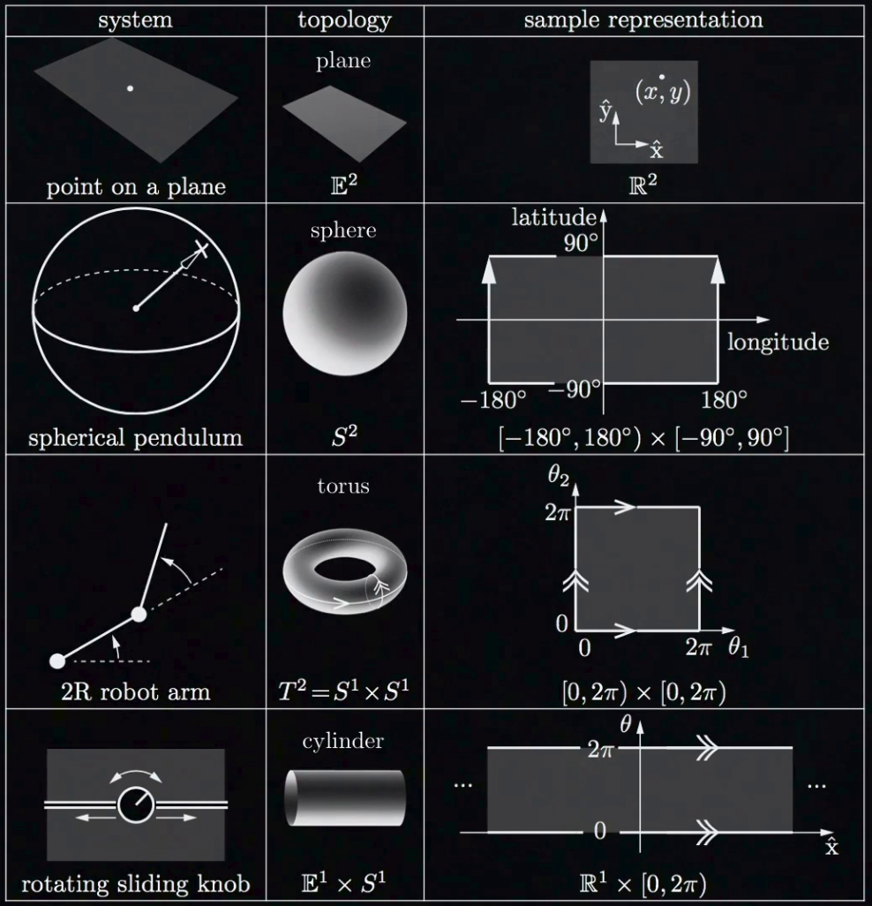

# Configuration of Robot
The configuration of something answers the question, where is that thing? position of all point of a robot. For example, to know where a door is, we only need to know the angle about its hinge when it changes from 0 to 360 degrees, or for a four linkage robot if we have only one joint value we know the others so we only need 1 of them to find out where is the robot

The configuration of robot is a representation of the positions of all the points of the robot.

# Configuration  Space - (C-space )
the space of all configurations of the robot is called the configuration space or C-space of the robot


# Degrees of freedom.
The minimum number of real numbers that are needed for our representation is called the degrees of freedom.

# Task Space 
is a space in which the robot's tasks can be naturally expressed.
i.e. If the task is to control the position of a marker on board then the task space is euclidean plane.
or if the task is control the position and orientation of rigid body then the task space is 6dim space of rigid body
you only have to know about the task not the robot to define the task space


# Work Space
The Cartesian points that eef can reach and has nothing to do with a particular task. for instance a planar robot
with 2 revolute joint limited to range of motion 90 and 45 degree 

# Dexterous space:
The set of positions that can be reached with all possible orientations is called dexterous space


# dof
dof=sum (freedom of bodies ) - number of independent  constraint
constraint are often coming from joint


- prismatic joint 1
- rotary joint 1
- revolute joint 1
- Cylindrical joint 2
- helical joint 1
- universal joint 2
- spherical joint 3


grubler formula
delta robot
Stewart mechanism


# Topology
In addition to dof an other important property of C-space is Topology (or its shape), 
surface of sphere and surface or a plane. This difference in shape impact the way we use coordinate to represent the space.
Two space has the same shape or topologically equivalent if one can be smoothly deformed to the other without cutting and gluing

By definition, we call two spaces to be topologically equivalent or of the same shape if we can smoothly deform one to the other without cutting or gluing.

 

C-space of same dimension can have different topology, examples:

- Point on a plane -> Plane
- C-space of spherical pendulum ->  Sphere
- 2R robot -> torus


Topology of C-Space is independent of representation of space!


## Different way to represent C-space

### Explicit
1) Explicit: Points on a plane (or generally N-Dimensional Euclidean Space)
If the space is flat like a line or plane o generally n dimensional euclidean  space  we typically choose origin and coordinate axis and then use coordinate to represent the point
velocity is time derivative of those points


	choose 1 arbitrary point in the space and two orthogonal axis

### Implicit
2) Implicit: If the space is curved like sphere we can use explicit or implicit representation. (surface of a sphere for instance )

I ) Explicit particularization with min number of coordinate: latitude, longitude
problems: representation have poor behavior at some points, for instance if you travel with constant speed around equator your equator/ poles
your longitude change very slow/ rapid and no upper bound as you close to poles
north pole is the singularity of representation
Also the the moment you step over north pole your longitude will change by 180 degree


Latitude: angle between the equatorial plane and the straight line that passes through that point and the center of the Earth
The North Pole is 90° N; the South Pole is 90° S

longitude: angle east or west of a reference meridian to another meridian that passes through that point

North pole is called the singularity of the representation.

II ) Implicit subject to constraint x^2 + y^2 + z^2 = 1


The singularity free implicit representation we use is called rotation matrix. The derivative is not velocity

configuration constrain and velocity constraint


  

The representation of c-space doesn't change the underlying space itself therefor the topology of the space is independent of its representation of it space.


Refs: [1](http://hades.mech.northwestern.edu/index.php/Modern_Robotics), [2](https://github.com/NxRLab/ModernRobotics)

# 1. Names
## 1.1 Graph Resource Names
Graph Resource Names provide a hierarchical naming structure that is used for all resources in a ROS Computation Graph, such as:
- Nodes
- Parameters
- Topics
- Services
### 1.1.1 Resolving Name
There are four types of Graph Resource Names in ROS with the following syntax

- base
- relative/name
- /global/name
- ~private/name


## 1.2 Package Resource Names
Package Resource Names are used in ROS with Filesystem-Level concepts to simplify the process of referring to files and data types on disk. Examples:

- Message (msg) types. For example, the name "std_msgs/String" refers to the "String" message type in the "std_msgs" Package.
- Service (srv) types
- Node types

# 2. Remapping Arguments
Any **Graph Resource Names** within a node can be remapped when it is launched at the command-line, This  lets you launch the same node with multiple configurations from the command-line. 
 syntax is `name:=new_name`
 
 
This will remap teh topic chat to chatter 
```
rosrun tutorials talker  chat:=/chatter
```

remapping so that the new node ends up subscribing to `/needed_topic `when it thinks it is subscribing to `/different_topic`
```
<remap from="/different_topic" to="/needed_topic"/>
```


Refs: [1](https://wiki.ros.org/roslaunch/XML/remap)
 
## 3. Special keys 

- __name: name of the node
- __log: designates the location that the node's log file
- __ip: and __hostname: substitutes for `ROS_IP` and `ROS_HOSTNAME`.
- __master: substitute for `ROS_MASTER_URI`.
- __ns: substitute for `ROS_NAMESPACE`. The `ROS_NAMESPACE` lets you push down a Node into a namespace. All of the names in the Node will be resolved relative to this value, including remapped names.


Example: This let you launch robot1 and robot2 start sedning their message (i.e. their position)
```
rosrun tutorials talker  __ns:=robot1  
rosrun tutorials talker  __ns:=robot2

rosrun tutorials listener __ns:=robot1
rosrun tutorials listener __ns:=robot2
```

or you can run a node in a namespace, simply add the `ns` attribute to a <node> tag. For example

```
<node pkg="foo" type="bar" name="my_node" ns="my_namespace" />
```

Refs: [1](https://wiki.ros.org/Names)

# NodeHandles


1.  public: /namespace/topic
```cpp
ros::NodeHandle nh=ros::NodeHandle();
```

This will look for your parameter in the global namespace,it will find /my_param


2. private: /namespace/node/topic
```cpp
ros::NodeHandle nh=ros::NodeHandle("~my_private_namespace");
```


This will look under the nested namespaces of the node itself and will find /namespace/my_node_name/my_param.


3. namespaced: /namespace/node/topic
```cpp
ros::NodeHandle nh=ros::NodeHandle("my_namespace");
```

4. global: /topic
```cpp
ros::NodeHandle nh=ros::NodeHandle("/my_global_namespace");
```


Refs: [1](http://wiki.ros.org/roscpp/Overview/NodeHandles), [2](http://wiki.ros.org/roscpp_tutorials/Tutorials/AccessingPrivateNamesWithNodeHandle), [3](http://wiki.ros.org/roscpp/Overview/NodeHandles)

## Publishers and Subscribers

Refs: [1](http://wiki.ros.org/roscpp/Overview/Publishers%20and%20Subscribers#Callback_Signature)

# Roslaunch

```
roslaunch tutorials display.launch model:=urdf/01-myfirst.urdf
```

# URDF


```
rosrun xacro xacro path/to/file.xacro > model.urdf
```

```
check_urdf model.urdf
```


Frames are attached to the links. Every link has an origin located in its center of mass which is called **link origin **. For instance for a cylinder it is in the center of that. 
Visual, inertia and collision can have offset relative to that.
If a link is child of a joint, the **link origin ** is the ** joint origin **. joint origin is its parent link origin.

For instance here we have `right_leg` 

```
    <link name="right_leg">
        <visual>
            <geometry>
                <box size="0.6 0.1 0.2"/>
            </geometry>
            <origin rpy="0 0 0" xyz="1 0 0"/>
        </visual>
    </link>
```

and 


```
    <joint name="base_to_right_leg" type="fixed">
        <parent link="base_link"/>
        <child link="right_leg"/>
        <origin rpy="0 0 0" xyz="0 1 1"/>
    </joint>
```



<br/>


<br/>


<br/>


<br/>


<br/>


```
roslaunch tutorials complete_model.launch
```

Refs: [1](https://wiki.ros.org/roslaunch), [2](https://github.com/ros/urdf_sim_tutorial), [3](https://github.com/ros/urdf_tutorial) , [4](http://wiki.ros.org/urdf/Tutorials/Using%20a%20URDF%20in%20Gazebo) 

# Publishing the State

Refs: [1](http://wiki.ros.org/urdf/Tutorials/Using%20urdf%20with%20robot_state_publisher), [2](http://wiki.ros.org/robot_state_publisher/Tutorials/Using%20the%20robot%20state%20publisher%20on%20your%20own%20robot)

# Differential Drive Wheel Systems

Refs: [1](https://github.com/ros-controls/ros_controllers/tree/noetic-devel/diff_drive_controller), [2](http://wiki.ros.org/diff_drive_controller)


# Gazebo

Refs: [1](https://classic.gazebosim.org/tutorials?tut=ros_gzplugins#IMU(GazeboRosImu))


# ROS best practices

Refs: [1](https://github.com/leggedrobotics/ros_best_practices/tree/master/ros_package_template), [2](https://github.com/leggedrobotics/ros_best_practices/wiki)


# move_base

Refs: [1](http://wiki.ros.org/move_base)


# Kinematics of Differential Drive Robots and Wheel odometry

## 1. Velocity-based (dead reckoning)
Linear Velocity:


<br/>
<br/>

so for the right wheel:
<br/>
<br/>

<br/>
<br/>

and for the left wheel:
<br/>
<br/>


if we add and subtract the above equation:

<br/>
<br/>


<br/>
<br/>


<br/>
<br/>


<br/>
<br/>


<br/>
<br/>



<br/>
<br/>

### Forward Kinematics for Differential Drive Robots

so we express the pose of the robot in  frame, we rotate it around that  degree and finally express it our world coordinate frame:


<br/>
<br/>

If we add orientation and write all positions in our world coordinate:
<br/>
<br/>


<br/>
<br/>


<br/>
<br/>


<br/>
<br/>
since we had :
<br/>
<br/>


<br/>
<br/>


<br/>
<br/>

###  Inverse Kinematics of Differential Drive Robots


Refs: [1](https://www.cs.columbia.edu/~allen/F17/NOTES/icckinematics.pdf)


## 2. Odometry-based




<br/>
<br/>


<br/>
<br/>


<br/>
<br/>


<br/>
<br/>


<br/>
<br/>


<br/>
<br/>


<br/>
<br/>


<br/>
<br/>
Not sure about the followings:
<br/>
<br/>


<br/>
<br/>


<br/>
<br/>


<br/>
<br/>


<br/>
<br/>

The pose of the  landmark


<br/>
<br/>

the pose of the robot at time t:
<br/>
<br/>


<br/>
<br/>


observed range and bearing of the landmark:


## ROS Odometery Model

Refs: [1](https://answers.ros.org/question/359950/is-ros-using-velocity-motion-model-or-odometry-motion-model/), [2](https://github.com/ros-planning/navigation/blob/melodic-devel/amcl/src/amcl/sensors/amcl_odom.cpp#L113), [3](https://www.mathworks.com/help/nav/ref/odometrymotionmodel.html#d124e109215)


# Estate Estimation


There are several solutions for fusion data
- madgwick filter
- mahony filter
- complementary filter


<br/>
<br/>


## State Space
So at the beginning we have only robot pose (robot start in its own frame) and orientation and zero land mark, as the robot explor we will add landmarks and increase the state space, but here we assume that all landmark are known beforehand, so for a map with   landmarks:   dimensional Gaussian


<br/>
<br/>


Compact Representation:

<br/>
<br/>


<br/>
<br/>


<br/>
<br/>


Refs: [1](https://www.youtube.com/watch?v=hN8dL55rP5I), [2](https://www.mathworks.com/help/fusion/ug/pose-estimation-from-asynchronous-sensors.html#d124e16816), [3](https://www.mathworks.com/help/fusion/ug/imu-and-gps-fusion-for-inertial-navigation.html)


## Jacobian Matrix of Motion 


# IMU

## IMU Noise Model

Refs: [1](https://github.com/ethz-asl/kalibr/wiki/IMU-Noise-Model)
## MPU-9250
Refs: [1](https://medium.com/@niru5/hands-on-with-rpi-and-mpu9250-part-3-232378fa6dbc)


# ROS State Estimation
Refs: [1](https://kapernikov.com/the-ros-robot_localization-package/), [2](https://automaticaddison.com/sensor-fusion-using-the-ros-robot-pose-ekf-package/), [3](http://wiki.ros.org/robot_pose_ekf), [4](https://github.com/ros-planning/robot_pose_ekf/blob/master/include/robot_pose_ekf/odom_estimation.h), [5](https://github.com/ros-planning/robot_pose_ekf/blob/master/src/odom_estimation.cpp), [6]()

# EKF Implementations

Refs: [1](https://github.com/Sina-Baharlou/Pose-Estimation-EKF), [2](https://orocos.org/bfl.html)

# Visual Odometry

# Online Resources

[aerial-robotics](https://aerial-robotics-iitk.gitbook.io/wiki)
<br/>
[ros-mobile-robots](https://ros-mobile-robots.com/)

# Gauss-Newton

Taylor series of an arbitrary function:

<br/>
<br/>


<br/>
<br/>

this will approximate a function by a line, if we set it to zero, meaning the point that line became zero is an approximation of the where the function became zero, this point would be a start point for our next iteration.

<br/>
<br/>


<br/>
<br/>


<br/>
<br/>


If we linearize the derivative of the function and set it zero we are looking for its extreme points


<br/>
<br/>

<br/>
<br/>


<br/>
<br/>
for multi dimensional data: 
<br/>
<br/>


<br/>
<br/>


<br/>
<br/>


<br/>
<br/>

is a reasonable the approximation of Hessian 

<br/>
<br/>


Refs: [1](https://math.stackexchange.com/questions/2349026/why-is-the-approximation-of-hessian-jtj-reasonable)

# Conditional Distribution of Y Given X

Refs: [1](https://online.stat.psu.edu/stat414/lesson/21/21.1)

# Hand-Eye Calibration
Refs: [1](https://support.zivid.com/en/latest/academy/applications/hand-eye.html), [2](https://wiki.ros.org/ensenso_driver/Tutorials/HandEyeCalibration)


## Eliminating Duplicate Solutions by Limiting the Roll and Pitch Ranges


# Quaternion estimator algorithm (QUEST)
Refs: [1](https://en.wikipedia.org/wiki/Quaternion_estimator_algorithm), [2](https://ahrs.readthedocs.io/en/latest/filters/quest.html)

# Closed-form solution of absolute orientation using unit quaternions
Refs: [1](https://web.stanford.edu/class/cs273/refs/Absolute-OPT.pdf)

# Wahba's problem
Refs [1](https://en.wikipedia.org/wiki/Wahba%27s_problem)


# Angular Velocity Vector Transformation

Refs: [1](https://physics.stackexchange.com/questions/429081/rotational-kinematics-and-angular-velocity-vector-transformation)

# Important Lie Groups and Typologies

<br/>



<br/>
<br/>


## so(3)
The set of all 3x3 skew-symmetric real matrices is called 

Rotation Matrix: The space of orientation of a rigid body has only 3 dimension but rotation matrix is 3x3 but that mean the 9 entries in matrix subject to 6 constraint. These constraint are:
- 3 column vector are unit vector 
- They are two by two orthogonal

These constraint can written as  which ensure 

## SO(2)
The group of rotations in two dimensions. The set of all 2×2 proper orthogonal matrices. They have the structure: 


## SO(3)
: set of all 3x3 real matrices satisfying:
- 
- 

## SE(2)
The set of all 3×3 matrices with the structure: 


 


## SE(3)
The special Euclidean groups  is the set of all 4x4 real matrices T of the form


Refs: [1](https://www.seas.upenn.edu/~meam620/notes/RigidBodyMotion3.pdf) 

# Dynamic Bayesian network


