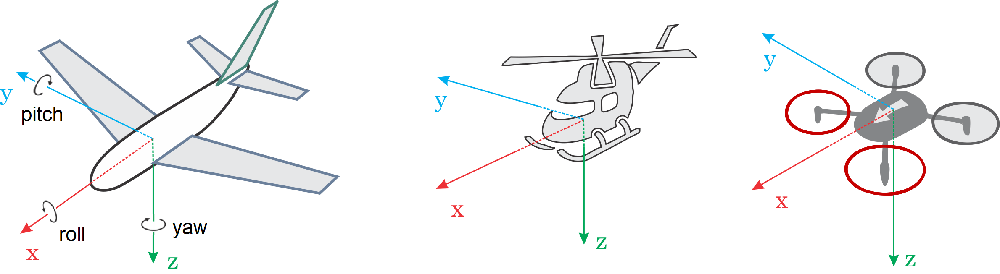
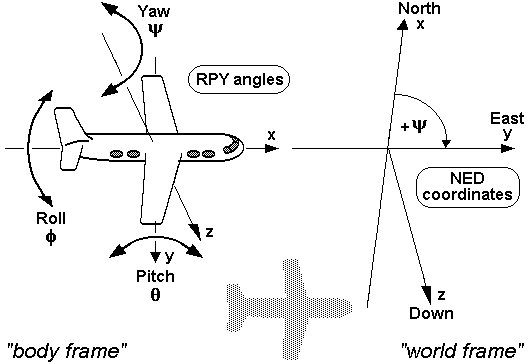

# Aerial Robotics

[aerial-robotics](https://aerial-robotics-iitk.gitbook.io/wiki)

## For airplanes/ drones

Refs: [1](https://docs.px4.io/main/en/config/flight_controller_orientation.html) 
 
 

 
 

## For cars

 
 

## Representing Robot Pose

Refs: [1](https://web.archive.org/web/20161029231029/https://paulfurgale.info/news/2014/6/9/representing-robot-pose-the-good-the-bad-and-the-ugly)

 
 
