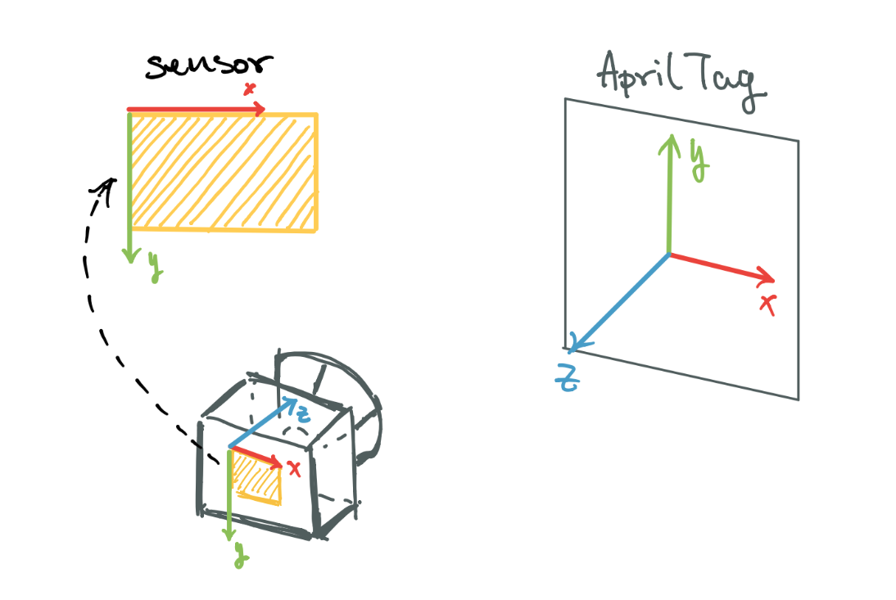
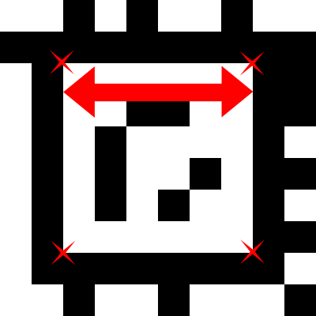

# Apriltag
Apriltag coordinate:




<br/>

How to measure:



# Generating Tag
You need `ant` build system, the easiest way is to use the following container:

`docker pull openjdk:bullseye`

Then clone the repository:

`git clone https://github.com/AprilRobotics/apriltag-generation`

 and follow the instruction there. For the vast majority of applications, the [agStandard41h12](https://github.com/AprilRobotics/apriltag-imgs/tree/master/tagStandard41h12) family will be the correct choice. 

Refs: [1](https://github.com/AprilRobotics/apriltag/wiki/AprilTag-User-Guide), [2](https://github.com/AprilRobotics/apriltag-imgs).


After downloading or creating tags, you can increase the size:
```
convert <small_marker>.png -scale <scale_chosen_in_percent>% <big_marker>.png
```
or

```
python3 tag_to_svg.py tagStandard52h13/tag52_13_00007.png tag52_13_00007.svg --size=20mm
```

# Apriltag ROS


Refs: [1](http://wiki.ros.org/apriltag_ros), [2](http://wiki.ros.org/apriltag_ros/Tutorials/Detection%20in%20a%20video%20stream)


# Detecting Apriltag

Clone the following repository:

```
git clone git@github.com:AprilRobotics/apriltag.git
```


Refs: [1](https://github.com/AprilRobotics/apriltag)

