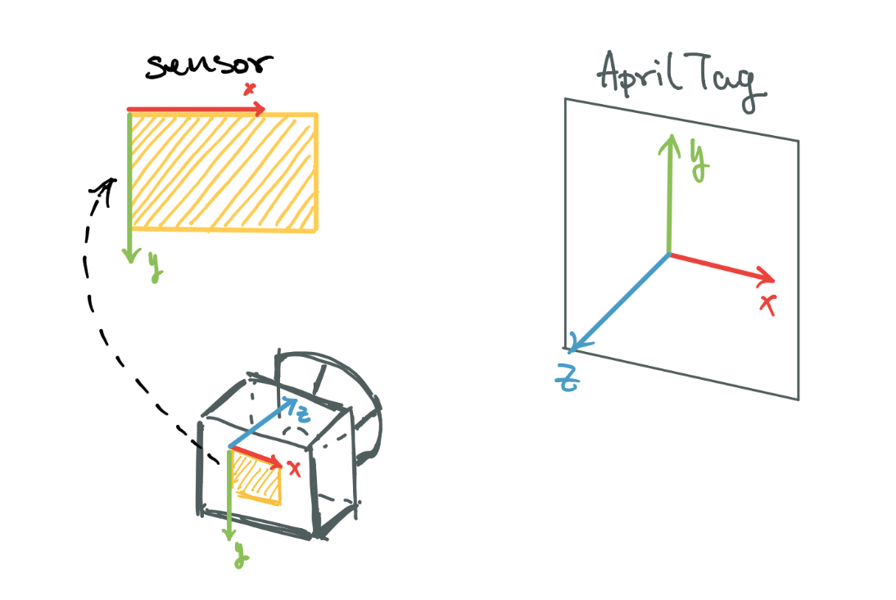
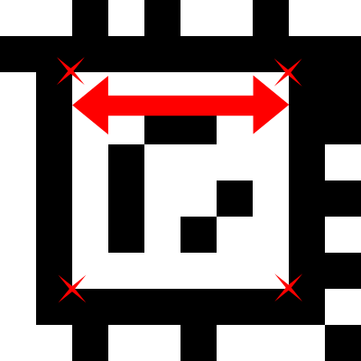
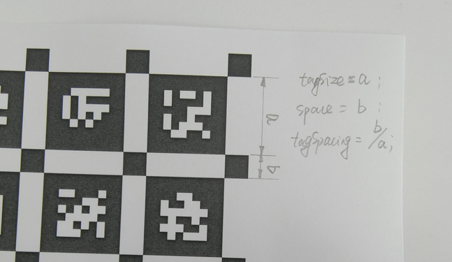
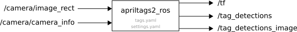

# Fiducial Markers

A **visual fiducial** is a printed pattern placed in the environment that a camera can both **identify** (return an integer ID) and **localize** (recover a 6-DoF pose from). They are the standard tool for camera/IMU calibration, AR overlays, robot localization landmarks, ground-truth labelling in datasets, and quick "where is this object?" sensing on robots.

This page collects the marker families you'll encounter, compares them, and then dives into **AprilTag** — the dominant choice in modern robotics — including generation, detection, and ROS usage.


---

## 1. Marker families at a glance

The four markers a robotics engineer is realistically going to choose between:

| Marker | Library / context | Encoding | Best for |
|---|---|---|---|
| **ArUco** | OpenCV (`cv::aruco`) | Configurable binary dictionaries (`DICT_4X4_50`, `DICT_6X6_250`, …) | AR demos and pipelines already on the OpenCV stack |
| **AprilTag** | APRIL Lab — standalone C lib + ROS | Hamming-coded families (`tag36h11`, `tagStandard41h12`, …) | Robot pose estimation, dataset ground-truth |
| **ChArUco** *(composite)* | OpenCV | ArUco markers inside the white squares of a chessboard | Single-camera calibration with sub-pixel corners and partial-view tolerance |
| **AprilGrid** *(composite)* | Kalibr / ETH ASL | Grid of AprilTags with known size and spacing | Multi-camera and camera/IMU calibration in Kalibr |

Everything else you might run into is either *encoded-data-only* (QR, DataMatrix — not designed for sub-pixel pose) or *historical* (ARToolKit, ARTag — predecessors of ArUco/AprilTag) and is out of scope for this page.

## 2. Square binary fiducials — the family relevant to robotics

**ArUco**, **AprilTag**, and **STag** all share the same four-step operating principle:

1. **Detect a square** in the image (edges → quadrilateral).
2. **Read the binary payload** inside the square (sample an $n \times n$ grid).
3. **Match the payload** against a dictionary, correcting bit errors via the code's Hamming distance.
4. **Recover pose** by **PnP** from the four known corner positions in the tag plane vs the corresponding pixel positions, plus the camera intrinsics.

What differs between families is mostly:

- **Dictionary quality**: how many distinct tags exist, what's the minimum Hamming distance between them, what's the false-positive rate when staring at random clutter.
- **Detector engineering**: decimation, anti-aliasing, sub-pixel corner refinement, occlusion handling.

The math — quad detection + decode + PnP — is the same.

### 2.1 ArUco

OpenCV's built-in fiducial library. **Pick a dictionary** (e.g. `DICT_4X4_50`, `DICT_6X6_250`) where the first number is the inner grid size and the second is the dictionary cardinality. Higher cardinality = more unique IDs but smaller minimum Hamming distance = more false positives at small scale.

- 👍 Bundled with OpenCV — no extra dependency.
- 👍 Many configurable dictionaries.
- 👎 Default dictionaries are weaker than AprilTag families; small or far tags get misread more often.

### 2.2 AprilTag

Standalone C library from APRIL Lab (Olson 2011, Wang & Olson 2016). The standard choice in robotics labs and the marker used by Kalibr's AprilGrid.

- Families: `tag36h11` (classic, very strong), `tagStandard41h12` (recommended, larger dictionary), `tagCircle21h7`, etc.
- 👍 Best-in-class false-positive rate and detection robustness.
- 👍 Multiple official binding libraries (C, Python `pupil-apriltags`, ROS `apriltag_ros`).
- 👎 Decoder is slower than ArUco on tiny hardware (mitigated by `decimate` in v3).

### 2.3 STag

Inserts a **stability ring** of black/white sectors around an ArUco-style payload. The ring gives more reliable corner localization at extreme angles or under partial occlusion.

- 👍 Holds up at steep viewing angles where ArUco/AprilTag corners wobble.
- 👎 Smaller ecosystem; mostly research code.

## 3. Composite calibration boards

`ChArUco` and `AprilGrid` are **not new marker dictionaries** — they are *board layouts* that combine multiple individual markers in a known geometric arrangement, so a calibration pipeline gets dozens of pose-consistent point correspondences from a single image.

| Board | Markers used | Library | What it gives you |
|---|---|---|---|
| **ChArUco** | ArUco | OpenCV (`cv::aruco::CharucoBoard`) | Sub-pixel chessboard corners + ArUco IDs that disambiguate which corner is which → tolerates partial occlusion |
| **AprilGrid** | AprilTag | Kalibr | A regular grid of AprilTags with known `tagSize` and `tagSpacing` ratio; standard target for IMU/camera calibration ([kalibr.md](kalibr.md)) |

So **ChArUco is not an AprilTag**, and **AprilGrid is not a ChArUco** — but they fill the same role of "calibration-grade target" in their respective ecosystems (OpenCV vs Kalibr).

## 4. Decision shortcut — which marker should I use?

| You want to… | Use |
|---|---|
| Get a 6-DoF pose for a known landmark on a robot | **AprilTag** (`tagStandard41h12` or `tag36h11`) |
| Build an AR demo using only the OpenCV stack | **ArUco** |
| Calibrate a single camera with rich sub-pixel corners (OpenCV) | **ChArUco** |
| Calibrate cameras + IMU in Kalibr | **AprilGrid** |
| Tolerate steep viewing angles or partial occlusion | **STag** or AprilTag with a strong family |
| Encode a URL or many bytes — no pose required | **QR code** |
| Mark a part on a factory line | **DataMatrix** or QR |

---

The rest of this page focuses on **AprilTag**, the de-facto choice in robotics.

## 5. Coordinate frame and measurements

AprilTag's tag frame is centred on the marker (verify the axis convention against the version of your detector — `apriltag` v3 differs from the original `apriltag2` in the $z$ direction):



<br/>

Distance and corner measurements returned by the detector:



<br/>

A tag's printed **size** (edge length, black-to-black) and the **spacing** ratio (gap between adjacent tags expressed as a fraction of the edge length). Both are required by Kalibr's `aprilgrid` config:



## 6. Generating tags

You can either **download pre-rendered PNGs** from the official repository, use a **browser-based generator**, or **generate** your own from scratch.

### 6.0 Browser generator (no install)

The web tool [AprilTag Generator](https://shiqiliu-67.github.io/apriltag-generator/) ([source](https://github.com/shiqiliu-67/apriltag-generator)) runs entirely in the browser and lays out one or many tags into a single **print-ready PDF** — useful for quickly producing a tag, a sheet of tags, or an AprilGrid for detection / pose / calibration without a local toolchain. Pick the family and physical size, download, and print at **100 % scale** (then measure with a ruler — see §8).

### 6.1 Download pre-rendered tags (easiest)

```bash
git clone https://github.com/AprilRobotics/apriltag-imgs
```

For most applications the **`tagStandard41h12`** family is recommended — it has a large minimum Hamming distance and the highest number of unique IDs among the standard families.

### 6.2 Generate a custom family (requires `ant`)

The `apriltag-generation` tool needs the Apache Ant Java build system. The simplest environment is the official OpenJDK image:

```bash
docker pull openjdk:bullseye
git clone https://github.com/AprilRobotics/apriltag-generation
```

Then follow that repo's `README` to build and run the generator.

### 6.3 Scaling and exporting to print

The raw PNGs are tiny (1 pixel per cell). Resize **using nearest-neighbour interpolation** so the black/white squares don't get blurred:

```bash
# bitmap scale (preserves crisp edges)
convert <small_marker>.png -filter point -scale <percent>% <big_marker>.png
```

For a vector output at an exact physical size (recommended for printing), use the script bundled with `apriltag-imgs`:

```bash
python3 tag_to_svg.py tagStandard52h13/tag52_13_00007.png tag52_13_00007.svg --size=20mm
```

References: [AprilTag User Guide](https://github.com/AprilRobotics/apriltag/wiki/AprilTag-User-Guide), [apriltag-imgs](https://github.com/AprilRobotics/apriltag-imgs).

## 7. Detecting AprilTags

### 7.1 C / C++ library

```bash
git clone https://github.com/AprilRobotics/apriltag.git
cd apriltag && cmake -B build && cmake --build build -j && sudo cmake --install build
```

Minimal detection pipeline (pseudocode):

```cpp
apriltag_family_t *tf = tagStandard41h12_create();
apriltag_detector_t *td = apriltag_detector_create();
apriltag_detector_add_family(td, tf);

image_u8_t im = { .width=W, .height=H, .stride=W, .buf=gray };
zarray_t *detections = apriltag_detector_detect(td, &im);
// each entry: id, hamming, corners[4], center
```

For pose: pass the detection together with the tag's physical edge length and the camera intrinsics (`fx, fy, cx, cy`) to `estimate_tag_pose()`.

### 7.2 Python (single dependency)

```bash
pip install pupil-apriltags     # maintained binary wheel of the AprilTag C lib
```

```python
from pupil_apriltags import Detector
det = Detector(families="tagStandard41h12")
results = det.detect(gray, estimate_tag_pose=True,
                     camera_params=(fx, fy, cx, cy), tag_size=0.04)  # metres
```

### 7.3 ROS



The `apriltag_ros` node subscribes to a rectified image + `camera_info` and publishes per-tag `geometry_msgs/PoseStamped` (or `AprilTagDetectionArray`). Config lives in two YAMLs:

- `settings.yaml` — which tag families to detect, decimation, refinement, etc.
- `tags.yaml` — the list of tag IDs the robot expects to see and their physical sizes.

References: [apriltag_ros wiki](http://wiki.ros.org/apriltag_ros), [video-stream tutorial](http://wiki.ros.org/apriltag_ros/Tutorials/Detection%20in%20a%20video%20stream), [apriltag (C library)](https://github.com/AprilRobotics/apriltag).

## 8. Common pitfalls

- **Blurry tags** — print at high DPI on **matte** paper; glossy paper produces specular highlights that wash out corners.
- **Wrong tag size** — `tag_size` is the **black-edge-to-black-edge** length, not the full white border (see §5). Off-by-margin errors here become metric pose errors.
- **Wrong family** — the detector silently fails on the right tag drawn from the wrong family. Always match the `families=` argument to the image you printed.
- **Unrectified images** — the C/C++ API expects already-rectified pixels for accurate pose. ROS users should subscribe to `image_rect` rather than `image_raw`.
- **Lens distortion not modelled** — for wide-angle / fisheye lenses, do the rectification first or use a model-aware detector.
- **Mixing AprilTag and ChArUco** — they are not interchangeable. If a tool says "AprilGrid", do **not** hand it a ChArUco board (and vice-versa).
