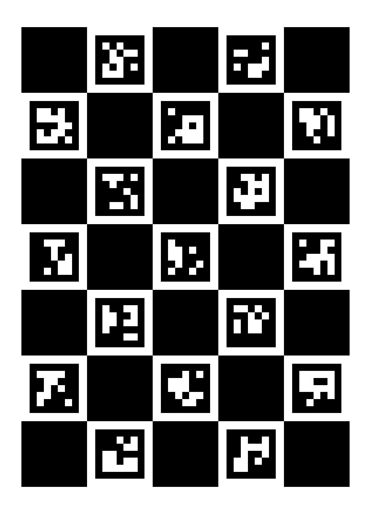
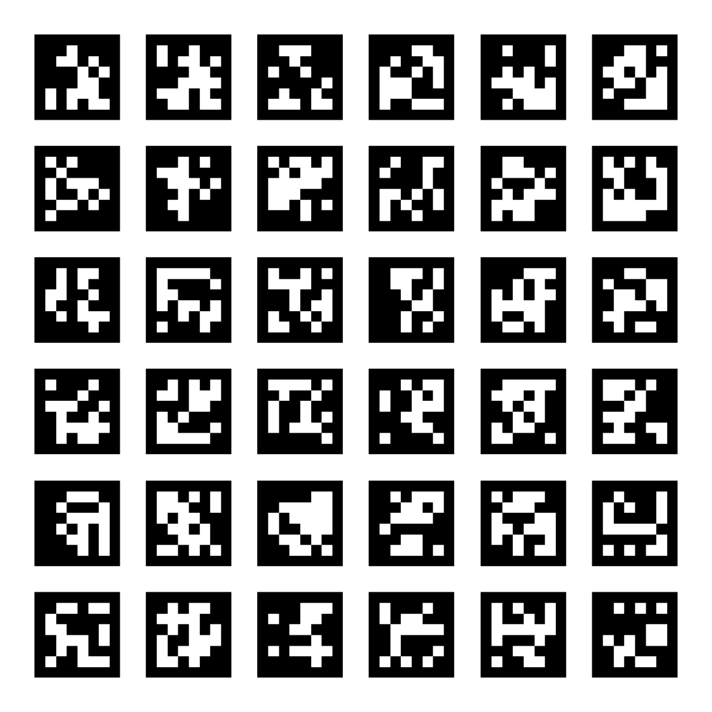

# AprilTag vs ArUco — and ChArUco / AprilGrid

This page is a deeper companion to the [fiducial markers overview](apriltag.md). That page introduces the marker landscape and then focuses on **using AprilTag**; this one zooms in on the **AprilTag-vs-ArUco choice**, explains what the cryptic family names (`tag36h11`, `DICT_6X6_250`) actually mean, and walks through the two calibration boards built on top of them — **ChArUco** (ArUco's board) and **AprilGrid** (AprilTag's board) — including how to generate each.

---

## 1. Same problem, different lineage

AprilTag and ArUco are **both square binary fiducial markers**. They solve the identical four-step problem:

1. **Detect** a square quadrilateral in the image,
2. **Decode** the black/white bit grid inside it into an integer ID,
3. **Match & error-correct** that ID against a known dictionary,
4. **Recover a 6-DoF pose** via `PnP` from the four corner correspondences plus the camera intrinsics.

The math (quad detection → decode → PnP) is the same. What differs is *lineage, encoding philosophy, and ecosystem*.

| Axis | **AprilTag** | **ArUco** |
|---|---|---|
| Origin | APRIL Lab, U. Michigan (Olson, 2011) | U. Córdoba (Garrido-Jurado, Muñoz-Salinas, 2014) |
| Codebase | Standalone C library (`apriltag`) + ROS wrappers | Built into OpenCV (`cv2.aruco`) |
| Families / dictionaries | `tag36h11`, `tag25h9`, `tag16h5`, `tagStandard41h12`, `tagCircle21h7`… | `DICT_4X4_*`, `DICT_5X5_*`, `DICT_6X6_*`, `DICT_7X7_*` (configurable size) |
| Naming scheme | data bits + minimum Hamming distance (see §2) | grid size + dictionary cardinality (see §2) |
| Detector | Line-segment clustering → graph-based quad fitting | Adaptive threshold → contour → quad → bit sampling |
| Speed | Heavier historically; AprilTag 3 closed most of the gap | Generally faster out of the box |
| False positives | Very low — `tag36h11` is engineered around a large Hamming distance | Depends on dictionary; tunable |
| Robustness | Strong at distance, rotation, partial occlusion | Good, lighter, slightly more lighting-sensitive |
| Calibration board | **AprilGrid** (Kalibr) | **ChArUco** (OpenCV) |

---

## 2. What the family / dictionary names mean

The single most confusing thing about both libraries is their naming. They encode *different* facts.

### 2.1 AprilTag: `tag36h11` = 36 data bits, Hamming ≥ 11

An AprilTag family name `tag{N}h{d}` packs two numbers:

- **`N` = number of data bits** in the payload. `tag36h11` carries **36 bits**, laid out as a **6×6 grid** of black/white cells *inside* the black border. (`tag25h9` → 25 bits → 5×5; `tag16h5` → 16 bits → 4×4.)
- **`d` = the minimum Hamming distance** between any two valid codewords in the family. `tag36h11` guarantees **at least 11 bits differ** between every pair of legal tags.

**Why the Hamming distance is the whole game.** The Hamming distance is the number of bit positions in which two codewords differ. If the closest two valid tags differ in `d` bits, then:

- You can **detect** up to `d − 1` bit errors (a corrupted tag can't accidentally look like another valid tag), and
- You can **correct** up to `⌊(d − 1) / 2⌋` bit errors (snap a slightly-corrupted read to the nearest valid codeword).

So `tag36h11` (d = 11) can correct up to **5 flipped bits** and still recover the right ID. That large margin is exactly why AprilTag has a famously low false-positive rate: random clutter or a half-occluded tag is overwhelmingly unlikely to land within 5 bits of a *different* valid codeword. The price is a **smaller dictionary** — only **587** unique IDs in `tag36h11`, because demanding that every pair of the chosen codewords be ≥11 apart eliminates most of the 2³⁶ raw combinations.

That is the fundamental trade-off baked into the name:

> **More data bits + larger minimum Hamming distance → fewer false positives and more error correction, but fewer unique IDs and a physically larger printed grid.**

`tagStandard41h12` is the modern recommended default: 41 data bits, Hamming ≥ 12, with a thinner border than `tag36h11`, giving more unique IDs *and* a slightly larger usable data area for the same printed footprint.

### 2.2 ArUco: `DICT_6X6_250` = 6×6 grid, 250 markers

An ArUco dictionary name `DICT_{n}X{n}_{k}` encodes:

- **`n×n` = the inner bit grid size.** `DICT_6X6_250` has a **6×6** data grid (the same payload resolution as `tag36h11`).
- **`k` = the dictionary cardinality** — how many unique markers it contains. `DICT_6X6_250` has exactly **250** markers; `DICT_6X6_1000` has 1000.

Crucially, **ArUco lets you trade IDs against robustness explicitly**: for a fixed grid size, a *smaller* `k` means OpenCV picks markers that are farther apart in Hamming distance (more robust, fewer false positives), while a *larger* `k` packs in more IDs at the cost of a smaller minimum distance. So `DICT_6X6_50` is more robust per-marker than `DICT_6X6_1000`. AprilTag bakes this choice into each fixed family; ArUco exposes it as the number you pick.

You can even generate a **custom dictionary** in OpenCV optimized for a target marker count and a desired minimum Hamming distance (`cv2.aruco.extendDictionary`), which is the ArUco analogue of generating a custom AprilTag family.

| | `tag36h11` (AprilTag) | `DICT_6X6_250` (ArUco) |
|---|---|---|
| Inner grid | 6×6 | 6×6 |
| Unique IDs | 587 | 250 (configurable) |
| Min Hamming distance | 11 (fixed) | chosen by OpenCV to maximize separation for k=250 |
| Philosophy | one curated, robustness-first family | pick `k` to dial robustness vs ID count |

---

## 3. The real fork in the road: calibration boards

For *single-marker pose* the two libraries are near-interchangeable — pick by ecosystem. The decision that actually matters is **calibration**, and here the two ecosystems give you genuinely different boards.

Neither board is a new marker dictionary. Both are **board layouts** that arrange many markers in a known geometry so a calibration pipeline gets dozens of pose-consistent correspondences from a single image.

| Board | Built on | Library | What it gives you |
|---|---|---|---|
| **ChArUco** | ArUco | OpenCV | Chessboard sub-pixel corners + ArUco IDs that survive partial occlusion |
| **AprilGrid** | AprilTag | Kalibr | A regular grid of AprilTags with known size + spacing for camera/IMU calibration |

### 3.1 ChArUco — chessboard accuracy *plus* occlusion tolerance

Reference: [Deepen AI — What is a ChArUco board and why you should use it](https://www.deepen.ai/blog/what-is-a-charuco-board-and-why-you-should-use-it).

A **ChArUco** (*Chessboard + ArUco*) board interleaves the two ideas to get the best of both:

- A **plain chessboard** gives the *most accurate corners possible*. A chessboard corner is the intersection of two black and two white squares — its location can be refined to **sub-pixel** accuracy because the surrounding gradients are strong and symmetric. This is why classic camera calibration has always used chessboards.
- A plain chessboard's weakness: it has **no identity**. If any part is occluded or off-frame, the detector can't tell *which* corner is which, so the whole image is usually discarded.
- A plain **ArUco board** has the opposite profile: every marker is uniquely identifiable (so partial views are fine), but the marker *corners* are less precise than a chessboard intersection.

ChArUco places an **ArUco marker inside every white square** of the chessboard. Now each chessboard corner is bracketed by ArUco markers whose IDs say *exactly which corner this is*. So you get:

- 👍 **Sub-pixel chessboard-corner accuracy** (the thing that drives calibration quality),
- 👍 **Per-corner identity from the ArUco IDs**, so partially occluded or partially out-of-frame boards still contribute every visible corner instead of being thrown away,
- 👍 **No extra dependency** — it's all in `cv2.aruco`.

This is why ChArUco is the **go-to target for intrinsic calibration in OpenCV pipelines**, and why it beats both plain ArUco-marker corners and plain chessboards in practice.

A 5×7 ChArUco board (rendered by the code below) — note the ArUco marker sitting in every white square:



#### Generating a ChArUco board

```python
import cv2
import numpy as np

# 5x7 chessboard, each square 40 mm, each embedded ArUco marker 30 mm,
# markers drawn from the 5x5 / 1000 dictionary.
aruco_dict = cv2.aruco.getPredefinedDictionary(cv2.aruco.DICT_5X5_1000)
board = cv2.aruco.CharucoBoard(
    size=(5, 7),            # (squaresX, squaresY)
    squareLength=0.040,     # chessboard square side [m]
    markerLength=0.030,     # embedded ArUco marker side [m]
    dictionary=aruco_dict,
)

# Render to a printable image (≈ 300 DPI A4-ish canvas, with a margin).
img = board.generateImage(outSize=(2480, 3508), marginSize=40)
cv2.imwrite("charuco_5x7.png", img)
```

> API note: this is the OpenCV ≥ 4.7 interface. Older code uses `cv2.aruco.CharucoBoard_create(...)` and `board.draw(...)` — same parameters, deprecated names.

**Detecting / calibrating with it** (the payoff): detect markers → interpolate the chessboard corners they bracket → feed corners + IDs across many views into the calibrator.

```python
detector = cv2.aruco.CharucoDetector(board)
charuco_corners, charuco_ids, marker_corners, marker_ids = detector.detectBoard(gray)
# Accumulate (charuco_corners, charuco_ids) over many images, then:
# cv2.aruco.calibrateCameraCharuco(...) -> camera_matrix, dist_coeffs
```

### 3.2 AprilGrid — the Kalibr target

An **AprilGrid** is a regular grid of AprilTags (each with a unique ID), separated by white gaps. It is the **standard target for [Kalibr](kalibr.md) camera and camera/IMU calibration**. Because every tag is uniquely identifiable, the board tolerates partial occlusion exactly like ChArUco — but it is consumed by the Kalibr ecosystem rather than OpenCV.

A 6×6 AprilGrid of `tag36h11` tags with `tagSpacing = 0.3` (rendered by the code below):



Two geometry numbers define it (both required by Kalibr's target YAML, see [kalibr.md §2.2](kalibr.md#22-target-description-yaml)):

- **`tagSize`** — the printed black-edge-to-black-edge length of one tag, in metres.
- **`tagSpacing`** — the gap between adjacent tags expressed *as a fraction of `tagSize`* (e.g. `0.3` means the gap is 30 % of a tag's edge).


#### Generating an AprilGrid

The easiest route is Kalibr's own generator, which emits a print-ready PDF *and* the matching target YAML:

```bash
# Inside a Kalibr install / Docker image:
kalibr_create_target_pdf \
    --type apriltag \
    --nx 6 --ny 6 \          # tags across / down
    --tsize 0.088 \          # tag edge length [m]
    --tspace 0.3 \           # gap as a fraction of tag edge
    --output april_6x6.pdf
```

**No-install / browser option.** If you don't have Kalibr handy, the web-based [AprilTag Generator](https://shiqiliu-67.github.io/apriltag-generator/) ([source](https://github.com/shiqiliu-67/apriltag-generator)) lays out **multiple tags into a single print-ready PDF** entirely in the browser — pick the family, the grid layout, and the physical tag size, and download the sheet. Handy for quickly producing a printable tag set or AprilGrid for detection / pose / calibration without a local toolchain. As always, **verify the printed tag size with a ruler** and write that number into the YAML below rather than trusting the on-screen value.

A ready-made 6×6 A0 PDF and its YAML are bundled in this repo — see [kalibr.md §2.1](kalibr.md#21-printable-aprilgrid-pdf). The corresponding YAML:

```yaml
target_type: 'aprilgrid'
tagCols: 6
tagRows: 6
tagSize: 0.088      # measure your actual print! [m]
tagSpacing: 0.3     # gap / tagSize
```

> ⚠️ Print at **100 % scale** and **measure the printed tag with a ruler** — `tagSize` is metric ground truth. A 10 % error here becomes a 10 % error in every distance the calibration returns. Same rule as ChArUco's `squareLength`/`markerLength`.

---

## 4. Decision guide

| You want to… | Use |
|---|---|
| 6-DoF pose of a landmark in a **ROS / robotics** stack | **AprilTag** (`tagStandard41h12` or `tag36h11`) |
| Single-marker pose in an existing **OpenCV** pipeline | **ArUco** |
| **Intrinsic-calibrate one camera** with sub-pixel corners (OpenCV) | **ChArUco** |
| **Calibrate cameras + IMU** in **Kalibr** | **AprilGrid** |
| Lowest possible **false-positive** rate for pure ID-tagging at distance | **AprilTag `tag36h11`** |
| Most **unique IDs**, dialed robustness, zero extra dependency | **ArUco** (pick the dictionary cardinality) |

**Rule of thumb:** ArUco / ChArUco if you're already in OpenCV or doing intrinsic calibration; AprilTag / AprilGrid if you're in ROS/robotics, need long-range robustness, or are calibrating in Kalibr. They are not interchangeable as *boards* — never hand a Kalibr "aprilgrid" config a ChArUco board, or vice-versa.

---

## See also

- [Fiducial markers overview & using AprilTag](apriltag.md) — coordinate frames, generation, C++/Python/ROS detection, pitfalls.
- [Kalibr — camera & camera/IMU calibration](kalibr.md) — the AprilGrid consumer.
- [Deepen AI — What is a ChArUco board](https://www.deepen.ai/blog/what-is-a-charuco-board-and-why-you-should-use-it)
- [AprilTag User Guide](https://github.com/AprilRobotics/apriltag/wiki/AprilTag-User-Guide) · [OpenCV ArUco / ChArUco tutorials](https://docs.opencv.org/4.x/d5/dae/tutorial_aruco_detection.html)
