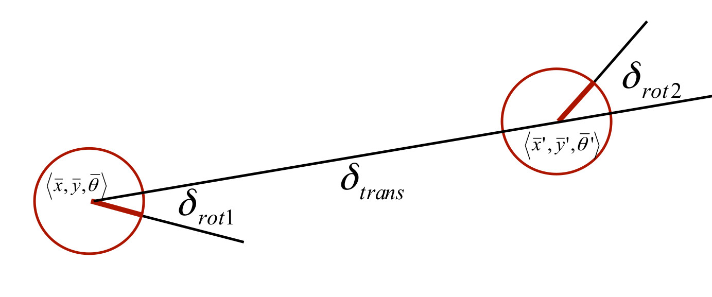

# Kinematics of Differential Drive Robots and Wheel odometry

# 1. Velocity-based (dead reckoning)
Linear Velocity:

 
 

so for the right wheel:
 
 

 
 

and for the left wheel:
 
 

if we add and subtract the above equation:

 
 

 
 

 
 

 
 

 
 

 
 

## 1.1 Forward Kinematics for Differential Drive Robots

so we express the pose of the robot in  frame, we rotate it around that  degree and finally express it our world coordinate frame:

 
 

If we add orientation and write all positions in our world coordinate:
 
 

 
 

 
 

 
 
since we had :
 
 

 
 

 
 

## 1.2.  Inverse Kinematics of Differential Drive Robots

Refs: [1](https://www.cs.columbia.edu/~allen/F17/NOTES/icckinematics.pdf)

# 2. Odometry-based

 
 

 
 

 
 

 
 

 
 

 
 

 
 

 
 
Not sure about the followings:
 
 

 
 

 
 

 
 

 
 

The pose of the  landmark

 
 

the pose of the robot at time t:
 
 

 
 

observed range and bearing of the landmark:

# DiffBot Differential Drive Mobile Robot

[ros-mobile-robots](https://ros-mobile-robots.com/)

