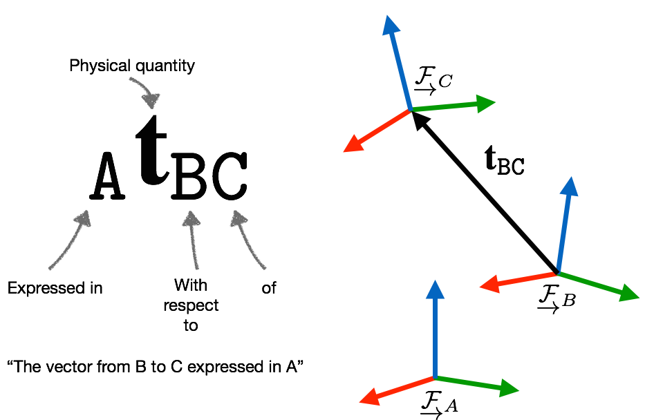

# Representing Robot Pose

1. Always provide a frame diagram

Refs: [1](https://web.archive.org/web/20161029231029/https://paulfurgale.info/news/2014/6/9/representing-robot-pose-the-good-the-bad-and-the-ugly)

