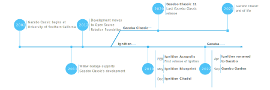

## Gazebo Versions

1. **Gazebo Classic** — the original Gazebo. Last stable: Gazebo 11 (released 2020, EOL **January 2025**). Supported ROS 1 and ROS 2 via `gazebo_ros_pkgs`.

2. **Gazebo / Ignition Gazebo** — the next-generation rewrite. Modular, designed for ROS 2.

Release codenames (oldest → newest):

| Version          | Codename     | CLI         | Status (mid-2026)                          |
|------------------|--------------|-------------|--------------------------------------------|
| Ignition Gazebo 1| Acropolis    | `ign gazebo`| EOL                                        |
| Ignition Gazebo 2| Blueprint    | `ign gazebo`| EOL                                        |
| Ignition Gazebo 3| Citadel      | `ign gazebo`| EOL                                        |
| Ignition Gazebo 4| Dome         | `ign gazebo`| EOL                                        |
| Ignition Gazebo 5| Edifice      | `ign gazebo`| EOL                                        |
| Ignition Gazebo 6| **Fortress** | `ign gazebo`| LTS, paired with ROS 2 Humble (until 2027) |
| Gazebo Sim 7     | Garden       | `gz sim`    | EOL                                        |
| Gazebo Sim 8     | **Harmonic** | `gz sim`    | LTS, paired with ROS 2 Jazzy (until 2028)  |
| Gazebo Sim 9     | Ionic        | `gz sim`    | Latest stable, pairs with Rolling          |

> The project rebranded from "Ignition Gazebo" to "Gazebo Sim" starting with Garden. Older codenames keep the `ign` CLI; Garden onwards use `gz`.



Get the version, paths, and CLI options:

```bash
gz sim -h        # or `ign gazebo -h` on Fortress
gz sim --version
```

Commonly used flags:

- `-g` — run only the GUI.
- `-r` — start the simulation immediately (otherwise it loads paused).
- `-s` — run only the server (headless). Overrides `-g` if both are present.
- `-v [0..4]` — verbosity. Default `1`; `-v` with no argument means `3`.

Refs: [Gazebo about](https://gazebosim.org/about), [version pairing matrix](https://gazebosim.org/docs/latest/ros_installation/).

---

## Installation

Harmonic binaries are provided for **Ubuntu Jammy (22.04)** and **Ubuntu Noble (24.04)**.

### Installation using Docker

The repo ships a parameterized image — see [`Dockerfile`](../Dockerfile) and [`docker-compose.yml`](../docker-compose.yml). Pick a pairing in [`.env.example`](../.env.example) (Humble + Fortress by default; uncomment to switch to Jazzy + Harmonic), then:

```bash
cp .env.example .env
docker compose build
docker compose run --rm dev
```

For a one-off image without compose, the OSRF maintains pre-built ROS 2 + Gazebo images:

```bash
xhost +local:docker
docker run -it --privileged \
  --name=ros2 \
  --network host --ipc host \
  -e DISPLAY=$DISPLAY \
  -v /tmp/.X11-unix:/tmp/.X11-unix:rw \
  -v $HOME:$HOME:rw \
  osrf/ros:jazzy-desktop-full
```

### Installation directly on your machine

Add the OSRF apt repository, then install the meta-package:

```bash
sudo apt-get update
sudo apt-get install -y curl lsb-release gnupg

sudo curl -fsSL https://packages.osrfoundation.org/gazebo.gpg \
  -o /usr/share/keyrings/pkgs-osrf-archive-keyring.gpg

echo "deb [arch=$(dpkg --print-architecture) signed-by=/usr/share/keyrings/pkgs-osrf-archive-keyring.gpg] http://packages.osrfoundation.org/gazebo/ubuntu-stable $(lsb_release -cs) main" \
  | sudo tee /etc/apt/sources.list.d/gazebo-stable.list > /dev/null

sudo apt-get update
sudo apt-get install -y gz-harmonic    # or ignition-fortress
```

Run it:

```bash
gz sim         # Harmonic / Garden
ign gazebo     # Fortress
```

Remove:

```bash
sudo apt remove gz-harmonic && sudo apt autoremove
```

Ref: [Gazebo install guide](https://gazebosim.org/docs/latest/install_ubuntu/).

---

## Building a model

A minimal model wraps one or more `<link>` elements together with the joints connecting them:

```xml
<model name='vehicle_blue' canonical_link='chassis'>
    <pose relative_to='world'>0 0 0 0 0 0</pose>
    <!-- links and joints here -->
</model>
```

- `canonical_link` — the link whose frame *is* the model frame. Required when the link order in the SDF is not the order you want as the model origin. If omitted, the first `<link>` is used.
- `pose` — model position + orientation (`x y z roll pitch yaw`). With `relative_to`, the pose is expressed in another frame's coordinates; without it, the world frame.

### Links

Every model is a group of `link` rigid bodies connected together by `joint`s. A link carries:

- `<inertial>` — mass + inertia tensor (required for dynamic simulation).
- `<collision>` — geometry used by the physics engine.
- `<visual>` — geometry used by the renderer (often a higher-detail mesh than `<collision>`).

```xml
<link name='chassis'>
    <pose>0 0 0.4 0 0 0</pose>
    <inertial>
        <mass>1.14395</mass>
        <inertia>
            <ixx>0.095329</ixx><ixy>0</ixy><ixz>0</ixz>
            <iyy>0.381317</iyy><iyz>0</iyz>
            <izz>0.476646</izz>
        </inertia>
    </inertial>
    <visual name='visual'>
        <geometry><box><size>2.0 1.0 0.5</size></box></geometry>
        <material><ambient>0.0 0.0 1.0 1</ambient><diffuse>0.0 0.0 1.0 1</diffuse></material>
    </visual>
    <collision name='collision'>
        <geometry><box><size>2.0 1.0 0.5</size></box></geometry>
    </collision>
</link>
```

#### Inertia Matrix

Inertia is the property of an object that resists changes to its rotational motion. For a 3D rigid body it is captured by a 3×3 symmetric matrix called the **inertia tensor**, with components .

**Diagonal terms** () — moments of inertia about the principal axes. They quantify how hard it is to angularly accelerate the body about each axis.

**Off-diagonal terms** () — products of inertia. They describe coupling between axes; a torque about the *x*-axis will also induce angular momentum about *y* if . For a body whose principal axes are aligned with the chosen frame (e.g. a centered, axis-aligned box), all off-diagonals vanish.

**Solid cuboid** of width `w`, height `h`, depth `d`, mass `m`:


Closed-form expressions for other primitives: [Wikipedia — list of moments of inertia](https://en.wikipedia.org/wiki/List_of_moments_of_inertia#List_of_3D_inertia_tensors).

For meshes, use Gazebo's auto-inertia computation (Harmonic+):

```xml
<inertial auto="true"><density>700</density></inertial>
```

### Visual and collision

Best practice: use a high-detail mesh for `<visual>` and a low-poly approximation (or a primitive — box, cylinder, sphere) for `<collision>`. Collision meshes drive every contact-resolution step, so a 100k-triangle visual mesh as `<collision>` is the most common cause of a slow simulation.

```xml
<visual name='visual'>
    <geometry><mesh><uri>model://my_robot/meshes/body.dae</uri></mesh></geometry>
</visual>
<collision name='collision'>
    <geometry><box><size>0.4 0.3 0.2</size></box></geometry>
</collision>
```

### Connecting links together (joints)

Joints constrain two links and define their relative motion. Common types:

| Type        | dof | Typical use                                  |
|-------------|-----|----------------------------------------------|
| `revolute`  | 1   | hinges, wheels, manipulator joints           |
| `prismatic` | 1   | linear actuators, sliders                    |
| `fixed`     | 0   | rigid attachment (sensor mounts, tool tips)  |
| `ball`      | 3   | spherical / ball-and-socket                  |
| `universal` | 2   | two intersecting rotation axes               |
| `continuous`| 1   | revolute with no joint limit (e.g. wheels)   |

```xml
<joint name='left_wheel_joint' type='revolute'>
    <parent>chassis</parent>
    <child>left_wheel</child>
    <axis>
        <xyz expressed_in='__model__'>0 1 0</xyz>
        <limit><lower>-1e16</lower><upper>1e16</upper></limit>
    </axis>
</joint>
```

The `<parent>` and `<child>` link names must already be declared. Joint axis is given in the parent link's frame unless `expressed_in` says otherwise.

---

## Building world

A minimum world wraps `<physics>`, plugins, lights, and one or more `<include>`d models:

```xml
<sdf version="1.10">
  <world name="my_world">
    <physics name="1ms" type="ignored">
      <max_step_size>0.001</max_step_size>
      <real_time_factor>1.0</real_time_factor>
    </physics>

    <plugin filename="gz-sim-physics-system"
            name="gz::sim::systems::Physics"/>
    <plugin filename="gz-sim-user-commands-system"
            name="gz::sim::systems::UserCommands"/>
    <plugin filename="gz-sim-scene-broadcaster-system"
            name="gz::sim::systems::SceneBroadcaster"/>

    <light type="directional" name="sun">
      <pose>0 0 10 0 0 0</pose>
      <diffuse>0.8 0.8 0.8 1</diffuse>
    </light>

    <include><uri>model://ground_plane</uri></include>
  </world>
</sdf>
```

### Physics

```xml
<physics name="1ms" type="ignored">
    <max_step_size>0.001</max_step_size>
    <real_time_factor>1.0</real_time_factor>
</physics>
```

- `type` — historical field for the dynamics engine name (`ode`, `bullet`, `simbody`, `dart`). In modern Gazebo this attribute is **ignored**; the engine is selected by the physics system plugin (see below).
- `max_step_size` — fixed simulation step in seconds. `0.001` (1 ms → 1 kHz) is the typical default.
- `real_time_factor` — target ratio of simulated to wall-clock time. `1.0` means real-time; `0.5` means simulate at half speed; `0` lets the simulator run as fast as it can.

### Plugins

A modern Gazebo world is a *kernel* loaded with **systems plugins**. Three are essentially mandatory; the rest depend on what you simulate.

#### Physics

The dynamics engine (DART by default) is loaded via the physics system plugin:

```xml
<plugin filename="gz-sim-physics-system"
        name="gz::sim::systems::Physics"/>
```

Selecting an alternate engine — Bullet, TPE, Simbody — is done by including the engine-specific plugin variant; see the [physics tutorial](https://gazebosim.org/api/sim/8/physics.html).

#### User-commands

Lets the GUI and CLI spawn / delete / move entities at runtime:

```xml
<plugin filename="gz-sim-user-commands-system"
        name="gz::sim::systems::UserCommands"/>
```

Without this plugin, `gz service /world/<name>/create` and "Insert" GUI clicks have no effect.

#### Scene-broadcaster

Publishes the live scene graph (poses, visuals) so the GUI, RViz bridges, and `ros_gz_bridge` can visualize what the server is computing:

```xml
<plugin filename="gz-sim-scene-broadcaster-system"
        name="gz::sim::systems::SceneBroadcaster"/>
```

### GUI

The GUI is itself a stack of plugins, configured under `<gui>` in the world file (or in `~/.gz/sim/<ver>/gui.config`).

#### World control plugin

Play / pause / step buttons in the GUI toolbar:

```xml
<plugin filename="WorldControl" name="World control">
    <gz-gui>
        <property type="bool" key="resizable">false</property>
        <property type="double" key="height">72</property>
        <property type="double" key="width">121</property>
        <anchors target="3D View">
            <line own="left" target="left"/>
            <line own="bottom" target="bottom"/>
        </anchors>
    </gz-gui>
    <play_pause>true</play_pause>
    <step>true</step>
    <start_paused>true</start_paused>
</plugin>
```

#### World stats plugin

Real-time factor, simulation time, iteration count:

```xml
<plugin filename="WorldStats" name="World stats">
    <gz-gui>
        <property type="bool" key="resizable">false</property>
        <property type="double" key="height">110</property>
        <property type="double" key="width">290</property>
    </gz-gui>
    <sim_time>true</sim_time>
    <real_time>true</real_time>
    <real_time_factor>true</real_time_factor>
    <iterations>true</iterations>
</plugin>
```

#### Entity tree

Hierarchical view of the scene graph (worlds → models → links → visuals). Useful for clicking onto a particular link to see its pose:

```xml
<plugin filename="EntityTree" name="Entity tree"/>
```

---

## Moving the robot

Drive a robot with a `DiffDrive` system plugin attached to the model. Inside the `<model>`:

```xml
<plugin filename="gz-sim-diff-drive-system"
        name="gz::sim::systems::DiffDrive">
    <left_joint>left_wheel_joint</left_joint>
    <right_joint>right_wheel_joint</right_joint>
    <wheel_separation>1.2</wheel_separation>
    <wheel_radius>0.4</wheel_radius>
    <topic>cmd_vel</topic>
    <odom_topic>odom</odom_topic>
    <frame_id>odom</frame_id>
    <child_frame_id>chassis</child_frame_id>
</plugin>
```

Send velocity commands from the host:

```bash
gz topic -t /cmd_vel -m gz.msgs.Twist \
  -p 'linear: {x: 0.5}, angular: {z: 0.2}'
```

Keyboard teleop is also a system plugin — `KeyPublisher` + `TriggeredPublisher`. Fortress uses `keyboard-system`. Or bridge `/cmd_vel` to ROS 2 and use `teleop_twist_keyboard`.

---

## Sensors

Attach a sensor as a child of a `<link>`. The `<topic>` element controls where the sensor publishes.

### IMU sensor

The IMU **system plugin** must be loaded once per world:

```xml
<plugin filename="gz-sim-imu-system"
        name="gz::sim::systems::Imu"/>
```

Then add the IMU sensor to a link:

```xml
<sensor name="imu_sensor" type="imu">
    <always_on>1</always_on>
    <update_rate>200</update_rate>
    <visualize>true</visualize>
    <topic>imu</topic>
</sensor>
```

200 Hz is a typical update rate for VIO / state-estimation; raise to 400+ for high-bandwidth controllers. Verify:

```bash
gz topic -e -t /imu       # echo the gz.msgs.IMU stream
```

### Lidar sensor

Add the sensors system plugin under `<world>`:

```xml
<plugin filename="gz-sim-sensors-system"
        name="gz::sim::systems::Sensors">
    <render_engine>ogre2</render_engine>
</plugin>
```

Then add a `gpu_lidar` sensor inside a link (assumes a `lidar_frame` link already declared):

```xml
<sensor name='gpu_lidar' type='gpu_lidar'>
    <pose relative_to='lidar_frame'>0 0 0 0 0 0</pose>
    <topic>lidar</topic>
    <update_rate>10</update_rate>
    <ray>
        <scan>
            <horizontal>
                <samples>640</samples>
                <resolution>1</resolution>
                <min_angle>-1.396263</min_angle>
                <max_angle>1.396263</max_angle>
            </horizontal>
            <vertical>
                <samples>1</samples>
                <resolution>0.01</resolution>
                <min_angle>0</min_angle>
                <max_angle>0</max_angle>
            </vertical>
        </scan>
        <range>
            <min>0.08</min>
            <max>10.0</max>
            <resolution>0.01</resolution>
        </range>
    </ray>
    <always_on>1</always_on>
    <visualize>true</visualize>
</sensor>
```

The 2D scan is published on `gz.msgs.LaserScan`; a `gpu_lidar` with `vertical.samples > 1` also publishes a `gz.msgs.PointCloudPacked` on `<topic>/points`.

---

## Model insertion from Fuel

Browse and download community models at [app.gazebosim.org](https://app.gazebosim.org/). Place them under any directory and add it to the resource path:

```bash
export GZ_SIM_RESOURCE_PATH=$GZ_SIM_RESOURCE_PATH:$HOME/gz_models
```

Then spawn entities at runtime via the world's `create` service. The world name (`diff_drive` below) must match the running world.

**Chessboard:**

```bash
gz service -s /world/diff_drive/create \
  --reqtype gz.msgs.EntityFactory --reptype gz.msgs.Boolean --timeout 300 \
  --req "sdf: '<sdf version=\"1.6\">'\
'<include>'\
'<uri>file://'$HOME'/gz_models/chessboard/model.sdf</uri>'\
'<pose>1 1 0 0 0 0</pose>'\
'</include>'\
'</sdf>'"
```

**AprilTag:**

```bash
gz service -s /world/diff_drive/create \
  --reqtype gz.msgs.EntityFactory --reptype gz.msgs.Boolean --timeout 300 \
  --req "sdf: '<sdf version=\"1.6\">'\
'<include>'\
'<uri>file://'$HOME'/gz_models/Apriltag36_11_00001/model.sdf</uri>'\
'<pose>2 0.2 0.8 3.14 1.57 0</pose>'\
'</include>'\
'</sdf>'"
```

**ArUco marker:**

```bash
gz service -s /world/diff_drive/create \
  --reqtype gz.msgs.EntityFactory --reptype gz.msgs.Boolean --timeout 300 \
  --req "sdf: '<sdf version=\"1.6\">'\
'<include>'\
'<uri>file://'$HOME'/gz_models/aruco_default/model.sdf</uri>'\
'<pose>2 0.2 0.8 3.14 1.57 1</pose>'\
'</include>'\
'</sdf>'"
```

**Spawn a primitive (sphere) on the fly:**

```bash
gz service -s /world/diff_drive/create \
  --reqtype gz.msgs.EntityFactory --reptype gz.msgs.Boolean --timeout 300 \
  --req "sdf: '<sdf version=\"1.6\">'\
'<model name=\"spawned_sphere\">'\
'<pose>2 3 1 0 0 0</pose>'\
'<link name=\"link\">'\
'<visual name=\"visual\"><geometry><sphere><radius>1.0</radius></sphere></geometry></visual>'\
'<collision name=\"collision\"><geometry><sphere><radius>1.0</radius></sphere></geometry></collision>'\
'</link>'\
'</model>'\
'</sdf>'"
```

**Spawn a directional light:**

```bash
gz service -s /world/diff_drive/create \
  --reqtype gz.msgs.EntityFactory --reptype gz.msgs.Boolean --timeout 300 \
  --req 'sdf: "<sdf version=\"1.6\"><light name=\"spawned_light\" type=\"directional\"><pose>0 0 10 0.1 1.0 0</pose></light></sdf>"'
```

List all available services:

```bash
gz service -l | grep create
```

---

## Spawn URDF

URDF is converted to SDF on the fly by the loader; you can pass a URDF wherever an SDF is expected. Two common paths:

**1. From a `xacro` source (typical ROS workflow):**

```bash
xacro robot.urdf.xacro > /tmp/robot.urdf
gz sim -r empty.sdf
gz service -s /world/empty/create \
  --reqtype gz.msgs.EntityFactory --reptype gz.msgs.Boolean --timeout 300 \
  --req 'sdf_filename: "/tmp/robot.urdf", name: "robot", pose: {position: {z: 0.5}}'
```

**2. With the `ros_gz_sim` launch helper (recommended in ROS 2):**

```bash
ros2 run ros_gz_sim create -file /tmp/robot.urdf -name robot -z 0.5
```

`-file` resolves relative to the **`gz sim` server's working directory**, so either pass an absolute path or `cd` to the URDF directory before launching the simulator.

For the robot to publish `/tf` from its joint states, also run a `robot_state_publisher` and bridge the simulator's joint-state topic.

---

## Environment variables

| Variable                       | Purpose                                                       |
|--------------------------------|---------------------------------------------------------------|
| `GZ_SIM_RESOURCE_PATH`         | Colon-separated paths to find worlds and models               |
| `GZ_SIM_SYSTEM_PLUGIN_PATH`    | Colon-separated paths to find system plugins                  |
| `GZ_SIM_SERVER_CONFIG_PATH`    | Server configuration file                                     |
| `GZ_GUI_PLUGIN_PATH`           | Colon-separated paths to find GUI plugins                     |
| `GZ_GUI_RESOURCE_PATH`         | Colon-separated paths to find GUI resources                   |
| `GZ_VERSION`                   | Gazebo release name; used by `ros_gz` source builds           |
| `GZ_PARTITION`                 | Partition name (analogous to `ROS_DOMAIN_ID`) for gz transport|

```bash
export GZ_SIM_RESOURCE_PATH=$HOME/gz_models
```

---

## Obtain the ground-truth pose

If the world includes the `pose-publisher` system, every model's true pose is published on `/model/<name>/pose`:

```bash
gz topic -e -t /model/tugbot/pose
```

- `-e` — echo
- `-t` — topic name

Bridge to ROS 2 with `ros_gz_bridge` (see [ros2_gazebo_integration.md](./ros2_gazebo_integration.md)) for use as ground truth in evaluations.

---

## ROS 2 integration

For the full Docker-first workflow, the bridge syntax, sensor recipes (camera / lidar / IMU / GNSS), and YAML bridge config, see the dedicated guide: **[`ros2_gazebo_integration.md`](./ros2_gazebo_integration.md)**.

Quick orientation:

| ROS 2  | `ros_gz` branch | Gazebo release | apt package         |
|--------|-----------------|----------------|---------------------|
| Humble | `humble`        | Fortress       | `ignition-fortress` |
| Jazzy  | `jazzy`         | Harmonic       | `gz-harmonic`       |

Smallest possible bridge (Gazebo → ROS 2, single topic):

```bash
ros2 run ros_gz_bridge parameter_bridge \
  /lidar@sensor_msgs/msg/LaserScan[gz.msgs.LaserScan
```

Direction symbols: `@` bidirectional, `[` Gazebo→ROS, `]` ROS→Gazebo.
