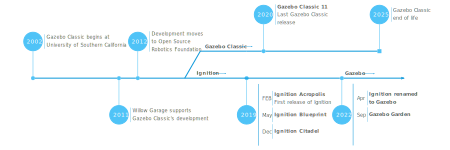

## Gazebo Versions

1. Gazebo Classic: is the original version of Gazebo. The last stable release of Gazebo Classic is Gazebo 11, which was released in 2020 and will be supported until 2025. It has integration with ROS1 and ROS2.

2. Gazebo Ignition: Ignition Gazebo is the next-generation version of Gazebo, built with modularity, flexibility, and modern design in mind. Designed to integrate better with ROS2 and other middleware.

Versions of Ignition Gazebo:

 - Ignition Gazebo 1: Acropolis
 - Ignition Gazebo 2: Blueprint
 - Ignition Gazebo 3: Citadel
 - Ignition Gazebo 4: Dome
 - Ignition Gazebo 5: Edifice
 - Ignition Gazebo 6: Fortress
 - Gazebo Sim 7: Garden
 - Gazebo Sim 8: Harmonic


**Gazebo Sim (GZ Sim)**: The name change from Ignition Gazebo to GZ Sim (or simply GZ Sim),  It's a continuation of Ignition, but with the name transition.




to get the version, path, etc:

```
gz sim -h
```
some commonly used cpmmands and params:

- `-g`: Run only the GUI.                                
- `-r`: Run simulation on start.                         
- `-s`: Run only the server (headless mode). This overrides -g, if it is also present.             
- `-v [arg]`: Adjust the level of console output (0~4). The default verbosity is `1`, use `-v` without rguments for level `3`.  
                               


Refs: [1](https://gazebosim.org/about)


## Installation
Gazebo Harmonic: Harmonic binaries are provided for **Ubuntu Jammy (22.04)** and **Ubuntu Noble (24.04)**.


### Installation using docker

You can use docker:

```
docker pull osrf/ros:jazzy-desktop
```

allow GUI

```
export containerId=$(docker ps -l -q)
```

and 

```
xhost +local: docker inspect --format='{{ .Config.Hostname }}' $containerId
```


then:


```bash
# 1. Allow all Docker containers to access your X server (only local/rootless Docker)
xhost +local:docker

# 2. Run the container with the correct X11 setup
docker run -it --rm \
  --privileged \
  --env=LOCAL_USER_ID="$(id -u)" \
  --env=DISPLAY=$DISPLAY \
  -v /tmp/.X11-unix:/tmp/.X11-unix:ro \
  -v /home/behnam:/home/behnam:rw \
  --network host \
  --name ros2 \
  osrf/ros:jazzy-desktop-full
  
```

### Installation directly on your machine
you can directly install it on your machine:


dependencies: 
```
sudo apt-get update
sudo apt-get install curl lsb-release gnupg
```


Then install Gazebo Harmonic:

```
sudo curl https://packages.osrfoundation.org/gazebo.gpg --output /usr/share/keyrings/pkgs-osrf-archive-keyring.gpg
echo "deb [arch=$(dpkg --print-architecture) signed-by=/usr/share/keyrings/pkgs-osrf-archive-keyring.gpg] http://packages.osrfoundation.org/gazebo/ubuntu-stable $(lsb_release -cs) main" | sudo tee /etc/apt/sources.list.d/gazebo-stable.list > /dev/null
sudo apt-get update
sudo apt-get install gz-harmonic
```

remove:

```
sudo apt remove gz-harmonic && sudo apt autoremove
```

you can run it by:

```
gz sim
```

or 

```
ign gazebo
```


Ref: [1](https://gazebosim.org/docs/latest/install_ubuntu/)


## Building a model

Defining the model: 

```
<model name='vehicle_blue' canonical_link='chassis'>
    <pose relative_to='world'>0 0 0 0 0 0</pose>
```

`canonical_link`: Each model may have one link designated as the canonical_link, the implicit frame of the model is attached to this link. If not defined, the first <link> will be chosen as the


`pose`: The <pose> tag is used to define the position and orientation of our model, If relative_to is not defined, the model’s <pose> will be relative to the world.

### Links
Every model is a group of `links` connected together with `joints`.

#### Inertia Matrix 
Inertia is a property of an object that resists changes in its motion, specifically rotational motion in this case. For a 3D object, the inertia of the object is represented by a 3x3 matrix called the **inertia tensor**. The terms you mentioned, , , , , , , are the components of this tensor.

Simple explanation using a 3D object, such as a **box**.

**Inertia Tensor Components**:

- **, , :** These represent the moments of inertia about the x, y, and z axes, respectively. These describe how difficult it is to rotate the object around each of these axes.
    - Example: If you try to rotate a box around its **x-axis**,  will tell you how much the box resists that rotation.

- **, , :** These represent the products of inertia. These terms describe how much the mass of the object is "coupled" between two different axes.
    - Example: If you try to rotate the box around the **x-axis**, but its mass distribution is uneven, you might also induce some rotation around the **y-axis** or **z-axis**. , , and  describe this coupling between axes.


---
**Simple Example** 

Imagine you have a rectangular box. Its moments of inertia about the **x**, **y**, and **z** axes can be calculated based on how its mass is distributed along those axes. Here’s a breakdown:

-  depends on the mass distribution away from the **x-axis** (how far the mass is from the axis).
-  depends on the mass distribution away from the **y-axis**.
-  depends on the mass distribution away from the **z-axis**.

Now, if the box is perfectly symmetrical and aligned with the axes, , , and  would be zero, meaning there's no coupling. But if the box is tilted or its mass is unevenly distributed, these terms would have values, indicating that rotating about one axis would also induce some motion around the others.

In Summary

- **Diagonal terms** (, , ) show resistance to rotation about each principal axis.
- **Off-diagonal terms** (, , ) show coupling between the axes, where rotating around one axis can also affect rotation around others. 
---


Solid cuboid of width `w`, height `h`, depth `d`, and mass `m`:
	


[List of moments of inertia](https://en.wikipedia.org/wiki/List_of_moments_of_inertia#List_of_3D_inertia_tensors)


### Visual and collision


### Connecting links together (joints)
The joint tag connects two links together and defines how they will move with respect to each other, we need to define the two links to connect and their relations (way of movement)


## Building world

### Physics
```
<physics name="1ms" type="ignored">
    <max_step_size>0.001</max_step_size>
    <real_time_factor>1.0</real_time_factor>
</physics>
```

### Plugins
#### Physics


- `type`: is the type of the dynamic engine (Ode, Bullet, Simbody and Dar), choosing the type of the physics engine is **not** done through this tag yet
- `max_step_size`:  maximum time at which every system in simulation can interact with the states of the world

```
<plugin
    filename="gz-sim-user-commands-system"
    name="gz::sim::systems::UserCommands">
</plugin>
```


#### User-commands
```
<plugin
    filename="gz-sim-user-commands-system"
    name="gz::sim::systems::UserCommands">
</plugin>
```
#### Scene-broadcaster

### GUI
#### World control plugin
#### World stats plugin
#### Entity tree

## Moving the robot


## Sensors

### IMU sensor
This code defines the IMU sensor plugin to be used in our world
```
<plugin filename="gz-sim-imu-system"
        name="gz::sim::systems::Imu">
</plugin>
```

Now we can add the IMU sensor to our robot as follows:

```
<sensor name="imu_sensor" type="imu">
    <always_on>1</always_on>
    <update_rate>1</update_rate>
    <visualize>true</visualize>
    <topic>imu</topic>
</sensor>
```


### Lidar sensor

Add this plugin under the <world> tag, to be able to use the lidar sensor:

```
    <plugin
      filename="gz-sim-sensors-system"
      name="gz::sim::systems::Sensors">
      <render_engine>ogre2</render_engine>
    </plugin>
```

add the lidar sensor 

```
<sensor name='gpu_lidar' type='gpu_lidar'>"
    <pose relative_to='lidar_frame'>0 0 0 0 0 0</pose>
    <topic>lidar</topic>
    <update_rate>10</update_rate>
    <ray>
        <scan>
            <horizontal>
                <samples>640</samples>
                <resolution>1</resolution>
                <min_angle>-1.396263</min_angle>
                <max_angle>1.396263</max_angle>
            </horizontal>
            <vertical>
                <samples>1</samples>
                <resolution>0.01</resolution>
                <min_angle>0</min_angle>
                <max_angle>0</max_angle>
            </vertical>
        </scan>
        <range>
            <min>0.08</min>
            <max>10.0</max>
            <resolution>0.01</resolution>
        </range>
    </ray>
    <always_on>1</always_on>
    <visualize>true</visualize>
</sensor>
```


## Model Insertion from Fuel
All models available at [app.gazebosim.org](https://app.gazebosim.org/)


```
export GZ_SIM_RESOURCE_PATH=$GZ_SIM_RESOURCE_PATH:/home/behnam/gz_models
```


and then 


```
gz service -s /world/diff_drive/create --reqtype gz.msgs.EntityFactory --reptype gz.msgs.Boolean --timeout 300 --req "sdf: '<sdf version=\"1.6\">'\
'<include>'\
'<uri>file:///home/behnam/gz_models/chessboard/model.sdf</uri>'\
'<pose>1 1 0 0 0 0</pose>'\
'</include>'\
'</sdf>'"
```

add April tag

```
gz service -s /world/diff_drive/create --reqtype gz.msgs.EntityFactory --reptype gz.msgs.Boolean --timeout 300 --req "sdf: '<sdf version=\"1.6\">'\
'<include>'\
'<uri>file:///home/behnam/gz_models/Apriltag36_11_00001/model.sdf</uri>'\
'<pose>2 0.2 0.8 3.14 1.57 0</pose>'\
'</include>'\
'</sdf>'"
```


or Aruco

```
gz service -s /world/diff_drive/create --reqtype gz.msgs.EntityFactory --reptype gz.msgs.Boolean --timeout 300 --req "sdf: '<sdf version=\"1.6\">'\
'<include>'\
'<uri>file:///home/behnam/gz_models/aruco_default/model.sdf</uri>'\
'<pose>2 0.2 0.8 3.14 1.57 1</pose>'\
'</include>'\
'</sdf>'"
```


gz service -s /world/diff_drive/create --reqtype gz.msgs.EntityFactory --reptype gz.msgs.Boolean --timeout 300 --req "sdf: '<sdf version=\"1.6\">'\
'<include>'\
'<uri>file:///home/behnam/gz_models/aruco_default/model.sdf</uri>'\
'<pose>2.5 0.2 0.8 4.71 -0.785 1.57</pose>'\
'</include>'\
'</sdf>'"


you can use service, i.e, first find the service: 
```
gz service -l | grep create
```

then add a light:

```
gz service -s /world/diff_drive/create --reqtype gz.msgs.EntityFactory --reptype gz.msgs.Boolean --timeout 300 --req 'sdf: '\
'"<?xml version=\"1.0\" ?>'\
'<sdf version=\"1.6\">'\
'<light name=\"spawned_light\" type=\"directional\">'\
'<pose>0 0 10 0.1 1.0 0</pose>'\
'</light>'\
'</sdf>"'
```

add a sphere:

```
gz service -s /world/diff_drive/create   --reqtype gz.msgs.EntityFactory   --reptype gz.msgs.Boolean   --timeout 300   --req "sdf: '<sdf version=\"1.6\">'\
'<model name=\"spawned_model\">'\
'<pose>2 3 1 0 0 0</pose>'\
'<link name=\"link\">'\
'<visual name=\"visual\">'\
'<geometry><sphere><radius>1.0</radius></sphere></geometry>'\
'</visual>'\
'<collision name=\"collision\">'\
'<geometry><sphere><radius>1.0</radius></sphere></geometry>'\
'</collision>'\
'</link>'\
'</model>'\
'</sdf>'"
```


Environment variables:                                                          
- `GZ_SIM_RESOURCE_PATH`:         Colon separated paths used to locate  resources such as worlds and models.                                         
- `GZ_SIM_SYSTEM_PLUGIN_PATH`:    Colon separated paths used to locate system plugins.                                                       
- `GZ_SIM_SERVER_CONFIG_PATH`:    Path to server configuration file.             
- `GZ_GUI_PLUGIN_PATH`:           Colon separated paths used to locate GUI  plugins.                                                                       
- `GZ_GUI_RESOURCE_PATH`:         Colon separated paths used to locate GUI resources such as configuration files.                                       


```
export GZ_SIM_RESOURCE_PATH=~/gz_models/
```


## Obtain the ground truth position

```
gz topic -e -t /model/tugbot/pose
```
`-e` : for echo.
`-t` : specify the topic.


