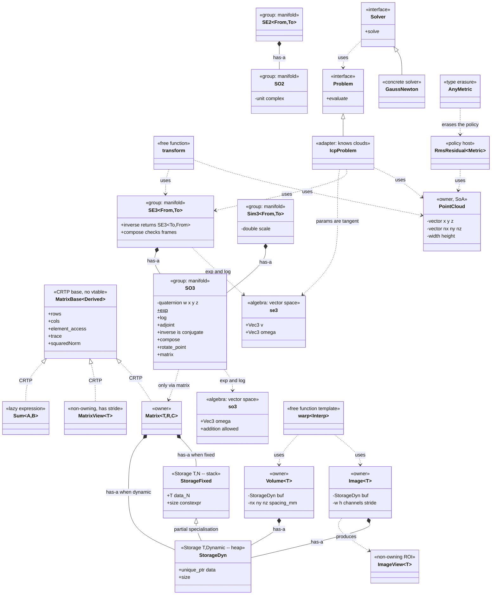

# Designing a Geometry & Imaging Library in C++

How Eigen, OpenCV and PCL are actually put together, and why. This note is about
**architecture**, not algorithms: which things deserve to be a class, where their
bytes live, what is a template parameter and what is a runtime value, when
inheritance is the right tool and when it is a mistake, and how an algorithm or a
solver plugs in without the container ever knowing it exists.

**This is a design note, not a library.** The code below is illustrative — the
smallest fragment that makes a decision concrete — and deliberately skips error
handling, SIMD and the hundred details a real implementation needs. What matters
is the reasoning: *why* a `Matrix3d` goes on the stack and an image on the heap,
*why* a rotation is never inverted with a matrix inverse but an image warp always
is, *when* a quaternion beats a matrix, and *who* is allowed to know about whom.

**How to read the code.** Every snippet is the *smallest sketch that makes one
decision visible* — signatures, member layout, and the one line that matters.
Constructors, error handling and `const` overloads are elided; where a body is
`/* ... */` it is because the body is not the point. Nothing here is meant to be
copied into a project.

**If you would rather see it used first, jump to [§22](#22-worked-examples-what-the-calls-actually-look-like)**
— two pipelines, 2-D and 3-D, written purely as call sequences with an allocation
count in the margin. Then come back for the reasons.

A version that does compile lives in
[`src/geometry_library_design/`](../src/geometry_library_design/) if you want to
poke at the mechanics — but read this for the decisions, not that for the code.

The inspiration is Eigen, OpenCV, PCL, Sophus/manif and Ceres: none of them is
being reimplemented here, and all of them made these same calls.

- [1. The three libraries, and what each one got right](#1-the-three-libraries-and-what-each-one-got-right)
- [2. The type razor: what earns a type](#2-the-type-razor-what-earns-a-type)
- [3. Storage: stack or heap, and who decides](#3-storage-stack-or-heap-and-who-decides)
- [4. The three-way split: owner, view, expression](#4-the-three-way-split-owner-view-expression)
- [5. Ownership: `unique_ptr`, `shared_ptr`, raw, view](#5-ownership-unique_ptr-shared_ptr-raw-view)
- [6. Templates: what to parameterise on, and what not to](#6-templates-what-to-parameterise-on-and-what-not-to)
- [7. Inheritance: CRTP, virtual, and type erasure](#7-inheritance-crtp-virtual-and-type-erasure)
- [8. Rotations: matrix, quaternion, angle-axis, Euler](#8-rotations-matrix-quaternion-angle-axis-euler)
- [9. Lie groups and Lie algebras: two types, not one](#9-lie-groups-and-lie-algebras-two-types-not-one)
- [10. Inversion: when to transpose, and when to genuinely invert](#10-inversion-when-to-transpose-and-when-to-genuinely-invert)
- [11. Putting frames in the type system](#11-putting-frames-in-the-type-system)
- [12. The class map: hierarchy, composition, dependency](#12-the-class-map-hierarchy-composition-dependency)
- [13. Images and volumes](#13-images-and-volumes)
- [14. Applying a transform to an image: why warping *does* invert](#14-applying-a-transform-to-an-image-why-warping-does-invert)
- [15. Point clouds: AoS vs SoA](#15-point-clouds-aos-vs-soa)
- [16. Rotating fast, without copying](#16-rotating-fast-without-copying)
- [17. Algorithms and extensibility: plugging in a solver](#17-algorithms-and-extensibility-plugging-in-a-solver)
- [18. Decision tables: which representation, when](#18-decision-tables-which-representation-when)
- [19. Files, headers and build structure](#19-files-headers-and-build-structure)
- [20. Modern C++: what the language now does for you](#20-modern-c-what-the-language-now-does-for-you)
- [21. Specification of a good design](#21-specification-of-a-good-design)
- [22. Worked examples: what the calls actually look like](#22-worked-examples-what-the-calls-actually-look-like)
- [23. Anti-patterns: the mistakes people actually make](#23-anti-patterns-the-mistakes-people-actually-make)
- [24. Do / Don't](#24-do--dont)
- [25. The whole picture](#25-the-whole-picture)

---

## 1. The three libraries, and what each one got right

| | core abstraction | storage decision | polymorphism | the thing it got right |
|---|---|---|---|---|
| **Eigen** | `Matrix<Scalar, Rows, Cols>` | **compile-time**: `Rows`/`Cols` known ⇒ stack | CRTP (`MatrixBase<Derived>`), zero virtual | fixed-size types cost nothing; `a+b+c` allocates nothing |
| **OpenCV** | `cv::Mat` | **runtime**: always heap, refcounted | virtual only at the algorithm boundary | header/data split — a ROI is a header, not a copy |
| **PCL** | `PointCloud<PointT>` | heap `std::vector`, aligned | templates on point type | the point type is a parameter, so xyz / xyzrgb / xyzinormal share every algorithm |

They disagree because they solve different problems. Eigen knows a rotation is
3×3 at compile time; OpenCV cannot know an image's size until a file is opened;
PCL needs one `PointCloud` to serve a dozen different field layouts. **The size
of your objects, and whether you know it at compile time, drives almost every
other decision in the design.**

---

## 2. The type razor: what earns a type

Before writing any class, apply the razor:

> **A new type is justified when it removes a class of bug that a comment cannot.**

Everything else is noise. Concretely:

| Candidate | Type? | Why |
|---|---|---|
| `Matrix3d` vs `MatrixXd` | ✅ separate | different storage, different cost model, different API guarantees |
| `SO3` vs `Matrix3d` | ✅ separate | a rotation is a *manifold element*, not 9 numbers. Typing it as a matrix makes `R1 + R2` compile |
| `SE3<World,Camera>` vs `SE3` | ✅ separate | the frame bug is the #1 cause of silent geometric errors; the compiler can catch it for free |
| `Sim3` vs `SE3` | ✅ separate | a similarity has scale; assigning one to the other must not compile |
| `Point3d` vs `Vector3d` | ⚠️ maybe | a point transforms with translation, a direction does not. Worth it in a big codebase, over-engineering in a small one |
| `Image` vs `Matrix<uint8_t>` | ✅ separate | an image has channels, padding, a colour space, and a stride that is *not* its width |
| `RowVector3d` vs `Vector3d` | ✅ (Eigen does) | catches dimension mismatches at compile time |
| `Millimetres` vs `double` | ⚠️ context | in a surgical stack, arguably yes; a units library is a real dependency though |

### The classic failure: a rotation typed as a matrix

```cpp
// BAD -- compiles, runs, produces garbage
Eigen::Matrix3d R_avg = 0.5 * (R1 + R2);   // not a rotation; det != 1, R^T R != I
```

```cpp
// GOOD -- does not compile, because SO3 has no operator+
SO3 R_avg = R1.slerp(0.5, R2);             // the only meaningful "average" on the manifold
```

The type razor is not about elegance. It is about which mistakes the compiler is
allowed to make on your behalf.

---

## 3. Storage: stack or heap, and who decides

This is the first and most consequential decision, and it is decided by **whether
the extent is known at compile time.**

```
              extent known at compile time?
                       │
        ┌──────────────┴──────────────┐
       yes                            no
        │                             │
   Matrix<double,3,3>            Matrix<double,Dynamic,Dynamic>
   Storage = T data[9]           Storage = unique_ptr<T[]> + size
   • no allocation               • one allocation
   • no indirection              • one pointer chase per access
   • sizeof == the data          • sizeof == 24 bytes, data elsewhere
   • copy = memcpy, trivial      • copy = allocate + copy (deep)
   • lives in a register/cache   • lives wherever malloc put it
```

The whole mechanism is one partial specialisation:

```cpp
inline constexpr int Dynamic = -1;

template <class T, int N>          // fixed: the elements ARE the object
struct Storage { alignas(16) T data[N] {}; };

template <class T>                 // dynamic: one heap block, RAII-owned
struct Storage<T, Dynamic> { std::unique_ptr<T[]> data; int n = 0; };
```

(The dynamic one needs a deep copy constructor and copy-and-swap assignment; the
fixed one needs nothing — the compiler's defaults are already correct.)

`Matrix` then picks a specialisation without any `if`:

```cpp
template <class T, int R, int C>
class Matrix : public MatrixBase<Matrix<T,R,C>> {
  static constexpr bool dyn = (R == Dynamic || C == Dynamic);
  Storage<T, dyn ? Dynamic : R*C> s_;
  int r_ = (R == Dynamic ? 0 : R), c_ = (C == Dynamic ? 0 : C);
  // ...
};
```

Measured on the companion demo:

```
sizeof(Matrix<double,3,3>) = 96 bytes   payload 9*8=72, rest is alignas(16) padding + 2 ints
sizeof(Matrix<double,D,D>) = 24 bytes   ptr + size + 2 ints; data on the heap
```

### Why this matters more than it looks

A `Matrix3d` inside a loop over a million points is constructed a million times.
On the stack that is a stack-pointer adjustment — effectively free, and the
optimiser can often keep it in registers and elide it entirely. On the heap it is
a million `malloc`/`free` pairs, each hundreds of cycles, each a chance to
fragment, each a **lock** in a multithreaded pipeline. That is the entire
argument for fixed-size types, and it is why Eigen makes `Matrix3d` and
`MatrixXd` the same template rather than different classes: you want to write one
algorithm and instantiate it either way.

### The threshold, and the escape hatch

Fixed-size means *stack*, and the stack is small (typically 8 MB, and far less
per thread in a real-time system). Eigen refuses to stack-allocate above
`EIGEN_STACK_ALLOCATION_LIMIT` (128 KB by default) and there is a real limit to
how big a fixed-size type should get. Rules of thumb:

| size | choice |
|---|---|
| ≤ 4×4, or any small fixed geometric object | fixed size, stack. Always. |
| bounded but not tiny (say ≤ 32 elements) | fixed size with a compile-time max, or small-buffer optimisation |
| unbounded, or runtime-determined | dynamic, heap |
| huge and hot (images, clouds, volumes) | dynamic + **preallocate once, reuse forever** |

**Small-buffer optimisation** is the hybrid: store inline up to N elements, spill
to the heap beyond. `Eigen::Matrix<double,Dynamic,Dynamic,0,4,4>` does exactly
this — dynamic interface, no allocation while it fits in 4×4. Worth it for
types like "a Jacobian block whose size depends on the residual, but is almost
always ≤ 6".

### The real-time rule

> **No allocation in the hot loop.** Ever.

Not because allocation is slow on average, but because its worst case is
unbounded and it can block. In a 30 Hz surgical or 1 kHz control loop, allocate
during setup, size everything to the worst case, and reuse. `Eigen::Ref<>` and
non-owning views (§4) exist so that a function can accept a preallocated buffer
without copying it.

---

## 4. The three-way split: owner, view, expression

The mistake beginners make is thinking `Matrix` is one concept. It is three, and
they must be different types:

```
┌──────────────────────────────────────────────────────────────────────┐
│  OWNER              Matrix<T,R,C>       has storage, frees it        │
│                     Image<T>            copy = deep copy             │
│                     PointCloud                                       │
├──────────────────────────────────────────────────────────────────────┤
│  VIEW               MatrixView<T>       points at someone else's     │
│  (non-owning)       ImageView<T>        bytes; copy = copy a header  │
│                     Eigen::Map/Block    lifetime is YOUR problem     │
│                     cv::Mat ROI                                      │
├──────────────────────────────────────────────────────────────────────┤
│  EXPRESSION         Sum<A,B>            owns nothing, computes       │
│  (lazy)             Scaled<A,S>         on demand, dies at the       │
│                     Eigen's a+b*c       end of the full expression   │
└──────────────────────────────────────────────────────────────────────┘
```

All three satisfy the same interface (`rows()`, `cols()`, `operator()(i,j)`), so
every algorithm written against that interface works with all three. That is what
CRTP is for (§7).

### Views: why a stride is not a width

```cpp
template <class T>
class MatrixView : public MatrixBase<MatrixView<T>> {
  T* p_; int r_, c_; std::size_t stride_;   // stride: elements between columns
public:
  T& operator()(int i, int j) const { return p_[std::size_t(j) * stride_ + i]; }
  MatrixView block(int i0, int j0, int nr, int nc) const {
    return MatrixView(&(*this)(i0, j0), nr, nc, stride_);   // a block of a view is a view
  }
};
```

The stride being separate from the width is the entire reason a sub-region can be
addressed without copying. `cv::Mat::step`, `Eigen::Block`'s outer stride and an
image ROI are all this one idea. Get it wrong — assume `stride == width` — and
every ROI in the codebase silently reads the wrong pixels.

### Expressions: why `a + b + c` allocates nothing

A naive `operator+` returning `Matrix` creates a temporary per operation: for
`a+b+c` that is two full matrices, two allocations, and three passes over memory.
Expression templates replace them with a type that computes elements on demand:

```cpp
template <class A, class B>
struct Sum : MatrixBase<Sum<A,B>> {
  const A& a; const B& b;                              // references, not copies
  auto operator()(int i, int j) const { return a(i,j) + b(i,j); }
};

template <class A, class B>
Sum<A,B> operator+(const MatrixBase<A>& a, const MatrixBase<B>& b) { return {a.self(), b.self()}; }
```

`a + b + 2.0*a` has type `Sum<Sum<M,M>, Scaled<M,double>>`. Nothing is computed
until it is assigned into a `Matrix`, and then it is **one fused loop, one
allocation, one pass**.

> ⚠️ **The classic expression-template trap.** Because `Sum` holds references,
> `auto x = a + b;` stores an expression, not a result. If `a` or `b` dies, `x`
> dangles. This is the well-known "don't use `auto` with Eigen expressions" rule.
> Either write the concrete type, or call `.eval()`.

---

## 5. Ownership: `unique_ptr`, `shared_ptr`, raw, view

Ownership is a **design statement**, not a convenience. Pick the weakest tool that
expresses the truth.

| what you mean | use | cost |
|---|---|---|
| "this object owns the bytes, exactly one owner" | `std::unique_ptr<T[]>` member | zero over a raw pointer |
| "I am looking at someone else's bytes" | a **view** (`std::span`, or your own) | zero |
| "several consumers, and nobody knows who dies last" | `std::shared_ptr<const T>` | atomic refcount on every copy |
| "a non-owning back-pointer that may dangle" | `std::weak_ptr`, or redesign | usually redesign |
| "an owner, but the size is fixed" | a plain array member | zero, no heap at all |

### The mistake: reaching for `shared_ptr` by default

```cpp
// ✗ BAD -- "it's safer" is the wrong reason
class Image { std::shared_ptr<uint8_t[]> data_; };
```

Three problems, in order of severity:

1. **It hides a lifetime bug instead of fixing one.** If you cannot say who owns a
   frame buffer, the design is unclear, and `shared_ptr` makes the unclarity
   permanent rather than surfacing it at review time.
2. **Every copy is an atomic increment.** On a 60 fps path with a few copies per
   frame that is measurable, and atomics do not vectorise or reorder freely.
3. **Copies become aliases.** `Image b = a;` silently shares pixels. Now a write
   through `b` changes `a`, which is exactly the bug `cv::Mat` is famous for.

```cpp
// ✓ GOOD -- one owner, and copies are copies
class Image { std::unique_ptr<uint8_t[]> data_; };
```

`shared_ptr` earns its place when a decoded frame is genuinely fanned out to
several consumers with independent lifetimes — and then prefer
`std::shared_ptr<const Frame>`, so sharing implies immutability and the aliasing
question disappears.

> **`cv::Mat` is refcounted and OpenCV is a good library — so is this wrong?**
> No: OpenCV made a deliberate trade for a C-era API where returning big buffers
> by value was expensive, and it pays for it with the single most common OpenCV
> bug (`Mat b = a;` aliases; you needed `a.clone()`). With move semantics since
> C++11, returning a `unique_ptr`-backed owner by value is free, so the trade no
> longer pays. **Know why the library you are imitating chose what it chose.**

### Rule of zero, and when you fall back to five

```cpp
// ✓ RULE OF ZERO -- write none of the five. This is the goal.
class Image {
  std::unique_ptr<uint8_t[]> data_;    // ...but this makes copying DELETED
  int w_, h_;
};
```

`unique_ptr` is move-only, so the compiler deletes the copy operations and `Image`
becomes move-only too. For a frame buffer that is often exactly right. If you
genuinely want a deep copy, you have to write it — and then the rule of five says
write **all** of them (or `= default` them):

```cpp
class Image {
public:
  Image(const Image&);                     // deep copy: the only one with real work
  Image& operator=(Image o) noexcept { swap(o); return *this; }  // copy-and-swap
  Image(Image&&) noexcept = default;       // unique_ptr moves itself
  ~Image() = default;                      // unique_ptr frees
  void swap(Image&) noexcept;
};
```

Three things to be able to say about that:

- **`operator=(Image o)` by value *is* copy-and-swap.** One function covers both
  copy- and move-assignment, it is self-assignment-safe for free, and it gives the
  strong exception guarantee.
- **Only the copy constructor does work.** Everything else is `= default` because
  `unique_ptr` already does the right thing. That is the rule of zero leaking back
  in, which is what you want.
- **`noexcept` on move and swap is not decoration.** `std::vector` will *copy*
  instead of move when growing if the move constructor is not `noexcept`.

### Never a raw owning pointer

```cpp
uint8_t* data_ = new uint8_t[n];    // ✗ who deletes it? on which path? after which throw?
```

Raw pointers are for **non-owning** references only, and even there a view type
that carries the extent alongside is better. If a raw `new` appears outside a
`unique_ptr`/`make_unique` in this design, it is a bug waiting for an exception.

---

## 6. Templates: what to parameterise on, and what not to

Template parameters are compile-time; constructor arguments are runtime. Choosing
wrongly is expensive in both directions — over-templating explodes compile times
and binary size, under-templating forces runtime branches into the hot loop.

| Parameterise at **compile time** | Keep at **runtime** |
|---|---|
| scalar type (`float`/`double`/`int16_t`) | matrix dimensions, when they come from a file or a sensor |
| fixed extents (3, 4, 6) | image width/height |
| storage order (row/col major) | number of points in a cloud |
| a metric or cost **policy** (§14) | which file to load |
| the point type in a cloud (`PointXYZ` vs `PointXYZRGB`) | thresholds, iteration counts |

Rules that keep this sane:

- **Template on the scalar, always.** `float` for images and GPU paths, `double`
  for geometry and accumulators. Hardcoding `double` in an image type wastes half
  your memory bandwidth; hardcoding `float` in a pose chain costs accuracy.
- **Do not template on things that only change behaviour, not layout.** A
  "verbose" flag or an iteration count is a runtime argument.
- **Put the heavy code in a non-template base or a `.cpp`.** If only the element
  type varies, a templated thin wrapper over a type-erased implementation keeps
  compile times down. OpenCV does this: `cv::Mat` is not a template; `cv::Mat_<T>`
  is a typed veneer over it.
- **Prefer `int` extents with a `Dynamic` sentinel over two separate class
  templates.** One code path, one set of algorithms.

---

## 7. Inheritance: CRTP, virtual, and type erasure

This is where most designs go wrong. There are three kinds of polymorphism and
they belong in three different places.

### 7.1 CRTP — for the value types. No vtable, ever.

```cpp
template <class Derived>
struct MatrixBase {
  const Derived& self() const { return static_cast<const Derived&>(*this); }

  auto trace() const {                     // written once, works for Matrix, View, Sum, ...
    using S = std::decay_t<decltype(self()(0,0))>;
    S acc {};
    for (int i = 0; i < self().rows(); ++i) acc += self()(i, i);
    return acc;
  }
};

class Matrix : public MatrixBase<Matrix> { /* ... */ };
class MatrixView : public MatrixBase<MatrixView> { /* ... */ };
```

Shared behaviour, resolved at compile time, fully inlinable. Why **not** virtual
here:

- A vtable pointer in `Matrix3d` makes it 104 bytes instead of 96, and no longer
  trivially copyable — memcpy optimisations and `constexpr` use both disappear.
- `operator()(i,j)` would be an indirect call **per element**. On a million-point
  cloud that is a million unpredictable branches the optimiser cannot see through.
- Value semantics break: slicing on copy, and `Matrix3d a = b;` stops meaning
  what it says.

> **Rule: no virtual functions in anything you will hold by value in a loop.**

### 7.2 Virtual — at the plugin boundary, and only there

Virtual dispatch is right exactly when the choice is genuinely a **runtime** one
that the caller does not know, and the call is **coarse-grained** enough that one
indirect call is irrelevant:

```cpp
class Solver {                                    // called once per optimisation, not per point
public:
  virtual ~Solver() = default;
  virtual bool solve(const Problem&, Solution&) = 0;
};
class LevenbergMarquardt : public Solver { /* ... */ };
class DoglegSolver      : public Solver { /* ... */ };

std::unique_ptr<Solver> make_solver(const Config& c);   // chosen from a config file at startup
```

One virtual call per `solve()` costs nothing next to the thousands of iterations
inside it. One virtual call per pixel is a catastrophe. **The frequency of the
call decides the mechanism.**

### 7.3 Type erasure — when you need runtime flexibility with value semantics

This is the middle ground people forget, and it is what `std::function`,
`cv::Mat`'s internal data handling, and `std::any` all are. You hide a template
behind a non-template interface *without* forcing the caller into pointers and
inheritance:

```cpp
class AnyMetric {                       // a VALUE that holds any metric
  struct Concept {
    virtual ~Concept() = default;
    virtual double residual(const Vec3&, const Vec3&, const Vec3&) const = 0;
  };
  template <class M> struct Model : Concept { M m; /* forwards each call to m */ };
  std::unique_ptr<Concept> p_;
public:
  template <class M> AnyMetric(M m) : p_(std::make_unique<Model<M>>(std::move(m))) {}
  double residual(const Vec3& a, const Vec3& b, const Vec3& n) const {
    return p_->residual(a, b, n);
  }
};

AnyMetric metric = PointToPlane{};      // PointToPlane inherits from nothing
std::vector<AnyMetric> metrics;         // ...yet they can live in one container
```

`PointToPlane` does not inherit from anything and does not know `AnyMetric`
exists. Use this when you need to store heterogeneous strategies in a container,
cross an ABI boundary, or expose a stable C++ API from a shared library — and
accept the heap allocation and indirect call that come with it.

### Choosing, in one table

| you need | use | cost |
|---|---|---|
| shared code across `Matrix`/`View`/`Sum` | **CRTP** | zero |
| a metric/kernel chosen at compile time | **policy template parameter** | zero |
| a solver chosen from a config file | **virtual interface** | one indirect call per solve |
| heterogeneous strategies in a `vector`, or a stable ABI | **type erasure** | allocation + indirect call |
| a compile-time interface contract | **concepts** (C++20) | zero, plus readable errors |

---

## 8. Rotations: matrix, quaternion, angle-axis, Euler

Four representations of the same thing, with genuinely different trade-offs. The
library should **store one** and convert on demand.

| | numbers | compose | rotate a point | interpolate | singularities | renormalise |
|---|---|---|---|---|---|---|
| **3×3 matrix** | 9 (6 redundant) | 27 mul | 9 mul — fastest | ✗ (needs SVD) | none | 6 constraints, drifts |
| **unit quaternion** | 4 (1 redundant) | 16 mul — cheapest | ~30 mul | ✓ slerp, trivially | none, but double cover ±q | 1 constraint, `normalize()` |
| **angle-axis / rotation vector** | 3 (minimal) | ✗ (must convert) | ✗ | ✓ | at θ = 0 and θ = 2π | none — it *is* the manifold |
| **Euler angles** | 3 | ✗ | ✗ | ✗ (gimbal) | **gimbal lock** | none |

### What to store, and why

> **Store a unit quaternion. Convert to a matrix only when something demands 3×3.**

- **4 doubles instead of 9** — a pose chain is 30 % smaller, which matters when
  you hold a hundred thousand of them.
- **Composition is 16 multiplies instead of 27.**
- **One normalisation constraint instead of six.** A quaternion is dragged back
  onto the manifold by a single `normalize()`; a matrix needs SVD or Gram-Schmidt.
- **Interpolation is slerp, one line.** With matrices you cannot interpolate at
  all without decomposing first.

Use **angle-axis / rotation vector** (`so(3)`, the Lie algebra) as the
**increment**, never as the stored state:

```cpp
SO3 R_new = SO3::exp(omega) * R_old;   // omega is a 3-vector: the update
```

This is the retraction that every modern optimiser uses. The state stays on the
manifold; the *increment* is minimal and unconstrained, which is exactly what a
least-squares solver needs (3 unknowns, not 9 with 6 constraints).

Use **Euler angles** only at a human interface — a config file, a GUI, a printed
report. Never internally. Gimbal lock is not a corner case; it is a coordinate
singularity that will find you.

### Storing it

```cpp
class SO3 {
  double w_ = 1, x_ = 0, y_ = 0, z_ = 0;      // 4 doubles, invariant: unit norm

public:
  void normalize() { /* divide by norm -- call after every update */ }

  static SO3 exp(const Vec3& w);              // so(3) -> SO(3), the retraction
  SO3 inverse() const { return SO3(w_, -x_, -y_, -z_); }   // conjugate. That's it.
  SO3 operator*(const SO3& o) const;          // Hamilton product
  Vec3 operator*(const Vec3& v) const;        // rotate a point, no matrix formed
  Matrix3d matrix() const;                    // only when someone insists
};
```

> ⚠️ **Hamilton vs JPL.** There are two quaternion conventions and they compose in
> opposite orders. Eigen, ROS and Sophus use Hamilton; some aerospace and older
> vision code uses JPL. Mixing them gives you a transposed rotation that still
> passes every orthonormality check. Write the convention in a comment at the top
> of the class and never assume it again.

### The 2-D case: `SO2` is the same design, one dimension down

```cpp
class SO2 {
  double c_ = 1, s_ = 0;                    // unit complex (cos θ, sin θ) -- NOT a bare angle
public:
  void normalize() { const double n = std::hypot(c_, s_); c_ /= n; s_ /= n; }
  SO2 inverse() const { return SO2{c_, -s_}; }                       // conjugate again
  SO2 operator*(const SO2& o) const {                                // complex multiply
    return SO2{c_*o.c_ - s_*o.s_, c_*o.s_ + s_*o.c_};
  }
  double angle() const { return std::atan2(s_, c_); }                // for output only
};
```

Store the **pair**, not the angle, for exactly the reasons you store a quaternion
in 3-D: composition is a multiply with no trig, and there is no ±π wraparound to
special-case when comparing or averaging. `SE2` is then `SO2 + Vec2`, 3 DOF, and
its inverse is the same `(Rᵀ, −Rᵀt)` formula.

One difference that matters: **2-D rotations commute, 3-D ones do not.** Most of
the 2-D intuition that misleads people in 3-D — including the belief that
rotations can be added or averaged componentwise — comes from this.

> ⚠️ **Double cover.** `q` and `-q` are the same rotation. Comparing quaternions
> for equality, or averaging them naively, breaks on this. Canonicalise (force
> `w >= 0`) if you ever compare or interpolate.

---

## 9. Lie groups and Lie algebras: two types, not one

Every pose type comes in a **pair**, and conflating them is the deepest modelling
error in this whole design. The pair is what makes optimisation possible at all.

```
        GROUP  (the manifold)                    ALGEBRA  (the tangent space)
        curved, no addition                      flat vector space, addition fine
   ┌──────────────────────────────┐        ┌──────────────────────────────────┐
   │  SO2   1 DOF   unit complex  │        │  so2   1 number   ω              │
   │  SO3   3 DOF   quaternion    │        │  so3   3-vector   ω              │
   │  SE2   3 DOF   SO2 + Vec2    │        │  se2   3-vector   (v, ω)         │
   │  SE3   6 DOF   SO3 + Vec3    │        │  se3   6-vector   (v, ω)         │
   │  Sim3  7 DOF   SO3+Vec3+s    │        │  sim3  7-vector   (v, ω, σ)      │
   └──────────────┬───────────────┘        └──────────────┬───────────────────┘
                  │                                       │
                  │   log()   ────────────────────────►   │
                  │   ◄────────────────────────  exp()    │
                  │                                       │
    ✗ X + Y  is meaningless                 ✓ ξ₁ + ξ₂  is fine
    ✓ X * Y  compose                        ✓ α·ξ      is fine
    ✓ X.inverse()                           ✗ ξ₁ * ξ₂  is meaningless
    ✗ no zero element, a "0 pose"           ✓ zero vector exists
      is the identity, not a number
```

### Why both must be types, and why the algebra is not `Vec3`

Apply the type razor (§2). A `so3` element and a `Vec3` point are both three
doubles, so a lazy design makes them the same type — and then this compiles:

```cpp
Vec3 p = cloud.point(0);
SO3  R = SO3::exp(p);        // ✗ a POSITION reinterpreted as a rotation. Silent nonsense.
```

The tangent vector is a *rotational velocity × time*, in radians; the point is a
position, in millimetres. Different units, different meaning, and the compiler
should say so:

```cpp
struct so3 { Vec3 w; };      // radians. Not a position.
struct se3 { Vec3 v, w; };   // millimetres and radians, in that order (a convention -- write it down)
```

The cost is zero at runtime and the payoff is that `exp` and `log` become the
*only* bridge between the two worlds, which is exactly what you want them to be.

### The three operations that make the pair useful

```cpp
class SO3 {                                   // the group
public:
  static SO3 exp(const so3& w);               // algebra -> group  (retraction)
  so3        log() const;                     // group -> algebra  (local coordinates)
  Matrix3d   adjoint() const;                 // move a tangent vector between frames
};
```

- **`exp`** is how an increment becomes a pose. This is the *only* correct way to
  update a pose during optimisation.
- **`log`** is how a difference between poses becomes a vector you can measure.
  `(X⁻¹ · Y).log()` is the pose error — six numbers you can put in a residual.
  Subtracting two poses componentwise is not that, and is not anything.
- **`Adj`** answers "I have a tangent vector expressed in frame A, what is it in
  frame B", which is what you need to move a covariance between frames:
  `Σ_B = Adj · Σ_A · Adjᵀ`.

### What this buys the optimiser

An unconstrained solver wants **n unknowns with no constraints**. A rotation as a
matrix is 9 unknowns with 6 constraints; the solver has no idea about the
constraints and will happily walk off the manifold. The Lie algebra is the fix:

```cpp
// The state stays on the manifold. The INCREMENT is a plain unconstrained vector.
X ← X * SO3::exp(δ)          //  δ ∈ ℝ³, the solver's actual unknown
```

3 unknowns, 0 constraints, no re-orthonormalisation ever needed, and the
derivative is well-defined. This is the "local parameterisation" / "manifold" /
"retraction" that Ceres, GTSAM, Sophus and manif all implement, and it is why §10
can say *never re-orthonormalise inside an optimiser* — the question does not
arise, because the state never leaves the manifold in the first place.

> **Left vs right.** `exp(δ) * X` and `X * exp(δ)` are both valid updates and give
> **different Jacobians**. Pick one — right/local is the common choice — and write
> it in the header. A codebase that mixes them has Jacobians that are wrong by an
> adjoint, and the symptom is an optimiser that converges slowly rather than one
> that fails, which is far harder to notice.

### `hat` and `vee`: the matrix face of the algebra

The algebra also has a matrix representation, used when deriving Jacobians:

```cpp
Matrix3d hat(const so3& w);   // 3-vector  -> skew-symmetric 3x3
so3      vee(const Matrix3d&);// skew-symmetric 3x3 -> 3-vector
```

Keep these as **free functions**, not members. They are a change of
representation, not behaviour of the type, and making them free means the
6-vector `se3` version can live next to them without `so3` knowing about it.

### Storage

Both sides are tiny and both live on the stack, always:

| type | doubles | note |
|---|---|---|
| `so3` / `se3` / `sim3` | 3 / 6 / 7 | plain vector, no invariant to maintain |
| `SO3` / `SE3` / `Sim3` | 4 / 7 / 8 | unit-norm invariant, `normalize()` after updates |

Heap-allocating any of these is a bug, and `std::vector<SE3>` of a trajectory is
one contiguous block of 56-byte objects — perfectly cache-friendly, no indirection.

---

## 10. Inversion: when to transpose, and when to genuinely invert

This is the single best worked example of "let the type know its own structure".

### Bad: a general inverse

```cpp
Eigen::Matrix4d T_inv = T.inverse();     // BAD on a pose
```

Three separate problems:

1. **It is 6× slower.** Measured, Eigen 3.4, `-O2 -march=native`:
   | | ns/call |
   |---|---|
   | `Matrix4d::inverse()` (general cofactor) | 9.28 |
   | `Isometry3d::inverse()` (structured) | 1.70 |
   | hand-written `R^T, -R^T t` | 1.47 |

   (The folklore figure of "10×" comes from LU/QR on larger matrices. For 4×4
   Eigen has a vectorised cofactor path, so the honest number is ~6×.)

2. **It ignores information you already have.** You *know* the top-left block is
   orthonormal. The general inverse computes determinants and cofactors to
   rediscover that, numerically, from scratch.

3. **The API lets you lose it silently.** `Eigen::Affine3d` and
   `Eigen::Isometry3d` hold the same 4×4 bits — but `Affine3d::inverse()` takes
   the general path. Choosing the wrong `Mode` tag costs you 6× and you will
   never see it.

### Good: exploit the structure

For a rotation, the inverse **is** the transpose, because `R⁻¹ = Rᵀ` for
orthonormal `R`:

```cpp
SO3 SO3::inverse() const { return SO3(w_, -x_, -y_, -z_); }   // quaternion conjugate: 3 sign flips
```

For a rigid transform, `T = [R t; 0 1]` gives `T⁻¹ = [Rᵀ  −Rᵀt; 0 1]`:

```cpp
template <class From, class To>
SE3<To, From> SE3<From, To>::inverse() const {
  const SO3 Ri = R_.inverse();
  return SE3<To, From>(Ri, Ri * t_ * -1.0);     // note: the frames swap in the return type
}
```

Derivation, so it is never guessed: `T` maps `p ↦ Rp + t`. Solving
`q = Rp + t` for `p` gives `p = Rᵀq − Rᵀt`. That is `[Rᵀ | −Rᵀt]`. There is no
determinant, no division, and no way for the result to leave the manifold.

For a **similarity** — which is what monocular SfM actually produces —
`S: p ↦ sRp + t`, so `S⁻¹: q ↦ (1/s)Rᵀq − (1/s)Rᵀt`:

```cpp
Sim3<To, From> inverse() const {
  const SO3 Ri = R_.inverse();
  return Sim3<To, From>(Ri, Ri * t_ * (-1.0 / s_), 1.0 / s_);
}
```

> **This is why `Sim3` must be its own type.** If a monocular pose is typed as
> `SE3`, applying the rigid inverse formula silently drops the scale, and the
> error is a clean multiplicative bias that looks exactly like reconstruction
> noise.

### And the drift argument, measured

The usual advice is "re-orthonormalise periodically or the chain drifts". Chain of
small rotations, error at a 60 mm lever arm:

| compositions | `float` matrix | `double` matrix | quaternion + normalise |
|---|---|---|---|
| 10³ | 0.00003 mm | 6e-13 mm | 4e-15 mm |
| 2.16×10⁵ | 0.0027 mm | 1e-10 mm | 9e-15 mm |
| 10⁷ | 0.1125 mm | 6e-09 mm | 3e-14 mm |

In `double`, ten million compositions drift by six picometres. **Re-orthonormalising
a double-precision chain on a schedule is cargo cult.** The quaternion's
`normalize()` costs one square root and keeps you at machine epsilon regardless,
which is a better reason to store quaternions than drift ever was.

### What *does* break: reflections

```cpp
Matrix3d M = R; M.col(0) *= -1;              // an LPS <-> RAS axis flip
// ||M^T M - I|| = 3e-16   <- PERFECTLY orthonormal. Every usual check passes.
// det(M)        = -1      <- but it is a mirror, not a rotation
```

That is a 120 mm error at a 60 mm lever, and **SVD re-orthonormalisation preserves
it**: `U·Vᵀ` comes back with `det = −1` still. The Kabsch sign fix is mandatory:

```cpp
Eigen::JacobiSVD<Eigen::Matrix3d> svd(M, Eigen::ComputeFullU | Eigen::ComputeFullV);
Eigen::Vector3d d(1, 1, (svd.matrixU() * svd.matrixV().transpose()).determinant() < 0 ? -1.0 : 1.0);
Eigen::Matrix3d R = svd.matrixU() * d.asDiagonal() * svd.matrixV().transpose();
```

A design that stores quaternions cannot represent a reflection at all — the bug
becomes unrepresentable rather than merely detectable. **That is the strongest
argument for the type.**

### In an optimiser, do not re-orthonormalise at all

Projecting the state back onto SO(3) mid-iteration invalidates the Jacobian the
solver just computed. Use a local parameterisation: optimise an `se(3)` increment
and retract with `exp`. Ceres (`Manifold`), GTSAM and Sophus all do this.

---

## 11. Putting frames in the type system

The most expensive geometry bugs are not numerical, they are conventional: a
camera-to-world pose used as world-to-camera, a column-major file read as
row-major, an LPS mesh registered to an RAS volume. These produce plausible
numbers and no exception.

Tag types cost nothing at runtime and let the compiler check the chain:

```cpp
struct World {}; struct Camera {}; struct CT {};    // empty tags, zero size

template <class From, class To> class SE3 { /* ... */ };

SE3<World, Camera> T_world_cam = ...;
SE3<Camera, CT>    T_cam_ct    = ...;

auto T_world_ct = T_world_cam * T_cam_ct;   // ✅ SE3<World, CT> -- frames chain
auto bad        = T_world_cam * T_world_cam; // ❌ does not compile
```

The composition operator enforces it in its signature:

```cpp
template <class Next>
SE3<From, Next> operator*(const SE3<To, Next>& o) const;   // my To must be their From
```

If tag types are too heavy for your codebase, the cheap version is a **naming
discipline**: `T_world_cam`, never `pose`. The variable name carries the
convention and a wrong composition is visible in review. The type-level version is
strictly better because it is checked.

---

## 12. The class map: hierarchy, composition, dependency

Three different relations get confused with each other constantly, so read the
map with all three in mind:

- **is-a** (inheritance) — used almost nowhere here, and only as CRTP or at a
  plugin boundary;
- **has-a** (composition) — the workhorse: `SE3` *has* an `SO3`, `Image` *has* a
  `Storage`;
- **uses** (dependency) — an algorithm *uses* a container and a group, without
  either knowing it exists.

Most designs go wrong by reaching for the first when they needed the third.

### The full class map



If mermaid does not render for you, the same thing in one screen:

```
                  ╔══════════════════════════════════════════════════════════╗
   L3 ALGORITHMS  ║ transform()  warp<Interp>()  RmsResidual<Metric>         ║
   free functions ║ Problem ◄── IcpProblem      Solver ◄── GaussNewton       ║
   & policies     ║   (the ONLY place `is-a` inheritance is used at runtime) ║
                  ╚═══╤═══════════════════════════════════╤══════════════════╝
                      │ uses                              │ uses
        ┌─────────────▼───────────────┐   ┌───────────────▼──────────────────┐
   L2a  │ GEOMETRY                    │   │ CONTAINERS                   L2b │
        │                             │   │                                  │
        │   so3 ──exp──► SO3          │   │   MatrixBase<Derived>            │
        │       ◄─log───   │ has-a    │   │      ▲CRTP  ▲CRTP  ▲CRTP         │
        │   se3 ──exp──► SE3<F,T>     │   │   Matrix  View   Sum             │
        │       ◄─log───   │ has-a    │   │                                  │
        │                Sim3<F,T>    │   │   Image  Volume  PointCloud      │
        │   SO2 ──────►  SE2<F,T>     │   │   ImageView (non-owning)         │
        │                             │◄╳►│                                  │
        │  algebra = vector space     │ n │   owner / view / expression      │
        │  group   = manifold         │ e │                                  │
        │                             │ v │   ✗ no .transform() method       │
        │  ✗ knows no containers      │ e │   ✗ knows no SE3                 │
        └─────────────┬───────────────┘ r └───────────────┬──────────────────┘
                      │ has-a                             │ has-a
        ┌─────────────▼───────────────────────────────────▼──────────────────┐
   L1   │ CORE     Vec3   Storage<T,N> (stack) | Storage<T,Dynamic> (heap)   │
        │          MatrixBase<Derived>   scalar traits   hat()/vee()         │
        └────────────────────────────────────────────────────────────────────┘
```

### Reading the map

| relation | where it appears | why |
|---|---|---|
| `is-a`, **CRTP** | `Matrix`/`View`/`Sum` → `MatrixBase` | shared code, zero runtime cost, no vtable |
| `is-a`, **virtual** | `IcpProblem` → `Problem`, `GaussNewton` → `Solver` | runtime choice, one call per *batch* |
| `has-a` | `SE3` has `SO3` + `Vec3`; `Image` has `Storage` | the default. Composition, not inheritance |
| `uses` | every algorithm → containers + geometry | the dependency that makes it extensible |
| **partial specialisation** | `Storage<T,N>` vs `Storage<T,Dynamic>` | stack/heap chosen at compile time |
| `exp` / `log` | algebra ↔ group | the *only* bridge between the two |

Notice what is **not** on the map: no `Image` inheriting from `Matrix`, no
`SE3` inheriting from `Matrix4d`, no common `Object` base. Each is a tempting
shortcut and each is wrong:

```cpp
// ✗ BAD -- an image is not a matrix. It has channels, padding, a colour space,
//          and a stride that is not its width. Inheriting drags in operator+,
//          trace(), and a hundred operations that mean nothing on pixels.
class Image : public Matrix<uint8_t, Dynamic, Dynamic> { ... };

// ✗ BAD -- now R1 + R2 compiles, R * 2.0 compiles, and neither is a rotation.
class SO3 : public Matrix3d { ... };

// ✓ GOOD -- composition, and a named conversion where one is genuinely needed
class SO3 { double w_, x_, y_, z_;  public: Matrix3d matrix() const; };
```

The rule underneath: **inherit to share an interface you actually want callers to
use polymorphically; compose to reuse an implementation.** `SO3` wants to reuse
nothing from `Matrix3d` except at one explicit conversion point.

### The one rule that matters

> **`Image` has no `rotate()` method. `PointCloud` has no `transform()` method.
> `SE3` has no `apply_to_image()` method.**

All three are sideways dependencies between peer layers, and each is the mistake
that turns a library into a monolith. Instead:

```cpp
// ✗ BAD -- the container now depends on the geometry layer, and grows a method
//          for every transform anyone ever invents
cloud.transform(T);
img.warp_affine(T);

// ✓ GOOD -- L3 knows both; neither L2 type knows the other exists
transform(T, cloud_in, cloud_out);
warp_affine(T, img_in, img_out, Bilinear{});
```

What this buys, concretely:

| | with methods on the container | with free functions at L3 |
|---|---|---|
| adding a new transform type | edit + recompile `PointCloud`, and everything including it | add a new free function; nothing recompiles |
| using it on a **view** | needs another overload inside the class | works already — the function takes an interface |
| unit-testing the transform | needs a full `PointCloud` | needs the interface only |
| someone else's container | impossible | works if it satisfies the interface |
| `Image` in a project with no geometry | drags in `SE3` | zero coupling |

This is the open/closed principle achieved by **not** using inheritance. Eigen,
OpenCV and PCL all do it: `cv::warpAffine(src, dst, M, size)` is a free function,
not `src.warpAffine(M)`. `pcl::transformPointCloud(in, out, T)` is a free
function. That is not an accident of style.

### The narrow exception

A container may know about geometry when the geometry *is* metadata the container
cannot be correct without:

```cpp
template <class T>
class Volume {
  std::array<double,3> spacing_;      // mm/voxel  -- fine, it is intrinsic
  SE3<Patient, Voxel> voxel_to_patient_;   // debatable: convenient, but couples L2b to L2a
};
```

Spacing is intrinsic to a CT volume — without it the array is meaningless. The
full voxel→patient pose is a judgement call: carrying it makes resampling
correct-by-construction, at the cost of a dependency. A common compromise is to
store the raw numbers (origin + direction cosines) in the container and let L3
build the `SE3` from them.

---

## 13. Images and volumes

An image is a strided 2-D buffer of a templated pixel type. A volume is the same
object with one more stride. Neither is a matrix, because:

- it has **channels** (interleaved, usually);
- its **stride is not its width** (rows are padded up for SIMD alignment);
- it carries metadata a matrix has no business knowing — colour space, and for
  medical volumes, **voxel spacing in millimetres**.

```cpp
template <class T>
class Image {
  Storage<T, Dynamic> buf_;                 // heap: size is a runtime fact
  int w_, h_, c_;
  std::size_t stride_;                      // elements per ROW, >= w*c (padded)

public:
  T& operator()(int y, int x, int ch = 0) {
    return buf_.data[std::size_t(y) * stride_ + std::size_t(x) * c_ + ch];
    //          ^^^^^^^^^^^ size_t, not int -- see below
  }
};
```

Three details that are not pedantry:

1. **`std::size_t` on the row term.** `y * stride` in `int` overflows past
   ~2 gigapixels. A 4K×4K×3 buffer is 50 Mpx — fine — but a 16-bit volume or a
   stitched panorama is not, and the failure is a wild pointer, not an exception.
2. **Padding rows to an alignment boundary** lets SIMD loads start aligned on
   every row instead of only the first. `stride > w*channels` is normal, and any
   code that assumes otherwise is broken.
3. **Value-initialise the buffer** (`new T[n]()` / `make_unique<T[]>`). Garbage
   that *looks* like an image is the worst kind of bug.

The ROI is a view over the same bytes:

```cpp
template <class T>
struct ImageView { T* p; int w, h, c; std::size_t stride;
  T& operator()(int y, int x, int ch = 0) const {
    return p[std::size_t(y) * stride + std::size_t(x) * c + ch]; } };
```

This is exactly `cv::Mat`'s design: a lightweight header (dims, `step`, data
pointer) separate from the pixel block, so `img(cv::Rect(...))` is O(1).

### Volumes

```cpp
template <class T>
class Volume {
  Storage<T, Dynamic> s_;
  int nx_, ny_, nz_;
  std::array<double, 3> spacing_ {1, 1, 1};    // mm per voxel

public:
  T& operator()(int x, int y, int z) { return s_.ptr()[(std::size_t(z) * ny_ + y) * nx_ + x]; }
  std::array<double,3> spacing() const { return spacing_; }
};
```

**Carry the spacing in the type.** A CT volume without its `PixelSpacing` and
`ImagePositionPatient` is just an array of numbers; with them it is metric
geometry, and every millimetre downstream depends on it. See
[coordinate_frame_conventions](coordinate_frame_conventions.ipynb) for the
LPS/RAS side of this.

---

## 14. Applying a transform to an image: why warping *does* invert

Section 8 said never invert a pose with a general inverse. Image warping is the
case where you **deliberately compute and use the inverse** — and understanding
why is the clearest way to see what a transform actually means.

### Forward vs inverse mapping

```
 FORWARD  (wrong)                          INVERSE  (right)
 for each INPUT pixel p:                   for each OUTPUT pixel q:
     q = T * p                                 p = T⁻¹ * q
     dst[round(q)] = src[p]                    dst[q] = interpolate(src, p)

   ┌───┬───┬───┐                             ┌───┬───┬───┐
   │ ● │ ● │ ● │  scatter                    │ ● │ ● │ ● │  gather
   └───┴───┴───┘                             └───┴───┴───┘
         │                                         ▲
         ▼   lands between pixels                  │  reads between pixels
   ┌───┬───┬───┐                             ┌───┬───┬───┐
   │ ● │   │ ● │  ← HOLES where nothing      │ ● │ ● │ ● │  ← every output
   │   │ ● │   │    landed, COLLISIONS       │ ● │ ● │ ● │    written exactly
   └───┴───┴───┘    where two did            └───┴───┴───┘    once
```

Forward mapping leaves holes when the transform expands and collisions when it
contracts, and neither is fixable without a second pass. Inverse mapping writes
every output pixel exactly once and turns the problem into interpolation, which is
well understood. **Every real implementation — `cv::warpAffine`, ITK, every
GPU texture fetch — iterates over the output and uses `T⁻¹`.**

So `cv::warpAffine(src, dst, M, size)` applies `M` as a *forward* map by
internally inverting it, and `cv::WARP_INVERSE_MAP` says "I already gave you the
inverse, don't invert again". That flag exists precisely because the inversion is
unavoidable.

### It is still not a general inverse

A 2-D affine is `[A | b]` with `A` a general 2×2 — so here you *do* solve. But:

- invert it **once**, outside the loop, never per pixel;
- for the **rigid** part, `A⁻¹` is still `Rᵀ`;
- for a **similarity** (`sR`), it is `Rᵀ/s`;
- only a genuinely general affine (shear, non-uniform scale) needs `A⁻¹`, and a
  2×2 or 3×3 inverse is a closed-form expression, not a factorisation.

```cpp
// hoisted ONCE; the inner loop is 4 multiplies and 2 adds per pixel
const Affine2 Tinv = T.inverse();
for (int y = 0; y < dst.height(); ++y)
  for (int x = 0; x < dst.width(); ++x) {
    const auto p = Tinv * Point2{x + 0.5, y + 0.5};   // pixel CENTRES, see below
    dst(y, x) = sample(src, p);
  }
```

Better still, exploit that the map is affine: consecutive `x` differ by a constant
vector, so the whole inner loop becomes an increment.

```cpp
// incremental: 2 adds per pixel, no multiplies
auto p   = Tinv * Point2{0.5, y + 0.5};
const auto dp = Tinv.linear() * Point2{1.0, 0.0};      // constant per row
for (int x = 0; x < dst.width(); ++x, p += dp) dst(y, x) = sample(src, p);
```

### Three coordinate systems, and the composition that keeps them straight

This is where warps actually go wrong. A warp is never one transform, it is a
composition:

```
   output pixel  ──S_dst⁻¹──►  output world (mm)  ──T⁻¹──►  input world (mm)  ──S_src──►  input pixel
        q                            X_dst                       X_src                        p
```

with `S` the pixel→world map built from spacing and origin. So the map you
actually apply per pixel is

```
   M = S_src ∘ T⁻¹ ∘ S_dst⁻¹        -- composed ONCE, applied per pixel
```

For plain images `S` is usually identity and people forget it exists. For
**tomography it never is**: a CT volume's `S` is
`ImagePositionPatient + i·PixelSpacing·direction_cosines`, and the geometry only
means anything in millimetres. Getting a "rotation by 30°" wrong because you
rotated in voxel index space on anisotropic voxels (0.33 × 0.33 × 0.25 mm here) is
a shear, not a rotation, and it looks almost right.

> **Best practice: keep transforms in millimetres, and put the pixel↔mm maps at
> the very edges of the pipeline.** Compose the whole chain into one matrix before
> the loop starts. Never let a transform in index space and a transform in mm meet
> in the same expression.

### 2-D and 3-D are the same code

The dimension is a template parameter, not a copy-paste:

```cpp
template <int D, class T, class Interp>
void warp(const Affine<D>& M_inv, const StridedView<T,D>& src, StridedView<T,D>& dst, Interp);
```

What changes with `D`:

| | 2-D image | 3-D volume |
|---|---|---|
| linear interpolation | bilinear, 4 taps | trilinear, **8 taps** |
| cubic | bicubic, 16 taps | tricubic, **64 taps** |
| memory touched per output | 2 rows | 2 slices — a **whole plane** apart |
| cache behaviour | fine | terrible unless you block/tile |

That last row is the real difference. A 3-D warp with an arbitrary rotation reads
voxels that are `nx*ny` elements apart; at 512² that is a cache miss per tap. The
fixes are all structural, not micro-optimisation: **tile the output** into blocks
whose source footprint fits in L2, or **decompose the transform into separable
passes** (a rotation is three shears; a scale is separable per axis), turning one
badly-strided 3-D gather into three well-strided 1-D ones.

### Interpolation is a policy, not a branch

```cpp
struct NearestNeighbour { template <class V> static auto at(const V&, Point p); };
struct Bilinear         { template <class V> static auto at(const V&, Point p); };
struct BSpline3         { template <class V> static auto at(const V&, Point p); };

template <class Interp = Bilinear, class T, int D>
void warp(const Affine<D>&, const StridedView<T,D>& src, StridedView<T,D>& dst);
```

A template parameter, resolved at compile time, so the inner loop has no
unpredictable branch. This is §7.1 and §17 applied: the *choice* is compile time,
so it costs nothing.

Two correctness rules that catch most warp bugs:

- **Sample at pixel centres** (`x + 0.5`), not corners. Off-by-half-a-pixel is the
  single most common warping bug and it survives every unit test that only checks
  a translation by whole pixels.
- **Label images use nearest neighbour, always.** Interpolating a segmentation
  mask produces label 3.5 — an anatomical structure that does not exist. In a CT
  pipeline this is how a femur label bleeds into a tibia label.

### Never materialise an intermediate

```cpp
// ✗ BAD -- three full images, three passes, two thrown away
Image tmp1 = rotate(src, θ);
Image tmp2 = scale(tmp1, s);
Image dst  = translate(tmp2, t);

// ✓ GOOD -- compose the transforms, warp once, interpolate once
const Affine2 M = Translate(t) * Scale(s) * Rotate(θ);
warp<Bilinear>(M.inverse(), src, dst);
```

Beyond the obvious 3× cost, each intermediate resampling **compounds the
interpolation blur**. Composing the transforms and resampling once is both faster
and sharper. This is the imaging analogue of expression templates in §4: don't
materialise what you can fuse.

---

## 15. Point clouds: AoS vs SoA

The one genuine layout decision in the whole design.

```
Array of Structures (PCL)            Structure of Arrays
─────────────────────────            ───────────────────
vector<PointXYZRGB> pts;             vector<float> x, y, z;
                                     vector<uint8_t> r, g, b;

[x y z _ r g b a][x y z _ r g b a]   [x x x x ...][y y y y ...][z z z ...]

+ one allocation, one iterator       + a kernel that touches only xyz reads
+ cache-friendly IF every kernel       only xyz -- no wasted bandwidth
  touches every field                + vectorises trivially (contiguous)
- drags colour through cache when    + maps directly onto a GPU buffer
  you only wanted geometry           - adding a point touches N vectors
- padding for alignment wastes       - a "point" is an index, not an object
  memory (note the _ above)
```

PCL chose AoS and templated on the point type, which makes
`PointCloud<PointXYZ>` and `PointCloud<PointXYZRGBNormal>` share every algorithm.
That is a real win, and it comes with a real cost: `PointXYZ` is 16 bytes for 12
bytes of data, because of the alignment padding that enables SSE loads.

> ⚠️ **The PCL/Eigen alignment trap.** A class with an over-aligned member (an
> `Eigen::Vector4f`, or our `alignas(16)` storage) makes the *enclosing* class
> over-aligned. Before C++17, `new` did not honour that, which is the entire
> reason `EIGEN_MAKE_ALIGNED_OPERATOR_NEW` and `Eigen::aligned_allocator` exist.
> The demo prints this: `sizeof(Matrix<double,3,3>)` is 96, not 72. C++17's
> aligned `new` fixes it for new code; you will still meet the macro in old code.

The illustrative SoA version:

```cpp
struct PointCloud {
  std::vector<double> x, y, z;         // always present
  std::vector<double> nx, ny, nz;      // optional attribute
  int width = 0, height = 1;           // height > 1  =>  organised

  bool organised() const { return height > 1; }
  bool has_normals() const { return nx.size() == x.size() && !nx.empty(); }
};
```

**Organised vs unorganised** is worth carrying explicitly. A cloud that came from
a depth image has a 2-D structure, which makes neighbour lookup O(1) instead of a
kd-tree query — an enormous difference for normal estimation. PCL encodes this in
`width`/`height` for exactly this reason, and it must survive a rigid transform.

---

## 16. Rotating fast, without copying

"Transform a million points" is the hot loop of every registration system. Four
things decide whether it takes 3 ms or 60 ms, and none of them is the maths.

### 16.1 Hoist the representation conversion

A quaternion is the right thing to **store** (§8). It is the wrong thing to use
**inside** a loop over points: rotating a point by a quaternion is ~30 multiplies,
by a matrix it is 9.

```cpp
// ✗ BAD -- reconstructs the rotation per point, or pays quaternion cost per point
for (auto& p : pts) p = q * p;

// ✓ GOOD -- convert once, then 9 mul + 6 add per point
const Matrix3d R = q.matrix();          // ~30 flops, ONCE
const Vec3     t = T.translation();
for (auto& p : pts) p = R * p + t;
```

This is the general rule and it resolves the apparent contradiction in §8:
**quaternion for storage, composition and interpolation; matrix for bulk
application.** Convert at the boundary of the loop, never inside it. The same
applies to `exp()` — never call it per point.

### 16.2 Transform in place, or into a preallocated buffer

```cpp
// ✗ BAD -- allocates a new cloud per frame; at 30 Hz that is 30 mallocs/s of
//          tens of megabytes, plus the page faults to first-touch them
PointCloud out = transform(T, in);

// ✓ GOOD -- caller owns the buffer, sized once at startup
transform(T, in, out);            // out.resize() is a no-op after the first call

// ✓ BETTER when the input is dead -- no second buffer at all
transform_inplace(T, cloud);
```

`std::vector::resize` does not shrink capacity, so a preallocated `out` reused
every frame allocates exactly once ever. That is the difference between a system
that holds a steady 3 ms and one that jitters.

### 16.3 SoA + contiguous access is what actually vectorises

```cpp
// SoA: three contiguous streams. The compiler emits AVX with no help.
for (std::size_t i = 0; i < n; ++i) {
  const double X = x[i], Y = y[i], Z = z[i];
  x[i] = R00*X + R01*Y + R02*Z + tx;
  y[i] = R10*X + R11*Y + R12*Z + ty;
  z[i] = R20*X + R21*Y + R22*Z + tz;
}
```

Each output stream is a contiguous write; each input a contiguous read; the nine
`R` values sit in registers for the whole loop. With AoS and 16-byte padded
points you read 16 bytes to use 12 and the loads are strided.

Note the scalars are pulled out into locals: reading `T.rotation().matrix()(0,0)`
inside the loop can defeat vectorisation because the compiler cannot always prove
no aliasing with the output arrays.

### 16.4 Don't materialise at all when you only need to *read* transformed points

The cheapest transform is the one that never happens. If the next stage only
consumes points once — a residual evaluation, a nearest-neighbour query, a render
— transform lazily:

```cpp
// A view that applies T on access. Nothing is written, nothing is allocated.
struct TransformedCloud {
  const PointCloud& c;
  Matrix3d R; Vec3 t;
  Vec3 operator[](std::size_t i) const {
    return R * Vec3{c.x[i], c.y[i], c.z[i]} + t;
  }
  std::size_t size() const { return c.size(); }
};
```

This is §4's expression-template idea applied to clouds: `Sum<A,B>` is to
`Matrix` what `TransformedCloud` is to `PointCloud`. Inside an ICP iteration —
where the pose changes every iteration and the transformed cloud is consumed once
— this removes an entire buffer and an entire pass over memory per iteration.

The trade-off is the same as for expression templates: it holds a reference, so
it dangles if the cloud dies, and if the same point is read many times you pay
the transform many times. Materialise when reads outnumber points; stay lazy when
they don't.

### 16.5 Normals are not points

```cpp
// ✗ BAD -- a normal is a direction; translating it is meaningless
n = R * n + t;

// ✓ GOOD
n = R * n;                       // rigid: rotate only

// ✓ For a NON-UNIFORM scale, the correct map is the inverse transpose
n = (A.inverse().transpose() * n).normalized();
```

Under a rigid transform `R⁻ᵀ = R`, so the rigid case collapses to `R * n` and
people forget the general rule exists. Under anisotropic scaling — an anisotropic
CT volume resampled to isotropic, for instance — it does not collapse, and using
the point path tilts every normal. Since point-to-plane ICP residuals are dot
products with normals, that is a systematic error in the cost function itself.

**Give it a separate function name.** `rotate_normal(T, n)` cannot be called by
accident; `T * n` can.

### 16.6 What the ordering costs, in one table

| version | relative time (1 M points) |
|---|---|
| quaternion rotate per point, AoS, allocating output | ~20× |
| matrix hoisted, AoS, allocating output | ~6× |
| matrix hoisted, AoS, preallocated | ~3× |
| matrix hoisted, SoA, preallocated, vectorised | **1×** |
| lazy view, never materialised | 0× (the pass disappears) |

Orders of magnitude, not measurements — the point is the ranking, and that the
biggest wins come from *not doing work*, not from doing it faster.

---

## 17. Algorithms and extensibility: plugging in a solver

**The container owns bytes and describes shape. It does nothing else.**

Everything algorithmic is a free function or a separate class. This is not
stylistic:

- `PointCloud` stays small enough to reason about and to test;
- a new algorithm is added without touching, recompiling, or re-reviewing the
  container (the open/closed principle, achieved by *not* using inheritance);
- each algorithm is independently testable with a hand-built cloud;
- the same algorithm works on an owner, a view, or an expression, because it is
  written against the interface, not the class.

```cpp
template <class From, class To>
void transform(const SE3<From, To>& T, const PointCloud& in, PointCloud& out) {
  out.resize(in.size());
  for (std::size_t i = 0; i < in.size(); ++i) {
    const Vec3 p = T * Vec3{in.x[i], in.y[i], in.z[i]};
    out.x[i] = p.x; out.y[i] = p.y; out.z[i] = p.z;
  }
  if (in.has_normals()) {                     // normals ROTATE, never translate
    out.resize_normals(in.size());
    for (std::size_t i = 0; i < in.size(); ++i) {
      const Vec3 n = T.rotate_normal(Vec3{in.nx[i], in.ny[i], in.nz[i]});
      out.nx[i] = n.x; out.ny[i] = n.y; out.nz[i] = n.z;
    }
  }
  out.height = in.height;                     // organised-ness survives a rigid transform
}
```

> The `rotate_normal` overload is deliberate. A **point** transforms as `Rp + t`;
> a **direction or normal** transforms as `Rn` (no translation), and under a
> *non-uniform* scaling it needs the inverse transpose. Having one `operator*`
> silently do the wrong thing to normals is a classic, and the type system should
> stop it.

### Compile-time extension: policies

When the strategy is known at compile time, make it a template parameter. No
virtual call in the inner loop:

```cpp
struct PointToPlane {
  static double residual(const Vec3& s, const Vec3& d, const Vec3& n) { return (s - d).dot(n); }
};
struct PointToPoint {
  static double residual(const Vec3& s, const Vec3& d, const Vec3&) { return (s - d).norm(); }
};

template <class Metric = PointToPlane>
class RmsResidual {
public:
  double operator()(const PointCloud& src, const PointCloud& dst) const { /* uses Metric::residual */ }
};

RmsResidual<PointToPlane> a;   // two different types, both fully inlined
RmsResidual<PointToPoint> b;
```

Adding a metric is adding a struct with one static function. Nothing else changes.

### Runtime extension: a solver interface

Now the thing you actually asked about — a numerical solver that takes "some
classes" and does something with them. The solver must not know about
`PointCloud`, `Image`, or `SE3`. It knows only how to evaluate a residual and a
Jacobian:

```cpp
class Problem {                                 // what the solver is allowed to ask
public:
  virtual ~Problem() = default;
  virtual int  num_residuals() const = 0;
  virtual int  num_parameters() const = 0;
  virtual void evaluate(const double* params, double* residuals, double* jacobian) const = 0;
};

class Solver {
public:
  virtual ~Solver() = default;
  virtual bool solve(const Problem&, double* params) = 0;
};

class GaussNewton    : public Solver { /* ... */ };
class LevenbergMarq  : public Solver { /* ... */ };
```

and the geometry side supplies an adapter:

```cpp
class IcpProblem : public Problem {              // knows clouds; the solver never does
  const PointCloud& src_;
  const PointCloud& dst_;
public:
  int num_parameters() const override { return 6; }          // se(3) increment
  int num_residuals()  const override { return int(src_.size()); }
  void evaluate(const double* p, double* r, double* J) const override {
    const SE3<World, World> T(SO3::exp(Vec3{p[0], p[1], p[2]}), Vec3{p[3], p[4], p[5]});
    // ... fill r and J
  }
};

std::unique_ptr<Solver> s = make_solver(config);   // chosen at runtime
s->solve(IcpProblem(src, dst), params.data());
```

Two virtual calls per **iteration** — irrelevant. Zero virtual calls per
**point**, because `evaluate` fills a whole buffer in one call. That batching is
the trick that makes a virtual interface affordable at all, and it is exactly what
Ceres's `CostFunction::Evaluate` does.

Note also that the parameters are a plain `double*` of size 6, not an `SE3`: the
solver works in the **Lie algebra**, the geometry layer retracts with `exp`. The
manifold never leaks into the solver, and the solver never leaks into the
geometry.

### The three extension points, side by side

```
                  compile time            runtime, coarse         runtime, value-semantic
                  ────────────            ───────────────         ───────────────────────
  mechanism       policy template         virtual interface       type erasure
  example         RmsResidual<Metric>     Solver / Problem        AnyMetric, std::function
  cost            zero                    1 indirect call/solve   allocation + indirect
  chosen by       the programmer          a config file           either
  use when        strategy is fixed       plugin, ABI boundary    heterogeneous containers
                  at build time           dlopen, scripting
```

---

## 18. Decision tables: which representation, when

Consolidated, for the moment you actually have to choose.

### Rotation representation

| situation | use | why |
|---|---|---|
| storing a pose, in a graph or a stream | **quaternion** | 4 numbers, 1 constraint, cheapest compose |
| composing many poses | **quaternion** | 16 mul vs 27, and `normalize()` is one sqrt |
| interpolating between two poses | **quaternion** (slerp) | the only representation where it is one line |
| rotating a million points | **matrix**, converted once | 9 mul/point vs ~30 |
| an optimiser's unknown | **rotation vector** (`so(3)`) | 3 unconstrained numbers; retract with `exp` |
| an IMU increment over a timestep | **rotation vector** | it *is* ω·Δt |
| a config file, a GUI, a report | **Euler** | humans read it; convert immediately on load |
| anything else | **not Euler** | gimbal lock is a coordinate singularity, not an edge case |

### 2-D versus 3-D

The 2-D types are not a special case to bolt on later; they are the same design
with a smaller manifold, and having both keeps you honest about which you are in.

| | 2-D | 3-D |
|---|---|---|
| rotation group | `SO2` | `SO3` |
| minimal storage | **one angle**, or a unit complex `(cos θ, sin θ)` | unit quaternion, 4 numbers |
| compose | add angles (or complex multiply) | quaternion product |
| DOF | 1 | 3 |
| rigid transform | `SE2`, 3 DOF | `SE3`, 6 DOF |
| commutative? | **yes** — 2-D rotations commute | **no** — order matters, always |
| singularities | none | none in quaternion, gimbal lock in Euler |

Store `SO2` as the **unit complex pair**, not the angle, for the same reason you
store a quaternion in 3-D: composition is a multiply with no trig, and there is no
wraparound at ±π to handle in comparisons. Convert to an angle only for output.

That 2-D rotations commute and 3-D ones do not is the reason so much 2-D intuition
misleads in 3-D — including the belief that you can "add" rotations.

### Storage location

| object | where | why |
|---|---|---|
| `SO2`, `SO3`, `SE2`, `SE3`, `Sim3` | **stack**, always | ≤ 7 doubles; heap-allocating one is a bug |
| `Matrix3d`, `Vector3d`, small fixed blocks | **stack** | no allocation in the hot loop |
| a Jacobian block of runtime-but-bounded size | **stack** via small-buffer optimisation | no allocation, dynamic interface |
| `MatrixXd`, `Image`, `Volume`, `PointCloud` | **heap**, allocated once, reused | too big for the stack; reuse beats reallocation |
| a ROI, a block, a row | **neither** — it is a view | no allocation at all, just a header |
| an unevaluated `a + b*c` | **neither** — it is an expression | dies at the semicolon |

### Polymorphism mechanism

| the choice is made | mechanism | cost |
|---|---|---|
| at compile time (metric, interpolator, scalar) | policy template parameter | zero |
| across `Matrix` / `View` / expression | CRTP | zero |
| at startup, from a config (solver, backend) | virtual interface | one indirect call per *batch* |
| at runtime, needs value semantics or a stable ABI | type erasure | allocation + indirect call |

---

## 19. Files, headers and build structure

**The physical layout should mirror the dependency graph of §12.** If it does, a
violation fails to compile instead of being caught in review — which is the only
enforcement that survives a deadline.

```
include/geo/
├── core/
│   ├── fwd.hpp              forward declarations ONLY. Cheap to include.
│   ├── scalar_traits.hpp    epsilon, is_floating_point, ...
│   ├── storage.hpp          Storage<T,N> + Storage<T,Dynamic>
│   ├── matrix_base.hpp      MatrixBase<Derived>  (CRTP)
│   └── vec.hpp              Vec2, Vec3
├── linalg/
│   ├── matrix.hpp           Matrix<T,R,C>            (includes core/)
│   ├── view.hpp             MatrixView<T>
│   ├── expressions.hpp      Sum, Scaled, Product
│   └── decompositions.hpp   SVD, QR   -- heavy, include only where used
├── lie/
│   ├── algebra.hpp          so2, so3, se2, se3, sim3, hat/vee
│   ├── so3.hpp              SO3                      (includes lie/algebra.hpp)
│   ├── se3.hpp              SE3<From,To>             (includes so3.hpp)
│   ├── sim3.hpp
│   └── frames.hpp           World, Camera, CT, ... tag types
├── image/
│   ├── image.hpp            Image<T>, ImageView<T>   (includes core/ ONLY)
│   ├── volume.hpp           Volume<T>
│   └── interpolate.hpp      NearestNeighbour, Bilinear, BSpline3  (policies)
├── cloud/
│   └── point_cloud.hpp      PointCloud               (includes core/ ONLY)
└── algo/
    ├── transform.hpp        transform(SE3, cloud, cloud)   -- includes lie/ AND cloud/
    ├── warp.hpp             warp<Interp>(...)              -- includes lie/ AND image/
    ├── icp.hpp              IcpProblem
    └── solver.hpp           Problem, Solver interfaces
src/
├── solver_gauss_newton.cpp  compiled: virtual, not a template
└── decompositions.cpp       compiled: explicit instantiations for float/double
```

Read the include arrows: `image/` includes `core/` and **nothing else**.
`cloud/` likewise. Only `algo/` includes both `lie/` and a container. That single
constraint is the whole architecture, expressed as file dependencies.

### Enforce it in the build system, not in a comment

```cmake
add_library(geo_core INTERFACE)                              # header-only
target_include_directories(geo_core INTERFACE include)

add_library(geo_image INTERFACE)
target_link_libraries(geo_image INTERFACE geo_core)          # core ONLY

add_library(geo_lie INTERFACE)
target_link_libraries(geo_lie INTERFACE geo_core)            # core ONLY

add_library(geo_algo INTERFACE)
target_link_libraries(geo_algo INTERFACE geo_lie geo_image geo_cloud)   # the join point
```

Now `#include <geo/lie/se3.hpp>` from inside `image/` does not compile for anyone
who links only `geo_image`. The layering is checked by the machine.

### What goes in a header, what goes in a `.cpp`

| kind of code | where | why |
|---|---|---|
| templates on user types (`Matrix<T,R,C>`, `warp<Interp>`) | **header** | the compiler needs the definition at instantiation |
| small, hot functions (`operator()`, `inverse()`) | **header**, `inline` | must be inlinable or the design's cost model collapses |
| virtual implementations (`GaussNewton::solve`) | **`.cpp`** | not a template; compiling once cuts build time |
| heavy templates on a *closed* set of scalars | **`.cpp` + explicit instantiation** | see below |
| anything pulling in `<Eigen/SVD>`, BLAS, CUDA | **`.cpp`** | keeps a heavy include out of every translation unit |

**Explicit instantiation** is the trick most people miss. If a template is only
ever used with `float` and `double`, declare it `extern` in the header and define
it once:

```cpp
// decompositions.hpp
template <class T> class Svd { /* ... */ };
extern template class Svd<float>;      // "do not instantiate here"
extern template class Svd<double>;

// decompositions.cpp
template class Svd<float>;             // instantiated exactly once, for the whole project
template class Svd<double>;
```

Every translation unit stops re-instantiating and re-compiling the same code. On
a real codebase this is routinely a 2–5× build-time win, and it shrinks the binary
because the linker no longer has to fold hundreds of identical copies.

### `fwd.hpp` — the cheapest include in the library

```cpp
// geo/core/fwd.hpp -- declarations only, no definitions, no <memory>, no <vector>
namespace geo {
inline constexpr int Dynamic = -1;
template <class T, int R, int C> class Matrix;
template <class T> class Image;
class SO3;
template <class From, class To> class SE3;
}
```

A header that only *mentions* `SE3` in a signature includes `fwd.hpp`, not
`se3.hpp`. Declarations propagate; definitions don't. This is what keeps a large
codebase from having every file transitively include everything.

### Header-only or compiled?

| | header-only | compiled library |
|---|---|---|
| templates on user types | forced | impossible |
| build time | slow, every TU pays | fast, pay once |
| inlining across the boundary | full | needs LTO |
| ABI stability | none — recompile everything | possible, with PIMPL |
| deployment | copy a directory | link a `.so` |

The pragmatic answer is **hybrid**, which is what the tree above is: templates
header-only, everything closed-form compiled. Eigen is fully header-only because
it is *all* templates; OpenCV is compiled because most of it is not.

If you ship a `.so` across an ABI boundary, hide the templates behind a
non-template facade — PIMPL or the type erasure of §7.3 — so that a change to an
inline function does not force every consumer to rebuild.

### Include hygiene rules that pay for themselves

- **Include what you use.** A header that names `std::vector` includes `<vector>`,
  even if some other header already did. Transitive includes are not a contract.
- **Forward-declare in headers, include in `.cpp`.** A pointer or reference needs
  only a declaration.
- **Never `using namespace` in a header.** It leaks into every consumer.
- **One public header per directory** (`geo/lie.hpp` including the whole `lie/`
  subtree) as a convenience, but keep the fine-grained headers so that someone
  who needs only `SO3` does not pay for `Sim3` and SVD.
- **Put implementation details in `namespace geo::detail`** so they are visibly
  not API and ADL does not find them by accident.
- **`#pragma once`** or include guards, consistently. Mixed conventions eventually
  produce a double inclusion that only fails on one compiler.

---

## 20. Modern C++: what the language now does for you

Much of the machinery in this note used to be hand-rolled. Some of it no longer
needs to be — and knowing which is which is the difference between a design that
reads as current and one that reads as 2011.

| you used to write | now write | since |
|---|---|---|
| `new[]` / `delete[]` | `std::unique_ptr<T[]>`, `make_unique` | C++14 |
| SFINAE, `enable_if` walls | **concepts** — readable constraints and errors | C++20 |
| a hand-written `MatrixView` | `std::span<T>`, `std::mdspan<T, extents>` | C++20 / **C++23** |
| `EIGEN_MAKE_ALIGNED_OPERATOR_NEW` | aligned `new` is automatic for over-aligned types | C++17 |
| a hand-written CRTP base | **deducing `this`** for some cases | C++23 |
| runtime `if` on dimension | `if constexpr` | C++17 |
| tag dispatch on storage | `if constexpr` + `constexpr` members | C++17 |
| raw loops over containers | `std::ranges` views, `std::transform` | C++20 |
| ignored return values | `[[nodiscard]]` | C++17 |
| "assume this is aligned" comments | `std::assume_aligned` | C++20 |

### `std::mdspan` is the standard `MatrixView`

C++23 finally standardises exactly the owner/view split of §4, strides included:

```cpp
// a non-owning, strided, multi-dimensional view -- and it is in the standard library
std::mdspan<uint8_t, std::dextents<std::size_t, 3>> img(ptr, height, width, channels);
```

If you are on C++23, **use it** rather than writing your own view. The design
argument of §4 does not change; the amount of code you write to express it does.

### Concepts turn a template contract into a readable one

```cpp
// ✗ BAD (pre-C++20) -- 400 lines of error output when a caller gets it wrong
template <class C, class = std::enable_if_t<has_xyz_v<C>>>
void transform(const SE3<...>&, const C&, C&);

// ✓ GOOD -- the contract is the signature, and the error names the missing member
template <class C>
concept PointRange = requires(C c, std::size_t i) {
  { c.size() } -> std::convertible_to<std::size_t>;
  { c.x[i]   } -> std::convertible_to<double>;
};

template <PointRange C>
void transform(const SE3<CT, Scanner>&, const C& in, C& out);
```

The payoff is not only diagnostics: **the concept is the documented extension
point.** A user with their own cloud type reads the concept and knows precisely
what to provide (§21).

### `if constexpr` replaces most specialisation tricks

```cpp
template <class T, int R, int C>
class Matrix {
  static constexpr bool fixed = (R != Dynamic && C != Dynamic);

  int rows() const {
    if constexpr (fixed) return R;      // compiled away entirely for fixed sizes
    else                 return r_;
  }
};
```

One class, no partial specialisation to keep in sync, and the fixed-size path has
no branch and no stored member.

### Aligned `new` is no longer your problem

The famous `EIGEN_MAKE_ALIGNED_OPERATOR_NEW` exists because pre-C++17 `operator
new` ignored over-alignment, so a heap-allocated class containing an
`alignas(16)` member could be misaligned and crash on an SSE load. **C++17 makes
`new` honour alignment.** You will still meet the macro in older code; you should
not need it in new code.

### Small things that prevent real bugs

```cpp
[[nodiscard]] SE3<To, From> inverse() const;   // T.inverse();  as a statement is now a warning
constexpr SO3 identity();                      // usable at compile time, zero runtime cost
explicit Image(int w, int h);                  // stops Image img = 5; from compiling
```

`[[nodiscard]]` on every pure function is close to free and catches a whole class
of "I forgot to assign the result" mistakes — which, for `inverse()` and
`normalized()`, are the two most commonly forgotten in geometry code.

---

## 21. Specification of a good design

Concrete, checkable criteria. If a design claims to be good, these are the
questions to ask it.

### Extensibility — can a user add things without editing yours?

| new thing a user might add | must they modify library code? |
|---|---|
| a new interpolation kernel (`Lanczos`) | ✗ — write a struct with `at()`, pass it as the `Interp` policy |
| a new ICP metric | ✗ — a struct with a static `residual()` |
| a new solver | ✗ — derive from `Solver`, register in the factory |
| a new scalar type (`half`, an autodiff `Jet`) | ✗ — everything is templated on the scalar |
| a new algorithm over clouds | ✗ — a free function; `PointCloud` is untouched |
| a new container of their own | ✗ — if it satisfies the interface, the algorithms work |
| a new group (`SE2`, `SO2`, a custom manifold) | ✗ — provide `exp`/`log`/`inverse`/`operator*` |

**Every ✗ is the design working.** A single ✓ means that extension point is a
modification point, and modification points are where libraries go to die. This is
the open/closed principle, and note it is achieved almost entirely with templates
and free functions — **not** with inheritance.

The test: *can a user extend this from a separate repository, without a pull
request?* If yes, the seams are in the right places.

### Memory — is it optimal, and can you show it?

| criterion | target | how to check |
|---|---|---|
| fixed-size objects allocate | never | `sizeof(SE3) == 56`, no pointer member |
| hot-loop allocations per frame | **zero** | run under `heaptrack`; the count must be flat |
| a ROI / block / row | zero allocation | it is a view; `sizeof` is a header |
| an expression `a + b*c` | zero temporaries | the type is `Sum<...>`, not `Matrix` |
| copying a container | explicit and visible | deep copy on `=`, move is cheap |
| a transform used once | need not materialise | a lazy view exists (§16.4) |
| large buffers | allocated once, reused | `resize()` is a no-op after the first frame |
| padding overhead | known and justified | `sizeof(Matrix3d)` is 96, not 72 — and you can say why |
| SoA vs AoS | a decision, written down | not "whatever `std::vector` did" |

### Correctness — which bugs are unrepresentable?

The strongest property a design can have is not "catches the bug" but "cannot
express the bug".

| bug | prevented by |
|---|---|
| `R1 + R2` on rotations | `SO3` has no `operator+` |
| a reflection masquerading as a rotation | quaternion storage cannot represent `det = −1` |
| composing `T_world_cam` with `T_world_cam` | frame tags (§11) |
| a similarity silently used as rigid | `Sim3` is a distinct type |
| a position used as a tangent vector | `so3` is distinct from `Vec3` (§9) |
| translating a normal | `rotate_normal()` is a separate function |
| an integer overflow at 4K | `std::size_t` on the row term |
| interpolating a label image | nearest neighbour is the default for label types |
| drift off the manifold | the state is never stored as a matrix |

### Performance — is the cost model visible?

- **Every operation's cost is predictable from its type.** `Matrix3d` never
  allocates. `MatrixXd` allocates once. A view never allocates. If you cannot say
  which from the declaration, the abstraction is leaking in the wrong direction.
- **No virtual call scales with the data.** Per-solve is fine, per-point is not.
- **Representation conversions are explicit and hoistable.** `q.matrix()` is a
  named call you can see and move out of a loop; an implicit conversion is not.
- **The hot loops are contiguous.** SoA for bulk kernels, strides for images,
  tiling for 3-D warps.

### Usability — does the API guide you to the right thing?

- **The obvious call is the correct one.** `T * p` transforms a point; `T * n` on
  a normal should not compile or should be named differently.
- **Conventions are in the type or the name.** `T_world_cam`, not `pose`.
- **Errors are compile-time where possible**, and where they can only be runtime,
  they are `assert`s with messages, not silent clamping.
- **The default is the safe one.** Deep copy on assignment; nearest neighbour for
  labels; value-initialised buffers.

### Testability

- **Every algorithm is a free function over an interface**, so a test constructs
  three points by hand rather than loading a file.
- **Manifold types have exact invariants to assert**: `‖q‖ = 1`, `det(R) = +1`,
  `(X⁻¹·X).log() = 0`, `exp(log(X)) = X`, `(X*Y)⁻¹ = Y⁻¹*X⁻¹`.
- **Round trips are the cheapest strong test**: warp by `T` then by `T⁻¹` and
  compare; `log`/`exp`; serialise/deserialise.

### The five-question review

When reviewing any geometry/imaging design, ask only these:

1. **Where does each object's memory live, and who decided?** (§3)
2. **Can I get a non-owning view of any part of it without copying?** (§4)
3. **Which types cannot represent an invalid state?** (§2, §9)
4. **Can I add a metric, a kernel, a solver from outside the library?** (§17, §21)
5. **Does any container know about any transform?** (§12 — the answer must be no)

---

## 22. Worked examples: what the calls actually look like

Everything above is design. This is what it feels like to *use*. Two pipelines,
annotated with the only two numbers that matter at runtime: **allocations** and
**passes over memory**.

Reading the annotations:

```
// alloc +1     one heap allocation happens here
// alloc  0     nothing is allocated -- a view, an expression, or a stack object
// pass  +1     one full traversal of the pixel/point data
```

---

### 22.1 A 2-D pipeline — align two images and subtract

The task: a prior and a current image of the same thing, taken months apart.
Align them, subtract, report where they differ. (Mammography temporal
subtraction, change detection in aerial imagery, before/after inspection — the
same call sequence.)

```cpp
using namespace geo;

// ---- setup: everything that allocates happens here, once ------------------
Image<uint16_t> prior   = io::load("prior.dcm");        // alloc +1
Image<uint16_t> current = io::load("current.dcm");      // alloc +1
Image<uint16_t> aligned(current.width(), current.height());  // alloc +1, the output buffer

// ---- crop to the region of interest: NO copy ------------------------------
ImageView<uint16_t> p = roi(prior,   120, 80, 2048, 2048);   // alloc  0  -- a header
ImageView<uint16_t> c = roi(current, 120, 80, 2048, 2048);   // alloc  0

// ---- normalise intensity in place -----------------------------------------
algo::normalise_inplace(c);                              // alloc 0, pass +1

// ---- estimate the alignment ------------------------------------------------
//      the solver owns its own scratch, allocated on construction, reused
algo::PyramidRegistration reg(/*levels=*/4);             // alloc +1 (scratch pyramid)
Sim2<Prior, Current> T = reg.estimate(p, c);             // alloc  0, passes +k

// ---- warp ONCE, with the whole chain composed ------------------------------
const Affine2 M = S_current * T.inverse() * S_prior.inverse();   // stack, 6 doubles
ImageView<uint16_t> out = roi(aligned, 0, 0, 2048, 2048);        // alloc 0
algo::warp<Bilinear>(M, p, out);                         // alloc 0, pass +1

// ---- measure ----------------------------------------------------------------
double rms = algo::rms_difference(out, c);               // alloc 0, pass +1
Image<int16_t> diff = algo::subtract(out, c);            // alloc +1 (you asked for it)
```

**Total: 5 allocations for the whole pipeline, all in setup. 4 passes over
pixels.** Every crop is free. The transform is composed on the stack and applied
once.

What each design decision bought, in that listing:

| line | what it costs | because of |
|---|---|---|
| `roi(...)` | nothing | owner/view split (§4, §13) |
| `T.inverse()` | 3 sign flips + one 2×2 solve | structured inverse (§10) |
| `S_current * T.inverse() * S_prior.inverse()` | 6 doubles on the stack | pixel↔mm maps composed once (§14) |
| `warp<Bilinear>` | one pass, no branch in the loop | interpolation is a policy (§14) |
| `normalise_inplace` | no second buffer | in-place where the input is dead (§16.2) |

**The naive version of the same pipeline:**

```cpp
Image p2 = crop(prior, ...);              // alloc +1, pass +1   <- copied for nothing
Image c2 = crop(current, ...);            // alloc +1, pass +1
Image c3 = normalise(c2);                 // alloc +1, pass +1   <- second buffer
Image r  = rotate(p2, T.angle());         // alloc +1, pass +1   Image s  = scale(r, T.scale());           // alloc +1, pass +1    > 3 resamplings
Image a  = translate(s, T.t());           // alloc +1, pass +1   /
Image d  = subtract(a, c3);               // alloc +1, pass +1
```

7 allocations, 7 passes, **and the image is interpolated three times** — so it is
both slower and blurrier. That last point is the one people miss: composing the
transforms is a *quality* win, not only a speed win.

---

### 22.2 A 3-D pipeline — register a scan to a CT-derived model

The task: a point cloud from a scanner, a surface extracted from a CT volume,
find the rigid transform between them. This is the ICP loop, and it is the case
where "zero allocation in the loop" actually decides whether you hit frame rate.

```cpp
// ---- setup ------------------------------------------------------------------
Volume<int16_t> ct = io::load_dicom_series("ct/");       // alloc +1  (and it carries spacing_mm)
PointCloud model = algo::iso_surface(ct, /*HU=*/300);    // alloc +1
PointCloud scan  = io::load_ply("scan.ply");             // alloc +1

algo::estimate_normals(model, /*k=*/16);                 // alloc +1 (the normal arrays)
algo::KdTree tree(model);                                // alloc +1, built ONCE

// buffers the loop will reuse; sized once, never again
std::vector<int>    corr(scan.size());                   // alloc +1
PointCloud          work; work.resize(scan.size());      // alloc +1

SE3<CT, Scanner> T;                                      // 56 bytes, ON THE STACK

// ---- the loop: ZERO allocations ---------------------------------------------
for (int it = 0; it < 30; ++it) {

  // a lazy view -- applies T on access, materialises nothing
  algo::TransformedCloud moving{scan, T};                // alloc 0

  tree.find_nearest(moving, corr);                       // alloc 0, writes into corr

  // the solver's unknown is a 6-vector in the tangent space, on the stack
  se3 delta = algo::solve_point_to_plane(moving, model, corr);   // alloc 0

  T = T * SE3<CT, Scanner>::exp(delta);                  // alloc 0, 7 doubles updated

  if (delta.norm() < 1e-6) break;
}

// ---- materialise once, at the end, only if someone needs the points ---------
algo::transform(T, scan, work);                          // alloc 0 (work preallocated), pass +1
double rms = algo::RmsResidual<PointToPlane>{}(work, model, corr);
```

**Total: 7 allocations, all in setup. Zero inside the loop, for any number of
iterations.** With a million-point scan and 30 iterations, the naive version
would allocate and free ~700 MB of transient buffers.

The lines that make it so:

| line | why it is free |
|---|---|
| `TransformedCloud moving{scan, T}` | lazy view — the transform happens at the point of use, never into a buffer (§16.4) |
| `tree.find_nearest(moving, corr)` | writes into a caller-owned buffer, no return-by-value (§16.2) |
| `se3 delta` | 6 doubles on the stack; the solver's unknown is the tangent vector (§9) |
| `T * SE3::exp(delta)` | 7 doubles updated in place; no matrix, no re-orthonormalisation (§9, §10) |
| `SE3<CT, Scanner>` | wrong-way composition would not compile (§11) |
| `algo::transform(...)` | free function; `PointCloud` never learned what `SE3` is (§12) |

**Where the design would have leaked:**

```cpp
// ✗ each of these is one allocation and one full pass, per iteration
PointCloud moving = transform(T, scan);          // alloc +1, pass +1   x30
auto corr = tree.find_nearest(moving);           // alloc +1            x30
Matrix4d Tm = T.matrix();                        // fine, but...
Tm = Tm * delta_matrix;                          // ...now it drifts, and you
Tm = reorthonormalise(Tm);                       // ...need this, and it can mirror (§10)
```

---

### 22.3 The streaming case — 30 Hz, steady state

The pattern that makes a real-time pipeline predictable: **all allocation lives
in the constructor.**

```cpp
class Tracker {
  Image<uint8_t>  prev_, curr_;      // allocated once, in the ctor
  PointCloud      cloud_;            // capacity fixed at the worst case
  std::vector<int> corr_;
  algo::KdTree    tree_;
  SE3<World, Camera> pose_;          // stack member, 56 bytes

public:
  Tracker(int w, int h, std::size_t max_pts)
      : prev_(w, h), curr_(w, h) { cloud_.reserve(max_pts); corr_.reserve(max_pts); }

  void on_frame(ImageView<uint8_t> frame) {      // a VIEW of the driver's buffer -- no copy in
    algo::undistort(frame, curr_);               // alloc 0
    algo::back_project(curr_, depth_, cloud_);   // alloc 0  -- resize() is a no-op after frame 1
    pose_ = pose_ * algo::track(cloud_, tree_, corr_);   // alloc 0
    std::swap(prev_, curr_);                     // alloc 0 -- two pointer swaps
  }
};
```

`on_frame` allocates **nothing** after the first call. `std::vector::resize` never
shrinks capacity, so the second frame onward reuses everything, and `std::swap` on
two `Image`s exchanges two `unique_ptr`s rather than copying pixels.

Take the input as an `ImageView`, not an `Image`: the camera driver already owns
that memory, and copying it in is a full pass you never needed.

---

### 22.4 What the numbers look like side by side

Per-iteration cost of the ICP loop, 1 M points, 30 iterations:

| version | allocations | passes over the cloud | note |
|---|---|---|---|
| naive: return-by-value everywhere | 60 | 60 | ~700 MB churn |
| preallocated buffers | 0 | 60 | the usual "good" version |
| **preallocated + lazy transform** | **0** | **30** | the transform pass disappears |
| + SoA and hoisted matrix | 0 | 30 | each pass ~4× faster (§16.3) |

The ranking is the lesson, not the exact figures: the biggest wins come from **not
doing work** — no copy, no materialisation, no second pass — and only then from
doing the remaining work faster.

---

## 23. Anti-patterns: the mistakes people actually make

Ten failures, in the order they usually appear in a codebase. Each is
*reasonable-looking*, which is why it survives review.

### 1. `class Image : public Matrix`

**Why it looks right:** an image is a 2-D array of numbers.
**Why it is wrong:** it inherits `operator+`, `trace()`, `inverse()` — a hundred
operations that mean nothing on pixels — and it has no place to put channels,
stride, or colour space. Inheritance is for interfaces callers use
polymorphically, not for reusing an implementation.
**Instead:** compose. `Image` *has* a `Storage`, like `Matrix` does.

### 2. `class SO3 : public Matrix3d`

**Why it looks right:** a rotation *is* a 3×3 matrix.
**Why it is wrong:** now `R1 + R2` compiles, `R * 2.0` compiles, and neither is a
rotation. The type's job was to make those unrepresentable.
**Instead:** store a quaternion, expose `matrix()` as one named conversion.

### 3. `std::shared_ptr` because ownership is unclear

**Why it looks right:** it never crashes.
**Why it is wrong:** it converts a lifetime question you could have answered into
an atomic refcount you now pay forever, and it makes copies alias.
**Instead:** decide who owns it. `unique_ptr` for the owner, a view for everyone
else (§5).

### 4. `cloud.transform(T)` / `img.rotate(θ)`

**Why it looks right:** it reads nicely.
**Why it is wrong:** the container now depends on the geometry layer, and grows a
method for every transform anyone invents. It also cannot be called on a *view*.
**Instead:** a free function that takes both (§12, §17).

### 5. `Matrix4d T_inv = T.inverse();` on a pose

**Why it looks right:** it is one line and it works.
**Why it is wrong:** ~6× slower, and it discards the structure you already knew
about. The API even lets you lose it silently — `Affine3d` and `Isometry3d` hold
the same bits and take different paths.
**Instead:** `(Rᵀ, −Rᵀt)` (§10).

### 6. Euler angles in the data structure

**Why it looks right:** three numbers, human-readable, easy to log.
**Why it is wrong:** gimbal lock is a coordinate singularity, not an edge case,
and you cannot compose or interpolate them.
**Instead:** quaternion internally, Euler only at the human interface (§8).

### 7. `auto x = a + b;` with expression templates

**Why it looks right:** `auto` is good practice.
**Why it is wrong:** `x` is a `Sum<A,B>` holding *references*. When `a` or `b`
dies, `x` dangles — and it usually still gives plausible numbers for a while.
**Instead:** name the concrete type, or `.eval()` (§4).

### 8. `y * stride` in `int`

**Why it looks right:** it has never overflowed.
**Why it is wrong:** it overflows past ~2 gigapixels, and the result is a wild
pointer, not an exception. A 16-bit volume or a stitched panorama gets there.
**Instead:** `std::size_t` on the row term (§13).

### 9. Allocating inside the loop

**Why it looks right:** return-by-value is clean, and move semantics make it
"free".
**Why it is wrong:** the move is free; the *allocation* is not, and its worst case
is unbounded. At 30 Hz over a million points this is the difference between a
steady 3 ms and unpredictable jitter.
**Instead:** preallocate and pass the output buffer, or use a lazy view (§16).

### 10. Interpolating a label image

**Why it looks right:** the same `warp()` worked for the intensity image.
**Why it is wrong:** bilinear interpolation of labels 3 and 4 produces 3.5 — a
structure that does not exist. In a medical pipeline one anatomical label bleeds
into its neighbour.
**Instead:** nearest neighbour for label data, and make it the default for label
types so nobody has to remember (§14).

### The pattern behind all ten

Nine of the ten are the same mistake wearing different clothes: **a type was given
an ability it should not have had.** Inheritance handed `SO3` an `operator+`;
`shared_ptr` handed `Image` an aliasing copy; a method on the container handed it
a dependency; `int` handed the index an overflow. Good design here is mostly
subtraction — deciding what each type is *not* allowed to do, and then letting the
compiler enforce it.

---

## 24. Do / Don't

| ✅ Do | ❌ Don't |
|---|---|
| Fixed-size ⇒ stack; dynamic ⇒ one heap block | Heap-allocate a `Matrix3d` |
| `Storage<T,N>` + partial specialisation for `Dynamic` | Write two unrelated classes for fixed and dynamic |
| Separate owner / view / expression types | Make `Matrix` sometimes own and sometimes not |
| Keep `stride` separate from `width` | Assume `stride == width * channels` |
| `std::size_t` on the row term in indexing | `y * stride` in `int` |
| CRTP for value-type polymorphism | A vtable in anything indexed per element |
| Virtual only where the call is coarse-grained | A virtual `operator()(i,j)` |
| Store rotations as unit quaternions | Store Euler angles internally |
| Angle-axis as the *increment* (`exp`), never the state | Interpolate or compose Euler angles |
| `inverse()` = `Rᵀ, −Rᵀt`, derived once | `Matrix4d::inverse()` on a pose |
| Give `Sim3` its own type | Type a monocular pose as `SE3` and lose the scale |
| Check `det(R) == +1`, with the Kabsch sign fix | Trust `‖RᵀR − I‖` alone — a mirror passes it |
| Frame tags, or at minimum `T_world_cam` naming | A variable called `pose` |
| Separate `operator*(point)` from `rotate_normal` | Transform normals with the point path |
| Algorithms as free functions / policies | Grow the container a method per algorithm |
| Preallocate; no allocation in the hot loop | `push_back` per point per frame |
| Template on the scalar type | Hardcode `double` in an image |
| `.eval()` or a concrete type at expression boundaries | `auto x = a + b;` with expression templates |
| Batch the virtual call (`evaluate(buffer)`) | Call a virtual per residual |
| Warp by iterating the **output** with `T⁻¹` | Scatter input pixels forward — holes and collisions |
| Invert the warp once, outside the loop | Invert per pixel |
| Compose pixel↔mm maps into one matrix before the loop | Rotate in voxel index space on anisotropic voxels |
| Sample at pixel **centres** (`x + 0.5`) | Sample at corners — the classic half-pixel shift |
| Nearest neighbour for label/segmentation images | Interpolate a mask into label 3.5 |
| Compose transforms, resample **once** | Chain warps — 3× cost and compounded blur |
| Quaternion to store, matrix to apply in bulk | Rotate a million points by quaternion |
| Convert representation once, outside the loop | Call `q.matrix()` or `exp()` per point |
| Transform into a preallocated buffer, or in place | Return a fresh cloud every frame |
| A lazy transformed **view** when points are read once | Materialise a buffer you use once |
| `rotate_normal()` as a separate named function | `T * n` on a normal — it translates it |
| Inverse transpose for normals under non-uniform scale | Reuse the point path and tilt every normal |
| Store `SO2` as `(cos θ, sin θ)` | Store a bare angle and fight ±π wraparound |
| Free functions: `transform(T, in, out)` | `cloud.transform(T)` — a sideways dependency |
| `so3`/`se3` distinct from `Vec3` | Reuse `Vec3` as a tangent vector — units differ |
| Update as `X * exp(δ)`, δ unconstrained | Optimise 9 matrix entries with 6 constraints |
| Pick left- **or** right-multiplied updates, once | Mix them — Jacobians wrong by an adjoint |
| `(X⁻¹·Y).log()` for pose error | Subtract poses componentwise |
| Compose (`has-a`) `SO3` inside `SE3` | Inherit `SE3 : Matrix4d`, `SO3 : Matrix3d` |
| `image/` includes `core/` only | Let a container header include `lie/` |
| Enforce layering with build targets | Enforce it with a comment |
| `fwd.hpp` in headers, real include in `.cpp` | Transitively include everything |
| `extern template` for a closed scalar set | Re-instantiate `Svd<double>` in every TU |
| `namespace detail` for internals | Ship implementation details as API |
| `unique_ptr` for the single owner | `shared_ptr` because ownership is unclear |
| `shared_ptr<const T>` when sharing is real | `shared_ptr<T>` — sharing plus mutation |
| Rule of **zero**; fall back to five together | Write two of the five and forget the rest |
| `noexcept` on move and swap | Omit it — `vector` will copy instead of move |
| `[[nodiscard]]` on `inverse()`, `normalized()` | Let a pure call be silently discarded |
| `if constexpr` over tag dispatch | Hand-rolled SFINAE walls |
| Concepts as the documented extension point | `enable_if` and 400-line error messages |
| `std::mdspan` (C++23) instead of your own view | Reinvent a strided view in 2025 |

---

## 25. The whole picture

```
   ┌──────────────────────────────────────────────────────────────────────────┐
   │  APPLICATION      registration • reconstruction • planning               │
   └───────────────────────────────▲──────────────────────────────────────────┘
                                   │  free functions, policies, Problem/Solver
   ┌───────────────────────────────┴──────────────────────────────────────────┐
   │  ALGORITHMS       transform()   RmsResidual<Metric>   IcpProblem         │
   │                   knows geometry + containers; owns no bytes             │
   └───────────────▲───────────────────────────────▲──────────────────────────┘
                   │                               │
   ┌───────────────┴─────────────┐   ┌─────────────┴────────────────────────┐
   │  GEOMETRY (manifolds)       │   │  CONTAINERS (bytes + shape)          │
   │  SO2   unit complex         │   │  Matrix<T,R,C>   Image<T>            │
   │  SO3   quaternion, 4 doubles│   │  MatrixView<T>   ImageView<T>        │
   │  SE2/SE3<From,To> tagged    │   │  Volume<T>       PointCloud          │
   │  Sim3<From,To> R + t + s    │   │  owner / view / expression           │
   │  exp/log, inverse, compose  │   │                                      │
   │      ✗ knows no containers  │   │  ✗ knows no geometry (§12)           │
   └───────────────▲─────────────┘   └─────────────▲────────────────────────┘
                   │                               │
   ┌───────────────┴───────────────────────────────┴──────────────────────────┐
   │  CORE             MatrixBase<Derived>   (CRTP, no vtable)                │
   │                   Storage<T, N>  |  Storage<T, Dynamic>                  │
   │                        stack     |      heap                             │
   └──────────────────────────────────────────────────────────────────────────┘
```

Read it bottom-up and every arrow is a decision from this note: the storage split
in §3, the CRTP base in §7, owner/view/expression in §4, manifold types in §8–9,
the dependency rule in §12, containers in §13–13, the two hot loops in §14 and
§16, and algorithms kept strictly outside in §17.

### If you remember five things

1. **Compile-time size decides stack vs heap**, and that one decision propagates
   into every other part of the design (§3).
2. **Ownership is a separate axis from shape.** Owner, view, expression — three
   types, one interface (§4).
3. **A rotation is not a matrix.** Store a quaternion, apply as a matrix, optimise
   in the Lie algebra, never store Euler (§8, §16.1).
4. **Never invert a pose; always invert a warp.** `Rᵀ, −Rᵀt` for the first,
   output-driven inverse mapping for the second (§10, §14).
5. **Dependencies point up, never sideways.** `Image` knows nothing about `SE3`,
   `PointCloud` has no `transform()` method, and that is what makes the whole
   thing extensible (§12, §17) — mirrored in the file layout so the build system
   enforces it (§19).

And the review question that subsumes the rest: **can a user add a kernel, a
metric, a solver or a scalar type from their own repository, without editing a
line of yours?** (§21)

If you remember one sentence instead of five, make it the closing line of §23:
**good design here is mostly subtraction** — deciding what each type is *not*
allowed to do, and letting the compiler enforce it.

### Build and run the companion code

```bash
cd src/geometry_library_design
g++ -std=c++17 -O2 -Wall -Wextra demo.cpp -o demo && ./demo
```

No dependencies — deliberately. The point is that none of this needs a library;
it needs a set of decisions, applied consistently.

### See also

- [understanding_poses.md](understanding_poses.md) — pose conventions in practice
- [lie_group_lie_algebra.ipynb](lie_group_lie_algebra.ipynb) — the maths behind `exp`/`log`
- [coordinate_frame_conventions.ipynb](coordinate_frame_conventions.ipynb) — LPS/RAS and friends
- [robotic_system_design.md](robotic_system_design.md) — the layer above this one
