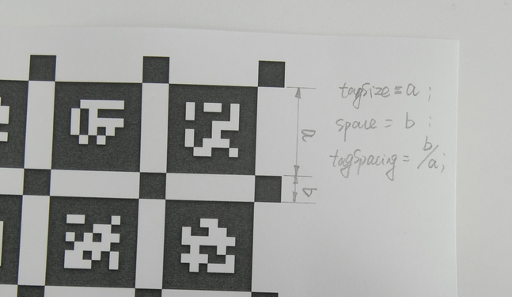

# Datasets and Calibration Targets

1. The PDF file of [Aprilgrid 6x6](data/april_6x6_80x80cm_A0.pdf)

2. Camera calibration targets: [april_6x6.yaml](data/april_6x6.yaml)
```
target_type: 'aprilgrid' #gridtype
tagCols: 6               #number of apriltags
tagRows: 6               #number of apriltags
tagSize: 0.0025           #size of apriltag, edge to edge [m]
tagSpacing: 0.3          #ratio of space between tags to tagSize
codeOffset: 0            #code offset for the first tag in the aprilboard
```
<br/>




3. The following file (`cam_april-camchain.yaml`) will be generated **automatically** from camera calibration and required by `camera and IMU calibration`:

```
cam0:
  cam_overlaps: []
  camera_model: pinhole
  distortion_coeffs: [-0.2879529995338575, 0.0781311194952221, 0.00021265916642721963, -0.0001221450347654466]
  distortion_model: radtan
  intrinsics: [458.9432286546919, 457.5637533402653, 367.0272509347057, 249.3128033381081]
  resolution: [752, 480]
  rostopic: /cam0/image_raw
```

4. IMU specification file [imu.yaml](data/imu.yaml):

```
#Accelerometers
accelerometer_noise_density: 0.00098   #Noise density (continuous-time)
accelerometer_random_walk:   0.00055   #Bias random walk

#Gyroscopes
gyroscope_noise_density:     6.981317007977319e-05   #Noise density (continuous-time)
gyroscope_random_walk:       0.00020   #Bias random walk

rostopic:                    /imu0      #the IMU ROS topic
update_rate:                 200      #Hz (for discretization of the values above)
```

it is recommended to obtain values for this file from: [allan_variance_ros](https://github.com/ori-drs/allan_variance_ros), otherwise
read [this page](https://github.com/ethz-asl/kalibr/wiki/IMU-Noise-Model)

Refs: [1](https://github.com/ethz-asl/kalibr/wiki/calibration-targets), [2](https://github.com/ethz-asl/kalibr/wiki/downloads)

# Supported Camera Models and Distortion

```
'pinhole-radtan', 'pinhole-equi', 'pinhole-fov', 'omni-none', 'omni-radtan', 'eucm-none', 'ds-none'
```

Refs: [1](https://github.com/ethz-asl/kalibr/wiki/supported-models)

# Camera Calibration

clone the repository:

```
git clone git@github.com:ethz-asl/kalibr.git
```
Then build the docker image"

```
cd kalibr
docker build Dockerfile_ros1_20_04
```

place your files (recording bag file `cam_april.bag`, `imu.yaml` and `april_6x6.yaml` ) in directory:

```
FOLDER=<path-to-data-directory>
```
Then run the following:
```
xhost +local:root
docker run -it -e "DISPLAY" -e "QT_X11_NO_MITSHM=1" \
    -v "/tmp/.X11-unix:/tmp/.X11-unix:rw" \
    -v "$FOLDER:/data" kalibr
```

Now in the container (for normal cameras):

```
source devel/setup.bash
rosrun kalibr kalibr_calibrate_cameras     --bag /data/cam_april.bag --target /data/april_6x6.yaml     --models pinhole-radtan --topics /cam0/image_raw 
```
for fish-eye lenses:

```
source devel/setup.bash
rosrun kalibr kalibr_calibrate_cameras     --bag /data/cam_april.bag --target /data/april_6x6.yaml     --models pinhole-equi --topics /cam0/image_raw 
```


# Camera IMU Calibration

```
source devel/setup.bash
rosrun kalibr kalibr_calibrate_imu_camera --bag /data/cam_april.bag --cam  /data/cam_april-camchain.yaml  --imu  /data/imu.yaml  --target /data/april_6x6.yaml
```

Refs: [1](https://github.com/ethz-asl/kalibr/wiki/camera-imu-calibration)
