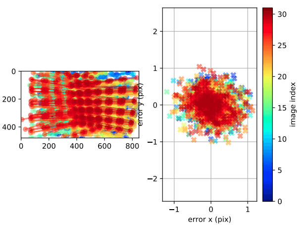

# Kalibr — Camera & Camera/IMU Calibration

[Kalibr](https://github.com/ethz-asl/kalibr) (ETH ASL) is the standard open-source tool for **multi-camera intrinsic/extrinsic** calibration and joint **camera + IMU** calibration. It works by observing a known calibration target across a sequence of frames (a ROS bag) and jointly optimizing for camera intrinsics, camera-to-camera extrinsics, the IMU-to-camera transform, and the time offset between the IMU clock and the camera clock.

> **Why a fiducial target?** Calibration needs many pose-consistent point correspondences per image. A single square fiducial gives 4 corner points; an **AprilGrid** of 6×6 tags gives 144. See [fiducial markers overview](apriltag.md#1-marker-families-at-a-glance) for the family of markers Kalibr is built on and how AprilGrid relates to ChArUco.

## 1. Choosing a calibration target

Kalibr supports three target types via the `target_type` field in its target YAML:

| `target_type` | Description | When to use |
|---|---|---|
| **`aprilgrid`** | Grid of AprilTag markers (each tag has a unique ID) | Default and recommended — works under partial occlusion because every tag is uniquely identifiable. Required for IMU/camera calibration. |
| **`checkerboard`** | Plain alternating black/white squares | Works if you can guarantee the full board is visible in every image — no per-corner ID. |
| **`circlegrid`** | Grid of asymmetric circles | Niche; sometimes useful for specialty optics or very low-resolution cameras. |

For comparison with the OpenCV ecosystem's **ChArUco** board (which Kalibr does *not* support), see [apriltag.md §3](apriltag.md#3-composite-calibration-boards). The short version: ChArUco is for OpenCV, AprilGrid is for Kalibr, and they are not interchangeable.

## 2. Calibration target files

### 2.1 Printable AprilGrid PDF

A ready-to-print 6×6 AprilGrid on A0 paper (80×80 cm printed area):

- [Aprilgrid 6×6 — A0 PDF](data/april_6x6_80x80cm_A0.pdf)

Print at **100 % scale** (no "fit to page"!) and verify the printed black-edge-to-black-edge tag length with a ruler — this measured number is what goes into `tagSize` below.

### 2.2 Target description YAML

[`april_6x6.yaml`](data/april_6x6.yaml) tells Kalibr the physical geometry of the target:

```yaml
target_type: 'aprilgrid'   # grid type
tagCols: 6                 # number of AprilTag columns
tagRows: 6                 # number of AprilTag rows
tagSize: 0.0025            # printed tag edge length, black-to-black [m]  ← measure your print!
tagSpacing: 0.3            # gap-between-tags as a fraction of tagSize
codeOffset: 0              # first tag ID in the grid (optional, defaults to 0)
```

> ⚠️ The `tagSize` above is a placeholder. For the bundled A0 PDF, the actual printed tag is roughly **88 mm**, so `tagSize: 0.088`. **Measure your own print** — an error of 10 % here becomes a 10 % error in every metric distance Kalibr returns.

What `tagSize` and `tagSpacing` mean visually (one cell of the grid):


<br/>

Distance measurements returned per-tag during detection:


<br/>

AprilTag coordinate frame (each tag's local frame; verify $z$ direction against your detector's version):


(See [apriltag.md §5](apriltag.md#5-coordinate-frame-and-measurements) for more on the tag frame convention.)

### 2.3 Camera-chain file (output of camera calibration)

`cam_april-camchain.yaml` is **produced automatically** by `kalibr_calibrate_cameras` and is then required as input to `kalibr_calibrate_imu_camera`:

```yaml
cam0:
  cam_overlaps: []
  camera_model: pinhole
  distortion_coeffs: [-0.2879529995338575, 0.0781311194952221, 0.00021265916642721963, -0.0001221450347654466]
  distortion_model: radtan
  intrinsics: [458.9432286546919, 457.5637533402653, 367.0272509347057, 249.3128033381081]
  resolution: [752, 480]
  rostopic: /cam0/image_raw
```

Order: `intrinsics = [fx, fy, cx, cy]`; `distortion_coeffs = [k1, k2, p1, p2]` for `radtan`, or `[k1, k2, k3, k4]` for `equidistant`/fisheye.

### 2.4 IMU specification file

[`imu.yaml`](data/imu.yaml):

```yaml
# Accelerometers
accelerometer_noise_density: 0.00098   # continuous-time noise density  [m/s²/√Hz]
accelerometer_random_walk:   0.00055   # bias random walk               [m/s³/√Hz]

# Gyroscopes
gyroscope_noise_density:     6.981317007977319e-05  # continuous-time noise density [rad/s/√Hz]
gyroscope_random_walk:       0.00020              # bias random walk                [rad/s²/√Hz]

rostopic:                    /imu0   # IMU ROS topic
update_rate:                 200     # Hz — used to discretize the densities above
```

Get these numbers from an **Allan-variance run** rather than guessing — use [allan_variance_ros](https://github.com/ori-drs/allan_variance_ros). Manufacturer datasheet values are usually optimistic. Background: [Kalibr IMU noise model wiki](https://github.com/ethz-asl/kalibr/wiki/IMU-Noise-Model).

References: [Kalibr calibration targets](https://github.com/ethz-asl/kalibr/wiki/calibration-targets), [Kalibr downloads](https://github.com/ethz-asl/kalibr/wiki/downloads).

## 3. Supported camera models and distortion

Kalibr's `--models` flag accepts a `projection-distortion` pair from this list:

```text
pinhole-radtan      pinhole-equi      pinhole-fov
omni-none           omni-radtan
eucm-none           ds-none
```

Quick guide:

- **`pinhole-radtan`** — standard pinhole + radial-tangential distortion. Default for most cameras with moderate FoV.
- **`pinhole-equi`** — pinhole + equidistant distortion. Use for fisheye lenses (FoV ≳ 120°).
- **`omni-radtan`** — omnidirectional (Mei) model, very wide FoV.
- **`eucm-none`** / **`ds-none`** — Extended Unified / Double-Sphere models for fisheye and mirror systems.

Refs: [supported models](https://github.com/ethz-asl/kalibr/wiki/supported-models).

## 4. Building the Kalibr Docker image

```bash
git clone git@github.com:ethz-asl/kalibr.git
cd kalibr
docker build -t kalibr -f Dockerfile_ros1_20_04 .
```

The `-t kalibr` tag is what the `docker run` step below references; `-f Dockerfile_ros1_20_04` selects the ROS 1 (Noetic) / Ubuntu 20.04 image. The upstream repo ships three Dockerfiles — `Dockerfile_ros1_16_04`, `Dockerfile_ros1_18_04`, `Dockerfile_ros1_20_04` — pick the one that matches the ROS Noetic / Melodic / Kinetic version the rest of your stack uses; functionally they produce the same Kalibr binaries.

### ROS 1 vs ROS 2

**Kalibr is ROS 1 only.** There is no official ROS 2 port (verified March 2024 — the upstream repo only ships `Dockerfile_ros1_*` variants and `rosrun` invocations). If your robot stack is ROS 2, the recommended workflow is:

1. Record your calibration data as a ROS 2 bag (`.db3` SQLite).
2. **Convert it to a ROS 1 `.bag`** using the [`rosbags`](https://pypi.org/project/rosbags/) Python package:

   ```bash
   pip install rosbags
   rosbags-convert --src cam_april_ros2/ --dst cam_april.bag
   ```

3. Mount the converted `.bag` into the Kalibr ROS 1 Docker container exactly as in §6 / §7 below. Make sure the `--topics`, `rostopic:` (camera-chain), and `rostopic:` (IMU YAML) values still match the topic names inside the converted bag (they survive the conversion verbatim).

Community ROS 2 forks of Kalibr exist on GitHub but are not upstream and may lag behind in bug-fixes — for production calibration, the ROS 1 + bag-conversion path is the safest.

## 5. Recording the calibration bag

Aim for **a few minutes** of footage with the target fully visible while you:

- Rotate the camera around all three axes (yaw, pitch, roll) — needed to excite the gyroscope.
- Translate along all three axes — needed to excite the accelerometer.
- Keep the target in frame at all times; avoid motion blur (slower or brighter is better than faster).

Save the bag as e.g. `cam_april.bag`, with the camera and IMU topics you'll reference in the YAMLs.

## 6. Camera-only calibration

Place `cam_april.bag`, `april_6x6.yaml`, and (after IMU calibration) `imu.yaml` in one directory and mount it into the container:

```bash
FOLDER=<path-to-data-directory>
xhost +local:root
docker run -it -e "DISPLAY" -e "QT_X11_NO_MITSHM=1" \
    -v "/tmp/.X11-unix:/tmp/.X11-unix:rw" \
    -v "$FOLDER:/data" kalibr
```

Inside the container:

```bash
source devel/setup.bash

# Normal (pinhole + radtan)
rosrun kalibr kalibr_calibrate_cameras \
    --bag /data/cam_april.bag \
    --target /data/april_6x6.yaml \
    --models pinhole-radtan \
    --topics /cam0/image_raw

# Fisheye (pinhole + equidistant)
rosrun kalibr kalibr_calibrate_cameras \
    --bag /data/cam_april.bag \
    --target /data/april_6x6.yaml \
    --models pinhole-equi \
    --topics /cam0/image_raw
```

This produces:

- `cam_april-camchain.yaml` — the intrinsics + (if multi-cam) extrinsics file used as input to the IMU step.
- `cam_april-results-cam.txt` — human-readable summary with reprojection errors per camera.
- `cam_april-report-cam.pdf` — PDF report with the coverage and reprojection-error plots described next.

### 6.1 Interpreting the reprojection report

The single most informative diagnostic Kalibr produces is the **reprojection error plot**:



It has two panels.

**Left — coverage / per-corner residuals.** Each dot is one detected AprilGrid corner across all calibration frames; colour encodes the frame index (blue = early, red = late). The short coloured lines coming out of each corner are the per-corner residual vectors (magnified). Two things to check:

- **Coverage.** Detections should reach the **edges and corners** of the image, not just the centre. Distortion is largest at the image periphery, so without samples there the radial coefficients are *extrapolated*. The plot above has slightly thin coverage on the left edge — a fully convincing calibration would show denser dots there.
- **No clusters of long residual vectors pointing the same way.** Such clusters indicate motion blur or an unmodelled effect (rolling shutter, autofocus changing focal length mid-sequence).

**Right — reprojection error scatter.** Each cross is one corner's residual `(error_x, error_y)` in pixels, again coloured by frame index. The healthy pattern is:

| Property | What it tells you |
|---|---|
| Cluster **centred on (0, 0)** | No systematic bias — principal point and focal length are right |
| **Isotropic (roughly circular)** cloud | Distortion model captures the lens correctly |
| All colours **interleaved**, no rainbow stripes | No per-frame drift (autofocus, temperature, sensor expansion) |
| Most points within **±1 px** | RMS error sub-pixel — a typical "good" calibration |

The image above shows a tight, isotropic, centred cloud with the bulk inside ±1 px and a few outliers to ±2 px — this is what a **healthy monocular calibration** looks like.

**Bad signs to recognise:**

- **Doughnut or lobed shape** → wrong distortion model. If you used `pinhole-radtan` on a fisheye lens, switch to `pinhole-equi`; for very-wide lenses use `omni-*` or `ds-none` ([§3](#3-supported-camera-models-and-distortion)).
- **Cloud centred off (0, 0)** → systematic bias in `(fx, fy)` or `(cx, cy)`. Often caused by a wrong `tagSize` or a single-frame outlier dragging the fit.
- **One colour-band offset from the others** → that batch of frames has a different intrinsic. Most common causes: **autofocus moved** (always disable it for calibration), the sensor heated up, or exposure changed.
- **RMS > 1 px** → too poor for visual-inertial use downstream. Re-record with less motion blur, better lighting, and the target filling more of the image.
- **Sparse / missing coverage at the corners** → radial coefficients are extrapolated there; expect the calibration to degrade in those regions even if the residuals look fine on the centre detections.

**Numerical targets** (RMS reprojection error printed in `cam_april-results-cam.txt`):

| RMS | Quality |
|---|---|
| **< 0.3 px** | Excellent — machine-vision grade |
| **0.3 – 0.6 px** | Typical good calibration for consumer sensors |
| **0.6 – 1.0 px** | Acceptable for non-critical use; VI-SLAM may struggle |
| **> 1.0 px** | Recalibrate |

## 7. Camera–IMU calibration

```bash
source devel/setup.bash
rosrun kalibr kalibr_calibrate_imu_camera \
    --bag /data/cam_april.bag \
    --cam  /data/cam_april-camchain.yaml \
    --imu  /data/imu.yaml \
    --target /data/april_6x6.yaml
```

Outputs:

- `cam_april-camchain-imucam.yaml` — extends the camera chain with the IMU→camera transform `T_cam_imu` and the time offset `timeshift_cam_imu` (seconds; positive means the IMU clock is ahead of the camera clock).
- `cam_april-imu.yaml` — refined IMU model parameters.
- `cam_april-results-imucam.txt` and `cam_april-report-imucam.pdf` — fit-quality summary. Look for:
  - Reprojection residuals still well below 1 px.
  - Accelerometer and gyroscope residuals consistent with the noise densities you provided in `imu.yaml` (if Kalibr's residuals are >> your stated densities, the IMU noise was under-estimated; re-run `allan_variance_ros`).
  - `timeshift_cam_imu` stable across re-runs (a few ms is normal; tens of ms means your driver isn't time-stamping consistently).

Ref: [camera-imu calibration wiki](https://github.com/ethz-asl/kalibr/wiki/camera-imu-calibration).

## 8. Common pitfalls

- **PDF printed at "fit-to-page"** — kills metric accuracy because `tagSize` no longer matches reality. Print at 100 % and measure.
- **`tagSize` in mm instead of m** — Kalibr expects metres. `0.088` ≠ `88`.
- **IMU noise from a datasheet** — overly optimistic; always run `allan_variance_ros` on the actual IMU at the actual `update_rate` you'll use.
- **Bag with not enough excitation** — if you don't rotate around all three axes the gyroscope bias and the IMU/camera rotation will not separate, and Kalibr will either fail to converge or return wildly wrong extrinsics.
- **Wrong target type** — handing Kalibr a ChArUco board with `target_type: aprilgrid` (or a chessboard with `aprilgrid`) silently produces zero detections. See [apriltag.md §3](apriltag.md#3-composite-calibration-boards).
- **Rolling-shutter cameras** — Kalibr's standard pipeline assumes a global shutter. Use the rolling-shutter branch / `--bag-from-to` workflows for RS cameras, or you'll bake a per-line distortion into the intrinsics.
