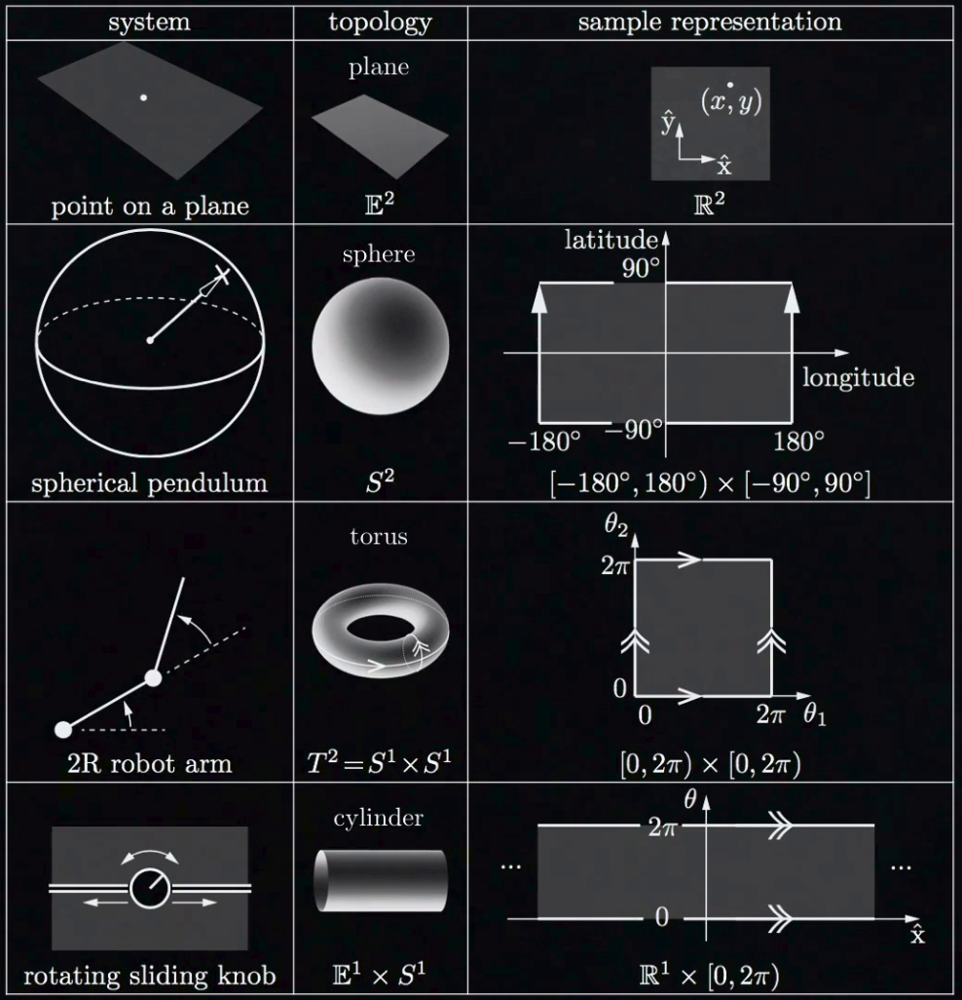

# Configuration of Robot
The configuration of something answers the question, where is that thing? position of all point of a robot. For example, to know where a door is, we only need to know the angle about its hinge when it changes from 0 to 360 degrees, or for a four linkage robot if we have only one joint value we know the others so we only need 1 of them to find out where is the robot

The configuration of robot is a representation of the positions of all the points of the robot.

# Configuration  Space - (C-space )
the space of all configurations of the robot is called the configuration space or C-space of the robot

# Degrees of freedom.
The minimum number of real numbers that are needed for our representation is called the degrees of freedom.

# Task Space 
is a space in which the robot's tasks can be naturally expressed.
i.e. If the task is to control the position of a marker on board then the task space is euclidean plane.
or if the task is control the position and orientation of rigid body then the task space is 6dim space of rigid body
you only have to know about the task not the robot to define the task space

# Work Space
The Cartesian points that eef can reach and has nothing to do with a particular task. for instance a planar robot
with 2 revolute joint limited to range of motion 90 and 45 degree 

# Dexterous space:
The set of positions that can be reached with all possible orientations is called dexterous space

# dof
dof=sum (freedom of bodies ) - number of independent  constraint
constraint are often coming from joint

- prismatic joint 1
- rotary joint 1
- revolute joint 1
- Cylindrical joint 2
- helical joint 1
- universal joint 2
- spherical joint 3

grubler formula
delta robot
Stewart mechanism

# Topology
In addition to dof an other important property of C-space is Topology (or its shape), 
surface of sphere and surface or a plane. This difference in shape impact the way we use coordinate to represent the space.
Two space has the same shape or topologically equivalent if one can be smoothly deformed to the other without cutting and gluing

By definition, we call two spaces to be topologically equivalent or of the same shape if we can smoothly deform one to the other without cutting or gluing.

 

C-space of same dimension can have different topology, examples:

- Point on a plane -> Plane
- C-space of spherical pendulum ->  Sphere
- 2R robot -> torus

Topology of C-Space is independent of representation of space!

## Different way to represent C-space

### Explicit
1) Explicit: Points on a plane (or generally N-Dimensional Euclidean Space)
If the space is flat like a line or plane o generally n dimensional euclidean  space  we typically choose origin and coordinate axis and then use coordinate to represent the point
velocity is time derivative of those points

	choose 1 arbitrary point in the space and two orthogonal axis

### Implicit
2) Implicit: If the space is curved like sphere we can use explicit or implicit representation. (surface of a sphere for instance )

I ) Explicit particularization with min number of coordinate: latitude, longitude
problems: representation have poor behavior at some points, for instance if you travel with constant speed around equator your equator/ poles
your longitude change very slow/ rapid and no upper bound as you close to poles
north pole is the singularity of representation
Also the the moment you step over north pole your longitude will change by 180 degree

Latitude: angle between the equatorial plane and the straight line that passes through that point and the center of the Earth
The North Pole is 90° N; the South Pole is 90° S

longitude: angle east or west of a reference meridian to another meridian that passes through that point

North pole is called the singularity of the representation.

II ) Implicit subject to constraint x^2 + y^2 + z^2 = 1

The singularity free implicit representation we use is called rotation matrix. The derivative is not velocity

configuration constrain and velocity constraint

  

The representation of c-space doesn't change the underlying space itself therefor the topology of the space is independent of its representation of it space.

Refs: [1](http://hades.mech.northwestern.edu/index.php/Modern_Robotics), [2](https://github.com/NxRLab/ModernRobotics)

# Important Lie Groups and Typologies

 

 
 

## so(3)
The set of all 3x3 skew-symmetric real matrices is called 

Rotation Matrix: The space of orientation of a rigid body has only 3 dimension but rotation matrix is 3x3 but that mean the 9 entries in matrix subject to 6 constraint. These constraint are:
- 3 column vector are unit vector 
- They are two by two orthogonal

These constraint can written as  which ensure 

## SO(2)
The group of rotations in two dimensions. The set of all 2×2 proper orthogonal matrices. They have the structure: 

## SO(3)
: set of all 3x3 real matrices satisfying:
- 
- 

## SE(2)
The set of all 3×3 matrices with the structure: 

 

## SE(3)
The special Euclidean groups  is the set of all 4x4 real matrices T of the form

Refs: [1](https://www.seas.upenn.edu/~meam620/notes/RigidBodyMotion3.pdf) 

