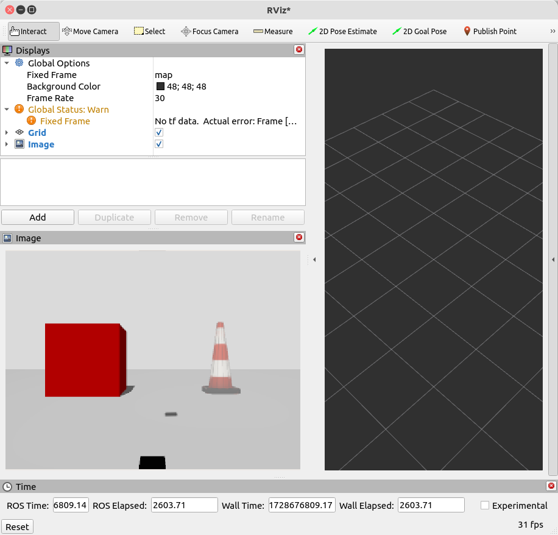
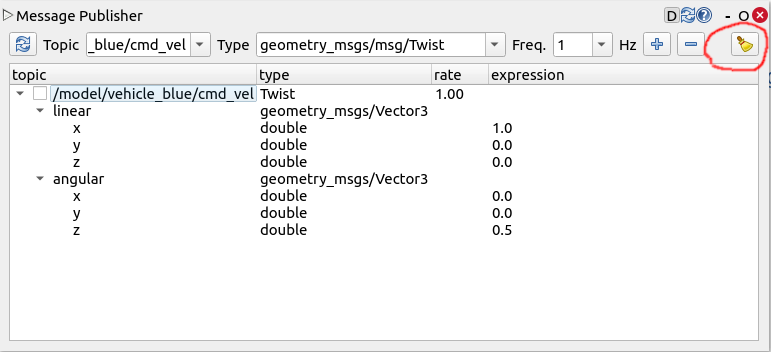
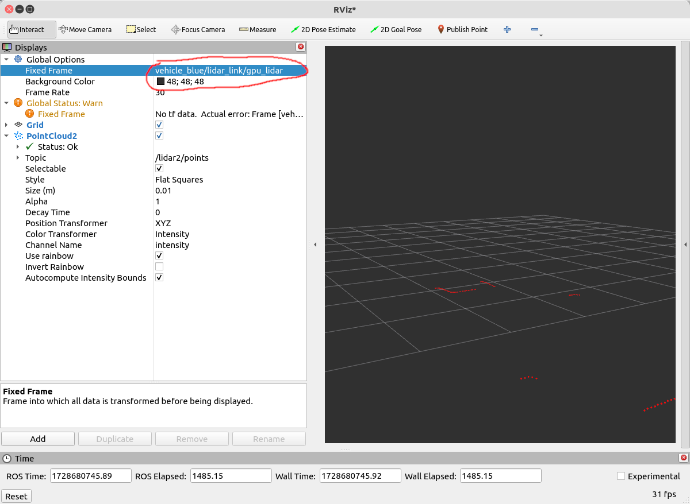
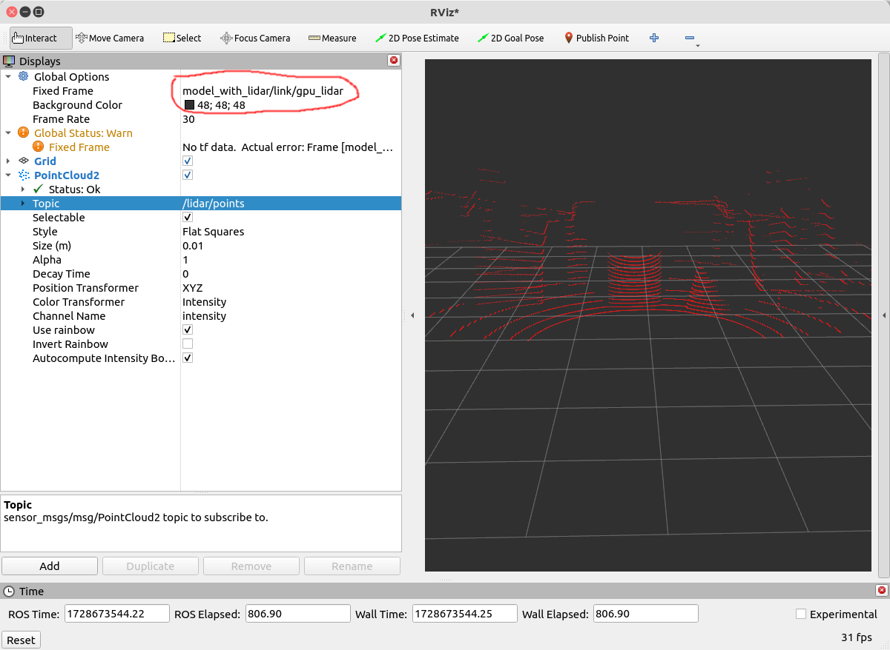
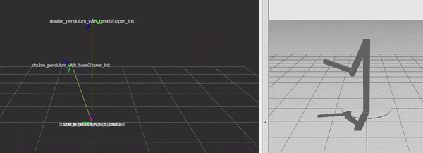

- [Installation of ros_gz](#installation-of-ros-gz)
  * [Launch Gazebo from ROS 2](#launch-gazebo-from-ros-2)
- [ROS2 Interaction With Gazebo](#ros2-interaction-with-gazebo)
  * [Bridge communication between ROS and Gazebo](#bridge-communication-between-ros-and-gazebo)
  * [1. Simple Hello between ROS2 and Gazebo](#1-simple-hello-between-ros2-and-gazebo)
  * [2. Camera Example](#2-camera-example)
  * [3. Diff Drive Example](#3-diff-drive-example)
  * [4. GPU lidar](#4-gpu-lidar)
  * [5. IMU, Magnetometer](#5-imu--magnetometer)
  * [6. GNSS](#6-gnss)


## Installation of ros_gz


Set the `GZ_VERSION` environment variable to the Gazebo version

```
export GZ_VERSION=harmonic
```


then 

```
cd ~/ros2_ws/src/
git clone https://github.com/gazebosim/ros_gz.git -b humble

cd ../
rosdep install -r --from-paths src -i -y --rosdistro humble
colcon build
```
Refs: [1](https://github.com/gazebosim/ros_gz/tree/humble)


### Launch Gazebo from ROS 2

```
ros2 launch ros_gz_sim gz_sim.launch.py gz_args:=empty.sdf
```

Refs: [1](https://gazebosim.org/docs/harmonic/ros2_launch_gazebo/)

## ROS2 Interaction With Gazebo

### Bridge communication between ROS and Gazebo


The following message types can be bridged for topics:

| ROS type                                    | Gazebo type                                 |
|---------------------------------------------|:-------------------------------------------:|
| geometry_msgs/msg/Twist                     | gz.msgs.Twist                               |
| sensor_msgs/msg/Imu                         | gz.msgs.IMU                                 |
| sensor_msgs/msg/Image                       | gz.msgs.Image                               |
| sensor_msgs/msg/LaserScan                   | gz.msgs.LaserScan                           |
| sensor_msgs/msg/MagneticField               | gz.msgs.Magnetometer                        |
| sensor_msgs/msg/PointCloud2                 | gz.msgs.PointCloudPacked                    |
| tf2_msgs/msg/TFMessage                      | gz.msgs.Pose_V                              |
| sensor_msgs/msg/Image                       | gz.msgs.Image                               |
| sensor_msgs/msg/MagneticField	              | gz.msgs.Magnetometer                        |
| sensor_msgs/msg/NavSatFix	              | gz.msgs.NavSat                              |
| nav_msgs/msg/Odometry                       | gz.msgs.Odometry                            |
| sensor_msgs/msg/CameraInfo                  | gz.msgs.CameraInfo                          |

	

full list here: [Bridge communication between ROS and Gazebo](https://github.com/gazebosim/ros_gz/tree/ros2/ros_gz_bridge)

Refs: [1](https://gazebosim.org/docs/harmonic/ros2_integration/#use-ros-2-to-interact-with-gazebo)


### 1. Simple Hello between ROS2 and Gazebo

```
ros2 run ros_gz_bridge parameter_bridge -h
```

Bridge a collection of ROS2 and Gazebo Transport topics and services.

```
  parameter_bridge [ topic_name@ROS2_type@Ign_type ]
```

Topics: The first `@` symbol delimits the topic name from the message types.

Following the first `@` symbol is the ROS message type.

The ROS message type is followed by an `@`, `[`, or `]` symbol where
    `@`  == a bidirectional bridge, 
    `[`  == a bridge from Gazebo to ROS,
    `]`  == a bridge from ROS to Gazebo.
    
Following the direction symbol is the Gazebo Transport message type.

A bidirectional bridge example:
```
ros2 run ros_gz_bridge parameter_bridge /chatter@std_msgs/msg/String@gz.msgs.StringMsg --ros-args --log-level DEBUG
```


If the `ros_gz_bridge` node doesn't publish anything, you might happen to have wrong version or gazebo. If you install ROS 2 Humble with the default, the "Ignition Fortress" will be installed. so you need to use (pay attention to `@ignition`):


```
ros2 run ros_gz_bridge parameter_bridge /chatter@std_msgs/msg/String@ignition.msgs.StringMsg --ros-args --log-level DEBUG

```


To install "Gazebo Harmonic" uninstall the default Ignition Fortress topics and install the correct bridge and other interface topics for Gazebo Harmonic with ROS2 Humble:


```
# Remove the wrong version (for Ignition Fortress)
sudo apt remove ros-humble-ros-gz

# Install the version for Gazebo Garden
sudo apt install ros-humble-ros-gzharmonic
```


[read more here](https://docs.px4.io/main/en/ros2/user_guide.html#ros-gz-bridge-not-publishing-on-the-clock-topic)


then publish from ROS:


```
ros2 topic pub /chatter std_msgs/msg/String '{data: "Hello from ROS"}'
```
receive from gazebo: 

```
ign  topic -e -t /chatter
```


then publish from gazebo:

```
ign topic -t /chatter -m ignition.msgs.StringMsg -p 'data:"Hello from Gazebo"'
```

receive in ROS: 
```
ros2 topic echo /chatter
```

A bridge from Gazebo to ROS example:

```
ros2 run ros_gz_bridge parameter_bridge  /chatter@std_msgs/msg/String[ignition.msgs.StringMsg
                                                         
```


A bridge from ROS to Gazebo example:
```
ros2 run ros_gz_bridge parameter_bridge  /chatter@std_msgs/msg/String]ignition.msgs.StringMsg
```

Ref: [1](https://index.ros.org/p/ros_gz_bridge/)


### 2. Camera Example 

run:
```
gz sim -v 4  -r sensors_demo.sdf
```

- `-v 4`: This sets the verbosity level of Gazebo to 4. 
- `-r`:  visualize_lidar.sdf: This loads a specific SDF


list topics

```
gz topic -l
```
then for `/camera`:


```
gz topic -i -t /camera
```

which gives us:
 
```
Publishers [Address, Message Type]:
  tcp://172.17.0.1:33325, gz.msgs.Image
Subscribers [Address, Message Type]:
  tcp://172.17.0.1:43429, gz.msgs.Image
```
 
 
mapping:

```
ros2 run ros_gz_bridge parameter_bridge /camera@sensor_msgs/msg/Image@gz.msgs.Image
```
	





Refs: [1](https://github.com/gazebosim/ros_gz/tree/ros2/ros_gz_sim_demos#camera) 
 


### 3. Diff Drive Example

```
gz sim -v 4 -r visualize_lidar.sdf
```

list topic:

```
gz topic -l
```

so mapping between `geometry_msgs/msg/Twist` and `gz.msgs.Twist`

```
ros2 run ros_gz_bridge parameter_bridge /model/vehicle_blue/cmd_vel@geometry_msgs/msg/Twist]gz.msgs.Twist
```
which gives you: 
```
Creating ROS->GZ Bridge: [/model/vehicle_blue/cmd_vel (geometry_msgs/msg/Twist) -> /model/vehicle_blue/cmd_vel (gz.msgs.Twist)]
```

now run: 

```
rqt
```
**very important:** do not forget to clear everything publishing new messages (clicking on the broom)



or you can publish from terminal:

```
ros2 topic pub /model/vehicle_blue/cmd_vel geometry_msgs/msg/Twist "{linear: {x: 5.0}, angular: {z: 0.5}}"
```

or with keyboard:


```
ros2 run teleop_twist_keyboard teleop_twist_keyboard --ros-args -r /cmd_vel:=/model/vehicle_blue/cmd_vel
```


now to get laser scans:

```
ros2 run ros_gz_bridge parameter_bridge /lidar2/points@sensor_msgs/msg/PointCloud2@gz.msgs.PointCloudPacked
```


**very important**

```
ros2 topic echo /lidar2/points | grep "frame_id"
```

which gives you"
```
frame_id: vehicle_blue/lidar_link/gpu_lidar
```

or simply:

```
ros2 launch ros_gz_sim_demos diff_drive.launch.py
```





### 4. GPU lidar

```
gz sim -r gpu_lidar_sensor.sdf
```
mapping:
```
ros2 run ros_gz_bridge parameter_bridge lidar@sensor_msgs/msg/LaserScan@gz.msgs.LaserScan
```

and 

```
ros2 run ros_gz_bridge parameter_bridge /lidar/points@sensor_msgs/msg/PointCloud2@gz.msgs.PointCloudPacked
```
now run:

```
rviz2
```

**very important:**

```
ros2 topic echo /lidar/points | grep "frame_id"
```

which give us:

```
frame_id: model_with_lidar/link/gpu_lidar
```



or you can run 


```
ros2 launch ros_gz_sim_demos gpu_lidar_bridge.launch.py
```
Refs: [1](https://github.com/gazebosim/ros_gz/tree/ros2/ros_gz_sim_demos#gpu-lidar)


### 5. IMU, Magnetometer

```
gz sim -r  sensors.sdf
```


```
ros2 run ros_gz_bridge parameter_bridge /imu@sensor_msgs/msg/Imu@gz.msgs.IMU

ros2 run ros_gz_bridge parameter_bridge /magnetometer@sensor_msgs/msg/MagneticField@gz.msgs.Magnetometer
```


or simply 

```
ros2 launch ros_gz_sim_demos imu.launch.py
ros2 launch ros_gz_sim_demos magnetometer.launch.py
```


### 6. GNSS

```
gz sim -r spherical_coordinates.sdf
```

find /navsat:
```
gz topic -i -t /navsat
```

which gives us:

```
Publishers [Address, Message Type]:
  tcp://172.17.0.1:43221, gz.msgs.NavSat
No subscribers on topic [/navsat]
```

now mapping:
        
```
ros2 run ros_gz_bridge parameter_bridge /navsat@sensor_msgs/msg/NavSatFix[gz.msgs.NavSat
```


### 7. Robot description publisher (spawning urdf model)

Lets download a simple model [08-macroed.urdf.xacro](https://github.com/ros/urdf_tutorial/blob/ros2/urdf/08-macroed.urdf.xacro)


```
xacro 08-macroed.urdf.xacro > 08-macroed.urdf.urdf
```

```
check_urdf 08-macroed.urdf.urdf
```

```
urdf_to_graphviz 08-macroed.urdf.urdf
```

and for SVG

```
dot -Tsvg macroed.gv -o output.svg
```


more models [here](https://wiki.ros.org/urdf/Examples)


now run:


```
gz sim empty.sdf
```

all worlds available at: `/usr/share/gz/gz-sim8/worlds/`


list all services:

```
gz service -l
```

Look for a create service.

```
/world/empty/create
```

to get the service’s request and response message types:


```
gz service -is /world/empty/create
```
 which gives you:

```
gz.msgs.EntityFactory, gz.msgs.Boolean
```


spawns the URDF file model.urdf into the Gazebo Sim world as a model named urdf_model:

```
gz service -s /world/empty/create --reqtype gz.msgs.EntityFactory --reptype gz.msgs.Boolean --timeout 1000 --req 'sdf_filename: "08-macroed.urdf.urdf", name: "08-macroed"'
```
**very important:**: in the terminal that you have run `gz sim empty.sdf` you have access to `08-macroed.urdf.urdf` (it should be in the same directory)
 
another example: `rrbot.xacro`

```
<?xml version="1.0"?>
<!-- Revolute-Revolute Manipulator -->
<robot name="rrbot" xmlns:xacro="http://www.ros.org/wiki/xacro">

  <!-- Constants for robot dimensions -->
  <xacro:property name="PI" value="3.1415926535897931"/>
  <xacro:property name="mass" value="1" /> <!-- arbitrary value for mass -->
  <xacro:property name="width" value="0.1" /> <!-- Square dimensions (widthxwidth) of beams -->
  <xacro:property name="height1" value="2" /> <!-- Link 1 -->
  <xacro:property name="height2" value="1" /> <!-- Link 2 -->
  <xacro:property name="height3" value="1" /> <!-- Link 3 -->
  <xacro:property name="axel_offset" value="0.05" /> <!-- Space btw top of beam and the each joint -->

  <!-- Define colors -->
  <material name="black">
    <color rgba="0.0 0.0 0.0 1.0"/>
  </material>

  <material name="orange">
    <color rgba="${255/255} ${108/255} ${10/255} 1.0"/>
  </material>

  <!-- Used for fixing robot to Gazebo 'base_link' -->
  <link name="world"/>

  <joint name="fixed" type="fixed">
    <parent link="world"/>
    <child link="link1"/>
  </joint>

  <!-- Base Link -->
  <link name="link1">
    <collision>
      <origin xyz="0 0 ${height1/2}" rpy="0 0 0"/>
      <geometry>
        <box size="${width} ${width} ${height1}"/>
      </geometry>
    </collision>

    <visual>
      <origin xyz="0 0 ${height1/2}" rpy="0 0 0"/>
      <geometry>
        <box size="${width} ${width} ${height1}"/>
      </geometry>
      <material name="orange"/>
    </visual>

    <inertial>
      <origin xyz="0 0 ${height1/2}" rpy="0 0 0"/>
      <mass value="${mass}"/>
      <inertia
    ixx="${mass / 12.0 * (width*width + height1*height1)}" ixy="0.0" ixz="0.0"
    iyy="${mass / 12.0 * (height1*height1 + width*width)}" iyz="0.0"
    izz="${mass / 12.0 * (width*width + width*width)}"/>
    </inertial>
  </link>

  <joint name="joint1" type="continuous">
    <parent link="link1"/>
    <child link="link2"/>
    <origin xyz="0 ${width} ${height1 - axel_offset}" rpy="0 0 0"/>
    <axis xyz="0 1 0"/>
    <dynamics damping="0.7"/>
  </joint>

  <!-- Middle Link -->
  <link name="link2">
    <collision>
      <origin xyz="0 0 ${height2/2 - axel_offset}" rpy="0 0 0"/>
      <geometry>
        <box size="${width} ${width} ${height2}"/>
      </geometry>
    </collision>

    <visual>
      <origin xyz="0 0 ${height2/2 - axel_offset}" rpy="0 0 0"/>
      <geometry>
        <box size="${width} ${width} ${height2}"/>
      </geometry>
      <material name="black"/>
    </visual>

    <inertial>
      <origin xyz="0 0 ${height2/2 - axel_offset}" rpy="0 0 0"/>
      <mass value="${mass}"/>
      <inertia
    ixx="${mass / 12.0 * (width*width + height2*height2)}" ixy="0.0" ixz="0.0"
    iyy="${mass / 12.0 * (height2*height2 + width*width)}" iyz="0.0"
    izz="${mass / 12.0 * (width*width + width*width)}"/>
    </inertial>
  </link>

  <joint name="joint2" type="continuous">
    <parent link="link2"/>
    <child link="link3"/>
    <origin xyz="0 ${width} ${height2 - axel_offset*2}" rpy="0 0 0"/>
    <axis xyz="0 1 0"/>
    <dynamics damping="0.7"/>
  </joint>

  <!-- Top Link -->
  <link name="link3">
    <collision>
      <origin xyz="0 0 ${height3/2 - axel_offset}" rpy="0 0 0"/>
      <geometry>
        <box size="${width} ${width} ${height3}"/>
      </geometry>
    </collision>

    <visual>
      <origin xyz="0 0 ${height3/2 - axel_offset}" rpy="0 0 0"/>
      <geometry>
        <box size="${width} ${width} ${height3}"/>
      </geometry>
      <material name="orange"/>
    </visual>

    <inertial>
      <origin xyz="0 0 ${height3/2 - axel_offset}" rpy="0 0 0"/>
      <mass value="${mass}"/>
      <inertia
    ixx="${mass / 12.0 * (width*width + height3*height3)}" ixy="0.0" ixz="0.0"
    iyy="${mass / 12.0 * (height3*height3 + width*width)}" iyz="0.0"
    izz="${mass / 12.0 * (width*width + width*width)}"/>
    </inertial>
  </link>

  <!-- Gazebo colors and frictions -->
  <!-- Link1 -->
  <gazebo reference="link1">
    <material>
      <diffuse> 1 0.423529412 0.039215686 1</diffuse>
      <ambient> 1 0.423529412 0.039215686 1</ambient>
      <specular>1 0.423529412 0.039215686 1</specular>
    </material>
  </gazebo>

  <!-- Link2 -->
  <gazebo reference="link2">
    <mu1>0.2</mu1>
    <mu2>0.2</mu2>
    <material>
      <diffuse> 0 0 0 1</diffuse>
      <ambient> 0 0 0 1</ambient>
      <specular>0 0 0 1</specular>
    </material>
  </gazebo>

  <!-- Link3 -->
  <gazebo reference="link3">
    <mu1>0.2</mu1>
    <mu2>0.2</mu2>
    <material>
      <diffuse> 1 0.423529412 0.039215686 1</diffuse>
      <ambient> 1 0.423529412 0.039215686 1</ambient>
      <specular>1 0.423529412 0.039215686 1</specular>
    </material>
  </gazebo>

  <!-- Joint states plugin -->
  <gazebo>
    <plugin filename="gz-sim-joint-state-publisher-system" name="gz::sim::systems::JointStatePublisher"/>
  </gazebo>

</robot>
```

```
xacro rrbot.xacro > rrbot.urdf
```

then run: 

```
gz service -s /world/empty/create --reqtype gz.msgs.EntityFactory --reptype gz.msgs.Boolean --timeout 1000 --req 'sdf_filename: "rrbot.urdf", name: "rrbot"'
```


### 8.Joint States Publisher


```
ros2 launch ros_gz_sim_demos tf_bridge.launch.py
```

in the file: `tf_bridge.launch.py`
 
change:
```
    cmd=[
        'ign', 'gazebo', '-r',
        os.path.join(
            pkg_ros_gz_sim_demos,
            'models',
            'double_pendulum_model.sdf'
        )
    ]
```


to this 

```
cmd=[
        'gz', 'sim', '-r',
        os.path.join(
            pkg_ros_gz_sim_demos,
            'models',
            'double_pendulum_model.sdf'
        )
    ]
```




