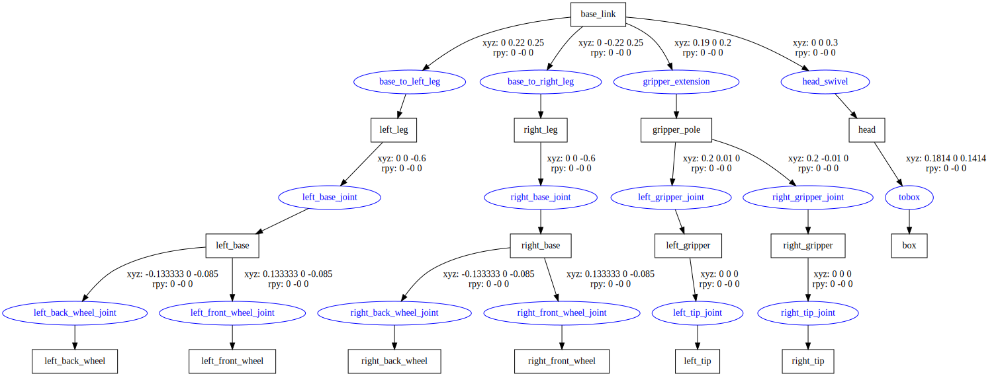

## ROS2 & Gazebo Integration Guide

### Table of Contents

1. [Installation Options](#installation-options) - Compare Native vs Docker
2. [Option 1: Native Installation](#option-1-native-installation-ubuntu) - Direct Ubuntu install
3. [Option 2: Docker Installation](#option-2-docker-installation) - Containerized setup
4. [Usage Guide](#usage-guide-native--docker) - Launch Gazebo from ROS2
5. [ROS2-Gazebo Interaction](#ros2-interaction-with-gazebo) - Bridge examples and demos

---

### Official ROS2/Gazebo Mapping (2024–2025)

| ROS 2 distro | ros_gz git branch | Required GZ_VERSION value | Actual Gazebo release name |
|--------------|-------------------|----------------------------|----------------------------|
| ROS Jazzy    | `jazzy`           | `harmonic`                 | Gazebo Harmonic            |
| ROS Iron     | `iron`            | `garden`                   | Gazebo Garden              |

---

## Installation Options

You have two main options for running ROS2 + Gazebo:

| Approach | Pros | Cons | Best For |
|----------|------|------|----------|
| **Native** | ✅ Better performance<br>✅ Simpler GPU setup<br>✅ Direct hardware access<br>✅ No container overhead | ❌ Can conflict with system packages<br>❌ Harder to reproduce<br>❌ Only one ROS version at a time | • Single-user workstations<br>• Production robots<br>• Maximum performance needs |
| **Docker** | ✅ Isolated environment<br>✅ Fully reproducible<br>✅ Multiple ROS versions simultaneously<br>✅ Easy cleanup | ❌ Slight overhead<br>❌ More complex GPU setup<br>❌ GUI apps need X11 forwarding | • Development work<br>• Testing multiple projects<br>• Team collaboration<br>• CI/CD pipelines |

### Quick Decision Guide

**Choose Native if:**
- You're working on a single robot/project
- You need maximum performance (real-time control, heavy simulation)
- You have physical hardware to interface with (cameras, LiDAR, motors)
- You're comfortable managing system packages

**Choose Docker if:**
- You work on multiple projects with different ROS versions
- You want to easily share your setup with teammates
- You're learning/experimenting and want easy cleanup
- You need reproducible environments for development

---

## Option 1: Native Installation (Ubuntu)

### Prerequisites

- Ubuntu 24.04 (Noble) for ROS2 Jazzy

### 1. Install ROS2 Jazzy

```bash
# Set locale
sudo apt update && sudo apt install locales
sudo locale-gen en_US en_US.UTF-8
sudo update-locale LC_ALL=en_US.UTF-8 LANG=en_US.UTF-8
export LANG=en_US.UTF-8

# Add ROS2 repository
sudo apt install software-properties-common
sudo add-apt-repository universe
sudo apt update && sudo apt install curl -y

# Add ROS2 GPG key
sudo curl -sSL https://raw.githubusercontent.com/ros/rosdistro/master/ros.key -o /usr/share/keyrings/ros-archive-keyring.gpg

# Add repository to sources list
echo "deb [arch=$(dpkg --print-architecture) signed-by=/usr/share/keyrings/ros-archive-keyring.gpg] http://packages.ros.org/ros2/ubuntu $(. /etc/os-release && echo $UBUNTU_CODENAME) main" | sudo tee /etc/apt/sources.list.d/ros2.list > /dev/null

# Update and install ROS2 Desktop Full
sudo apt update
sudo apt upgrade
sudo apt install ros-jazzy-desktop-full

# Install development tools
sudo apt install ros-dev-tools
sudo apt install python3-colcon-common-extensions

# Initialize rosdep (dependency management tool)
sudo rosdep init
rosdep update
```

### 2. Install Gazebo Harmonic

**Note:** If you installed `ros-jazzy-desktop-full`, Gazebo might already be included as a vendor package. Check if you already have it:

```bash
which gz
# If it returns: /opt/ros/jazzy/opt/gz_tools_vendor/bin/gz
# You can skip this step - Gazebo is already installed!
```

If Gazebo is **not** already installed, proceed with the following:

```bash
# Add Gazebo repository
sudo wget https://packages.osrfoundation.org/gazebo.gpg -O /usr/share/keyrings/pkgs-osrf-archive-keyring.gpg
echo "deb [arch=$(dpkg --print-architecture) signed-by=/usr/share/keyrings/pkgs-osrf-archive-keyring.gpg] http://packages.osrfoundation.org/gazebo/ubuntu-stable $(lsb_release -cs) main" | sudo tee /etc/apt/sources.list.d/gazebo-stable.list > /dev/null

# Install Gazebo Harmonic
sudo apt update
sudo apt install gz-harmonic
```

### 3. Install ROS2-Gazebo Bridge

```bash
# Install ros_gz packages for Jazzy + Harmonic
sudo apt install ros-jazzy-ros-gz

# This includes:
# - ros-jazzy-ros-gz-bridge (message bridge)
# - ros-jazzy-ros-gz-sim (launch integration)
# - ros-jazzy-ros-gz-image (image transport)
```

### 4. Setup Environment

Add to your `~/.bashrc`:

```bash
# ROS2 Jazzy
source /opt/ros/jazzy/setup.bash

# Gazebo Harmonic
export GZ_VERSION=harmonic

# Optional: set default ROS domain ID (useful for multi-robot)
export ROS_DOMAIN_ID=0

# Optional: workspace overlay (if you have one)
# source ~/ros2_ws/install/setup.bash
```

Apply changes:

```bash
source ~/.bashrc
```

### 5. Verify Installation

```bash
# Test ROS2
ros2 doctor

# Test Gazebo
gz sim --version

# Test the bridge
ros2 pkg list | grep ros_gz
```

Should show:

```
gz-harmonic 8.x.x
ros_gz
ros_gz_bridge
ros_gz_image
ros_gz_interfaces
ros_gz_sim
ros_gz_sim_demos
```

### 6. Quick Test

```bash
# Terminal 1: Start Gazebo
gz sim

# Terminal 2: Check Gazebo topics are visible in ROS2
ros2 run ros_gz_bridge parameter_bridge /chatter@std_msgs/msg/String@gz.msgs.StringMsg
```

### 7. Install Additional Common Packages

```bash
# Navigation stack
sudo apt install ros-jazzy-navigation2 ros-jazzy-nav2-bringup

# Visualization
sudo apt install ros-jazzy-rviz2

# SLAM toolbox
sudo apt install ros-jazzy-slam-toolbox

# Robot state publisher
sudo apt install ros-jazzy-robot-state-publisher

# Xacro for URDF processing
sudo apt install ros-jazzy-xacro

# TF2 tools
sudo apt install ros-jazzy-tf2-tools ros-jazzy-tf-transformations

# Teleop keyboard
sudo apt install ros-jazzy-teleop-twist-keyboard

# Useful debugging tools
sudo apt install ros-jazzy-rqt ros-jazzy-rqt-common-plugins
```

### GPU Support (Native)

If you have an NVIDIA GPU, install drivers:

```bash
# Check available drivers
ubuntu-drivers devices

# Install recommended driver
sudo ubuntu-drivers autoinstall

# Reboot
sudo reboot

# Verify
nvidia-smi
```

No CUDA toolkit installation needed for Gazebo or most ROS2 packages. ML frameworks (PyTorch, TensorFlow) will bring their own CUDA runtime when installed via pip/conda.

---

## Option 2: Docker Installation

### 1. Create Dockerfile

Create this file once (put it in your project root or `~/ros2_docker/`):

`Dockerfile` (no extension needed):

```dockerfile
FROM osrf/ros:jazzy-desktop-full

ARG USERNAME=behnam
ARG USER_UID=1000
ARG USER_GID=1000

# Remove the default user/group that ships with UID/GID 1000 (name varies)
# and make sure UID 1000 + GID 1000 are completely free
RUN set -e && \
    # Try to remove any existing user with UID 1000
    (id -u 1000 >/dev/null 2>&1 && userdel -r $(id -un 1000)) || true && \
    # Try to remove any existing group with GID 1000
    (getent group 1000 >/dev/null 2>&1 && groupdel $(getent group 1000 | cut -d: -f1)) || true && \
    # Install sudo if missing (it usually is already there)
    apt-get update && apt-get install -y --no-install-recommends sudo && \
    rm -rf /var/lib/apt/lists/* && \
    # Now safely create your own group and user
    groupadd --gid ${USER_GID} ${USERNAME} && \
    useradd --uid ${USER_UID} --gid ${USER_GID} \
            --create-home --shell /bin/bash ${USERNAME} && \
    echo "${USERNAME} ALL=(ALL) NOPASSWD:ALL" > /etc/sudoers.d/${USERNAME} && \
    chmod 0440 /etc/sudoers.d/${USERNAME} && \
    usermod -aG dialout,video ${USERNAME}

# Switch to your user forever
USER ${USERNAME}
WORKDIR /home/${USERNAME}
ENV USER=${USERNAME}

# Nice orange prompt so you know you're inside the container
RUN echo '# Orange ROS2-Jazzy prompt (only when inside container)' >> /etc/bash.bashrc && \
    echo 'export PS1="\[\e[38;5;208m\][ROS2-Jazzy \u@\h] \[\e[0;33m\]\w\[\e[0m\] \$ "' >> /etc/bash.bashrc && \
    echo 'export GZ_VERSION=harmonic' >> /etc/bash.bashrc
```

#### Enhanced Dockerfile with Pre-installed Packages

If you want common packages pre-installed (recommended for reproducibility):

```dockerfile
FROM osrf/ros:jazzy-desktop-full

ARG USERNAME=behnam
ARG USER_UID=1000
ARG USER_GID=1000

# 1. Clean up the default UID/GID 1000 user that the base image ships with
RUN set -e && \
    (id -u 1000 >/dev/null 2>&1 && userdel -r $(id -un 1000)) || true && \
    (getent group 1000 >/dev/null 2>&1 && groupdel $(getent group 1000 | cut -d: -f1)) || true

# 2. Create your own user (same UID/GID as host)
RUN apt-get update && apt-get install -y --no-install-recommends sudo && \
    rm -rf /var/lib/apt/lists/* && \
    groupadd --gid ${USER_GID} ${USERNAME} && \
    useradd --uid ${USER_UID} --gid ${USER_GID} \
            --create-home --shell /bin/bash ${USERNAME} && \
    echo "${USERNAME} ALL=(ALL) NOPASSWD:ALL" > /etc/sudoers.d/${USERNAME} && \
    chmod 0440 /etc/sudoers.d/${USERNAME} && \
    usermod -aG dialout,video ${USERNAME}

# 3. Install common system packages (add more as needed)
RUN apt-get update && apt-get install -y --no-install-recommends \
        ros-jazzy-libg2o \
        libceres-dev \
        libsuitesparse-dev \
        ros-jazzy-bond \
        ros-jazzy-bondcpp \
        ros-jazzy-nav2-map-server \
        ros-jazzy-nav2-bringup \
        ros-jazzy-navigation2 \
        ros-jazzy-urdf-launch \
        ros-jazzy-simulation-interfaces \
        gz-harmonic \
        python3-pip \
        python3-colcon-common-extensions \
        git \
        wget \
        curl \
    && rm -rf /var/lib/apt/lists/*

# Switch to your user for the rest of eternity
USER ${USERNAME}
WORKDIR /home/${USERNAME}

# Add a nice orange prompt so you instantly know you're inside the container
RUN echo '# Orange ROS2-Jazzy prompt (only when inside container)' >> /etc/bash.bashrc && \
    echo 'export PS1="\[\e[38;5;208m\][ROS2-Jazzy \u@\h] \[\e[0;33m\]\w\[\e[0m\] \$ "' >> /etc/bash.bashrc && \
    echo 'export GZ_VERSION=harmonic' >> /etc/bash.bashrc

ENV USER=${USERNAME}
```

---

### 2. Build the Image

```bash
docker build -t ros:jazzy \
  --build-arg USER_UID=$(id -u) \
  --build-arg USER_GID=$(id -g) \
  --build-arg USERNAME=$USER .
```

Takes ~30–60 seconds depending on which Dockerfile version you used.

---

### 3. Run Containers

#### Option A: Temporary Container (Deleted on Exit)

Good for quick tests and experiments:

```bash
# First, allow GUI apps from Docker containers
xhost +local:docker

# Run temporary container
docker run -it --rm \
  --name jazzy \
  --privileged \
  --network host \
  -e DISPLAY=$DISPLAY \
  -v /tmp/.X11-unix:/tmp/.X11-unix:rw \
  -v "$HOME":"$HOME":rw \
  --workdir "$PWD" \
  --ipc=host \
  --ulimit nofile=524288 \
  ros:jazzy \
  bash
```

#### Option B: Persistent Container (Survives Exit)

Best for development — install packages once and they stay:

```bash
# Allow GUI apps from Docker containers
xhost +local:docker

# Create persistent container (run once)
docker run -d \
  --name jazzy-permanent \
  --restart unless-stopped \
  --privileged \
  --network host \
  --ipc=host \
  --ulimit nofile=524288 \
  -e DISPLAY=$DISPLAY \
  -v /tmp/.X11-unix:/tmp/.X11-unix:rw \
  -v "$HOME":"$HOME":rw \
  --workdir "$PWD" \
  ros:jazzy \
  sleep infinity
```

Then connect to it anytime:

```bash
docker exec -it jazzy-permanent bash
```

Or start/stop it:

```bash
docker start jazzy-permanent
docker stop jazzy-permanent
```

#### Important Docker Flags Explained

| Flag | Why it matters |
|------|----------------|
| `-v /tmp/.X11-unix:/tmp/.X11-unix:rw` | Some distributions (Ubuntu 24.04, Fedora, Arch) require **read-write** access to X11 socket. Using `:ro` silently fails → black windows or "Cannot open display". |
| `--ipc=host` | ROS 2 tools (especially rviz2, Gazebo, Foxglove) heavily use shared memory (`/dev/shm`). Without this flag you get crashes or extremely slow rendering. |
| `--ulimit nofile=524288` | Prevents "Too many open files" errors when running large ROS 2 nodes or rviz2 with many topics. |
| `--network host` | Allows ROS 2 DDS discovery to work seamlessly between host and container. |
| `--privileged` | Gives access to hardware devices (cameras, IMUs, serial ports, etc.). |

---

### 4. GPU Support (NVIDIA)

#### What to Install Where

| Component | Install on Host? | Install in Container? | Notes |
|-----------|------------------|------------------------|-------|
| **NVIDIA driver** | ✅ Yes (already done) | ❌ Never | Host only |
| **CUDA toolkit** | ❌ No | ❌ No (manual install) | Bundled with PyTorch/TF wheels |
| **cuDNN** | ❌ No | ❌ Usually no | Bundled with ML frameworks |
| **NVIDIA Container Toolkit** | ✅ Yes (once) | — | Enables `--gpus all` |
| **PyTorch/TensorFlow/JAX** | — | ✅ Yes (pip/conda) | Automatically GPU-enabled |

#### Key Points

**CUDA Toolkit:** Don't install the CUDA toolkit manually — let pip/conda packages bring their own CUDA runtime. Modern ML frameworks like PyTorch and TensorFlow ship with their own CUDA runtime libraries (e.g., `libcudart.so`) bundled in the wheel.

**cuDNN:** Usually not needed (bundled with ML frameworks). But if you're using bare CUDA code or TensorRT, you might need `libcudnn8` via `apt` or conda.

**`--runtime nvidia` is redundant:** After you run `nvidia-ctk runtime configure --runtime=docker`, that command sets `nvidia` as the *default* runtime, so you don't need to specify `--runtime nvidia` again.

#### One-Time Setup (Host Only)

Install NVIDIA Container Toolkit once:

```bash
# Configure the production repository (modern method, not deprecated)
curl -fsSL https://nvidia.github.io/libnvidia-container/gpgkey | sudo gpg --dearmor -o /usr/share/keyrings/nvidia-container-toolkit-keyring.gpg \
  && curl -s -L https://nvidia.github.io/libnvidia-container/stable/deb/nvidia-container-toolkit.list | \
    sed 's#deb https://#deb [signed-by=/usr/share/keyrings/nvidia-container-toolkit-keyring.gpg] https://#g' | \
    sudo tee /etc/apt/sources.list.d/nvidia-container-toolkit.list

# Update and install
sudo apt-get update
sudo apt-get install -y nvidia-container-toolkit

# Configure Docker to use nvidia as default runtime
sudo nvidia-ctk runtime configure --runtime=docker
sudo systemctl restart docker
```

#### Run Container with GPU

**First, verify NVIDIA driver works on host:**

```bash
nvidia-smi
```

If this fails, you need to install NVIDIA drivers first:

```bash
# Check available drivers
ubuntu-drivers devices

# Install recommended driver
sudo ubuntu-drivers autoinstall

# Reboot
sudo reboot
```

**After driver verification, check Docker configuration:**

```bash
# Verify the configuration is correct
cat /etc/docker/daemon.json
```

Should show:

```json
{
    "runtimes": {
        "nvidia": {
            "args": [],
            "path": "nvidia-container-runtime"
        }
    },
    "default-runtime": "nvidia"
}
```

**Run container with GPU:**

```bash
xhost +local:docker

# Persistent container with GPU support
docker run -d \
  --name jazzy-permanent \
  --restart unless-stopped \
  --privileged \
  --network host \
  --ipc=host \
  --ulimit nofile=524288 \
  -e DISPLAY=$DISPLAY \
  -v /tmp/.X11-unix:/tmp/.X11-unix:rw \
  -v "$HOME":"$HOME":rw \
  --gpus all \
  ros:jazzy sleep infinity
```

**Note:** No `--runtime nvidia` needed since you set the default runtime with `nvidia-ctk runtime configure`.

**If you get "libnvidia-ml.so.1: cannot open shared object file" error:**

1. Reconfigure the runtime:

```bash
sudo nvidia-ctk runtime configure --runtime=docker
sudo systemctl restart docker
```

2. If still failing, try without default runtime (remove `"default-runtime": "nvidia"` from `/etc/docker/daemon.json`):

```bash
sudo systemctl restart docker

docker run -d \
  --name jazzy-permanent \
  --restart unless-stopped \
  --privileged \
  --network host \
  --ipc=host \
  --ulimit nofile=524288 \
  -e DISPLAY=$DISPLAY \
  -v /tmp/.X11-unix:/tmp/.X11-unix:rw \
  -v "$HOME":"$HOME":rw \
  --runtime=nvidia \
  --gpus all \
  ros:jazzy sleep infinity
```

**To run without GPU (if troubleshooting):**

Simply omit the `--gpus all` flag:

```bash
docker run -d \
  --name jazzy-permanent \
  --restart unless-stopped \
  --privileged \
  --network host \
  --ipc=host \
  --ulimit nofile=524288 \
  -e DISPLAY=$DISPLAY \
  -v /tmp/.X11-unix:/tmp/.X11-unix:rw \
  -v "$HOME":"$HOME":rw \
  ros:jazzy sleep infinity
```

#### Verify GPU Access

```bash
# Enter the container
docker exec -it jazzy-permanent bash

# Check if GPU is visible
nvidia-smi

# Verify CUDA toolkit is NOT installed (correct behavior)
nvcc --version  # Should output: command not found

# Install PyTorch to test GPU (example)
pip install torch torchvision torchaudio

# Test in Python
python3 -c "import torch; print(f'CUDA available: {torch.cuda.is_available()}'); print(f'GPU count: {torch.cuda.device_count()}')"
```

If everything is set up correctly:
- `nvidia-smi` should show your GPU
- `nvcc --version` should NOT exist (correct — no toolkit installed)
- PyTorch (or TensorFlow) should detect the GPU automatically

---

### 5. Managing Packages

#### Strategy 1: Rebuild Image (Recommended)

Best for reproducibility. Add packages to Dockerfile, rebuild (30–60 seconds):

```bash
cd ~/ros2_docker
docker build -t ros:jazzy \
  --build-arg USERNAME=$USER \
  --build-arg USER_UID=$(id -u) \
  --build-arg USER_GID=$(id -g) .
```

#### Strategy 2: Install in Persistent Container

Use persistent container (from Option B above), then install packages:

```bash
docker exec -it jazzy-permanent bash
sudo apt install ros-jazzy-some-package
pip install some-python-package
```

Everything persists across restarts.

---

### Why This Setup is Best Practice

- ✅ Never runs as root
- ✅ Files created inside → owned by you on the host (no more `sudo chown -R`)
- ✅ Proper `$HOME`, bash history, sudo, rosdep, colcon all work perfectly
- ✅ GUI apps (rviz2, rqt, Gazebo, Foxglove Studio) work out of the box
- ✅ Fully reproducible — commit Dockerfile to repo, everyone gets same setup
- ✅ Works with any UID/GID (1000, 1001, 1337, 50000, etc.)
- ✅ No permission conflicts with mounted volumes
- ✅ Clean separation: OSRF base image users are removed, your user is created fresh

---

## Usage Guide (Native & Docker)

The following sections apply to both native and Docker installations.

### Launch Gazebo from ROS 2

**Native installation:**

```bash
source /opt/ros/jazzy/setup.bash
gz sim
```

**Docker installation:**

```bash
# Inside the container
gz sim
```

**Launch with ROS2:**

```bash
ros2 launch ros_gz_sim gz_sim.launch.py gz_args:=empty.sdf
```

**Note:** The `ros2 launch` method may not work reliably in Docker due to discovery issues. Use `gz sim` directly instead.

Refs: [1](https://gazebosim.org/docs/harmonic/ros2_launch_gazebo/)

---

## ROS2 Interaction With Gazebo

**All examples below work for both native and Docker installations.**

### Bridge Communication between ROS and Gazebo

The following message types can be bridged for topics:

| ROS type                                    | Gazebo type                                 |
|---------------------------------------------|:-------------------------------------------:|
| geometry_msgs/msg/Twist                     | gz.msgs.Twist                               |
| sensor_msgs/msg/Imu                         | gz.msgs.IMU                                 |
| sensor_msgs/msg/Image                       | gz.msgs.Image                               |
| sensor_msgs/msg/LaserScan                   | gz.msgs.LaserScan                           |
| sensor_msgs/msg/MagneticField               | gz.msgs.Magnetometer                        |
| sensor_msgs/msg/PointCloud2                 | gz.msgs.PointCloudPacked                    |
| tf2_msgs/msg/TFMessage                      | gz.msgs.Pose_V                              |
| sensor_msgs/msg/Image                       | gz.msgs.Image                               |
| sensor_msgs/msg/MagneticField	              | gz.msgs.Magnetometer                        |
| sensor_msgs/msg/NavSatFix                   | gz.msgs.NavSat                              |
| nav_msgs/msg/Odometry                       | gz.msgs.Odometry                            |
| sensor_msgs/msg/CameraInfo                  | gz.msgs.CameraInfo                          |

	

full list here: [Bridge communication between ROS and Gazebo](https://github.com/gazebosim/ros_gz/tree/ros2/ros_gz_bridge)

Refs: [1](https://gazebosim.org/docs/harmonic/ros2_integration/#use-ros-2-to-interact-with-gazebo)


### 1. Simple Hello between ROS2 and Gazebo

```
ros2 run ros_gz_bridge parameter_bridge -h
```

Bridge a collection of ROS2 and Gazebo Transport topics and services.

```
  parameter_bridge [ topic_name@ROS2_type@Ign_type ]
```

Topics: The first `@` symbol delimits the topic name from the message types.

Following the first `@` symbol is the ROS message type.

The ROS message type is followed by an `@`, `[`, or `]` symbol where
    `@`  == a bidirectional bridge, 
    `[`  == a bridge from Gazebo to ROS,
    `]`  == a bridge from ROS to Gazebo.
    
Following the direction symbol is the Gazebo Transport message type.

A bidirectional bridge example:
```
ros2 run ros_gz_bridge parameter_bridge /chatter@std_msgs/msg/String@gz.msgs.StringMsg --ros-args --log-level DEBUG
```

**⚠️ IMPORTANT:** The bridge only relays messages - it doesn't create publishers or subscribers. You need:
1. **The bridge running** (creates the topic on both sides)
2. **Something actively publishing** (ROS2 or Gazebo)
3. **Something listening** (on the opposite side)

**Start the bidirectional bridge** (allows communication both ways):

Terminal 1 - Start the bridge (MUST run first):
```bash
source /opt/ros/jazzy/setup.bash
ros2 run ros_gz_bridge parameter_bridge /chatter@std_msgs/msg/String@gz.msgs.StringMsg
```

Wait a moment for the bridge to initialize, then proceed with testing.

**Test 1: Publish from ROS2 → Receive in Gazebo**

Terminal 2 - Listen on Gazebo side (start this BEFORE publishing):
```bash
gz topic -e -t /chatter
```

Terminal 3 - Publish from ROS2:
```bash
source /opt/ros/jazzy/setup.bash
ros2 topic pub /chatter std_msgs/msg/String '{data: "Hello from ROS2"}'
```

You should now see the messages appearing in Terminal 2!

**Test 2: Publish from Gazebo → Receive in ROS2**

Terminal 2 - Listen on ROS2 side (with bridge from Terminal 1 still running):
```bash
source /opt/ros/jazzy/setup.bash
ros2 topic echo /chatter
```

Terminal 3 - Publish from Gazebo:
```bash
gz topic -t /chatter -m gz.msgs.StringMsg -p 'data:"Hello from Gazebo"'
```

You should see the message appear in Terminal 2!

**One-way bridge examples:**

Gazebo to ROS only (Gazebo publishes, ROS subscribes):
```bash
ros2 run ros_gz_bridge parameter_bridge /chatter@std_msgs/msg/String]gz.msgs.StringMsg
```

ROS to Gazebo only (ROS publishes, Gazebo subscribes):
```bash
ros2 run ros_gz_bridge parameter_bridge /chatter@std_msgs/msg/String[gz.msgs.StringMsg
```

**Notes:** 
- **Docker limitation:** The `gz topic` CLI tool doesn't work inside Docker containers due to shared memory/discovery issues. However, the bridge and Gazebo plugins work perfectly! To verify the bridge is working in Docker, use `ros2 topic echo /chatter` instead. The `gz topic` commands work correctly when running on the host system.

**Troubleshooting:**

If `gz topic -e -t /chatter` shows nothing:
1. ✅ **Check the bridge is running** - You should see a `parameter_bridge` process
2. ✅ **Verify something is publishing** - Run the `ros2 topic pub` or `gz topic -t` command
3. ✅ **Start listener BEFORE publishing** - The listener needs to be subscribed first
4. ✅ **Source ROS2 in every terminal** - Run `source /opt/ros/jazzy/setup.bash` in each terminal

If `ros2 topic list` shows `/chatter` but no data flows:
- The bridge is working! You just need to publish messages from one side
- Remember: The bridge doesn't generate messages, it only relays them

If working with an existing simulation (like `sensors_demo.sdf`):
- Don't use `/chatter` - bridge actual sensor topics like `/camera`, `/lidar`, etc.
- Check what topics the simulation publishes: `gz topic -l` (when Gazebo is running)

Ref: [1](https://index.ros.org/p/ros_gz_bridge/)


### 2. Camera Example 

run:
```
gz sim -v 4  -r sensors_demo.sdf
```

- `-v 4`: This sets the verbosity level of Gazebo to 4. 
- `-r`:  visualize_lidar.sdf: This loads a specific SDF


list topics

```
gz topic -l
```
then for `/camera`:


```
gz topic -i -t /camera
```

which gives us:
 
```
Publishers [Address, Message Type]:
  tcp://172.17.0.1:33325, gz.msgs.Image
Subscribers [Address, Message Type]:
  tcp://172.17.0.1:43429, gz.msgs.Image
```
 
 
mapping:

```
ros2 run ros_gz_bridge parameter_bridge /camera@sensor_msgs/msg/Image@gz.msgs.Image
```
	


Refs: [1](https://github.com/gazebosim/ros_gz/tree/ros2/ros_gz_sim_demos#camera) 
 


### 3. Diff Drive Example

```
gz sim -v 4 -r visualize_lidar.sdf
```

list topic:

```
gz topic -l
```

so mapping between `geometry_msgs/msg/Twist` and `gz.msgs.Twist`

```
ros2 run ros_gz_bridge parameter_bridge /model/vehicle_blue/cmd_vel@geometry_msgs/msg/Twist]gz.msgs.Twist
```
which gives you: 
```
Creating ROS->GZ Bridge: [/model/vehicle_blue/cmd_vel (geometry_msgs/msg/Twist) -> /model/vehicle_blue/cmd_vel (gz.msgs.Twist)]
```

now run: 

```
rqt
```
**very important:** do not forget to clear everything publishing new messages (clicking on the broom)


or you can publish from terminal:

```
ros2 topic pub /model/vehicle_blue/cmd_vel geometry_msgs/msg/Twist "{linear: {x: 5.0}, angular: {z: 0.5}}"
```

or with keyboard:


```
ros2 run teleop_twist_keyboard teleop_twist_keyboard --ros-args -r /cmd_vel:=/model/vehicle_blue/cmd_vel
```


now to get laser scans:

```
ros2 run ros_gz_bridge parameter_bridge /lidar2/points@sensor_msgs/msg/PointCloud2@gz.msgs.PointCloudPacked
```


**very important**

```
ros2 topic echo /lidar2/points | grep "frame_id"
```

which gives you"
```
frame_id: vehicle_blue/lidar_link/gpu_lidar
```

or simply:

```
ros2 launch ros_gz_sim_demos diff_drive.launch.py
```


### 4. GPU lidar

```
gz sim -r gpu_lidar_sensor.sdf
```
mapping:
```
ros2 run ros_gz_bridge parameter_bridge lidar@sensor_msgs/msg/LaserScan@gz.msgs.LaserScan
```

and 

```
ros2 run ros_gz_bridge parameter_bridge /lidar/points@sensor_msgs/msg/PointCloud2@gz.msgs.PointCloudPacked
```
now run:

```
rviz2
```

**very important:**

```
ros2 topic echo /lidar/points | grep "frame_id"
```

which give us:

```
frame_id: model_with_lidar/link/gpu_lidar
```


or you can run 


```
ros2 launch ros_gz_sim_demos gpu_lidar_bridge.launch.py
```
Refs: [1](https://github.com/gazebosim/ros_gz/tree/ros2/ros_gz_sim_demos#gpu-lidar)


### 5. IMU, Magnetometer

```
gz sim -r  sensors.sdf
```


```
ros2 run ros_gz_bridge parameter_bridge /imu@sensor_msgs/msg/Imu@gz.msgs.IMU

ros2 run ros_gz_bridge parameter_bridge /magnetometer@sensor_msgs/msg/MagneticField@gz.msgs.Magnetometer
```


or simply 

```
ros2 launch ros_gz_sim_demos imu.launch.py
ros2 launch ros_gz_sim_demos magnetometer.launch.py
```


### 6. GNSS

```
gz sim -r spherical_coordinates.sdf
```

find /navsat:
```
gz topic -i -t /navsat
```

which gives us:

```
Publishers [Address, Message Type]:
  tcp://172.17.0.1:43221, gz.msgs.NavSat
No subscribers on topic [/navsat]
```

now mapping:
        
```
ros2 run ros_gz_bridge parameter_bridge /navsat@sensor_msgs/msg/NavSatFix[gz.msgs.NavSat
```


### 7. Robot description publisher (spawning urdf model)

Lets download a simple model [08-macroed.urdf.xacro](https://github.com/ros/urdf_tutorial/blob/ros2/urdf/08-macroed.urdf.xacro)


```
xacro 08-macroed.urdf.xacro > 08-macroed.urdf.urdf
```

```
check_urdf 08-macroed.urdf.urdf
```

```
urdf_to_graphviz 08-macroed.urdf.urdf
```

and for SVG

```
dot -Tsvg macroed.gv -o output.svg
```




more models [here](https://wiki.ros.org/urdf/Examples)


now run:


```
gz sim empty.sdf
```

all worlds available at: `/usr/share/gz/gz-sim8/worlds/`


list all services:

```
gz service -l
```

Look for a create service.

```
/world/empty/create
```

to get the service’s request and response message types:


```
gz service -is /world/empty/create
```
 which gives you:

```
gz.msgs.EntityFactory, gz.msgs.Boolean
```


spawns the URDF file model.urdf into the Gazebo Sim world as a model named urdf_model:

```
gz service -s /world/empty/create --reqtype gz.msgs.EntityFactory --reptype gz.msgs.Boolean --timeout 1000 --req 'sdf_filename: "08-macroed.urdf.urdf", name: "08-macroed"'
```
**very important:**: in the terminal that you have run `gz sim empty.sdf` you have access to `08-macroed.urdf.urdf` (it should be in the same directory)
 
another example: `rrbot.xacro`

```
<?xml version="1.0"?>
<!-- Revolute-Revolute Manipulator -->
<robot name="rrbot" xmlns:xacro="http://www.ros.org/wiki/xacro">

  <!-- Constants for robot dimensions -->
  <xacro:property name="PI" value="3.1415926535897931"/>
  <xacro:property name="mass" value="1" /> <!-- arbitrary value for mass -->
  <xacro:property name="width" value="0.1" /> <!-- Square dimensions (widthxwidth) of beams -->
  <xacro:property name="height1" value="2" /> <!-- Link 1 -->
  <xacro:property name="height2" value="1" /> <!-- Link 2 -->
  <xacro:property name="height3" value="1" /> <!-- Link 3 -->
  <xacro:property name="axel_offset" value="0.05" /> <!-- Space btw top of beam and the each joint -->

  <!-- Define colors -->
  <material name="black">
    <color rgba="0.0 0.0 0.0 1.0"/>
  </material>

  <material name="orange">
    <color rgba="${255/255} ${108/255} ${10/255} 1.0"/>
  </material>

  <!-- Used for fixing robot to Gazebo 'base_link' -->
  <link name="world"/>

  <joint name="fixed" type="fixed">
    <parent link="world"/>
    <child link="link1"/>
  </joint>

  <!-- Base Link -->
  <link name="link1">
    <collision>
      <origin xyz="0 0 ${height1/2}" rpy="0 0 0"/>
      <geometry>
        <box size="${width} ${width} ${height1}"/>
      </geometry>
    </collision>

    <visual>
      <origin xyz="0 0 ${height1/2}" rpy="0 0 0"/>
      <geometry>
        <box size="${width} ${width} ${height1}"/>
      </geometry>
      <material name="orange"/>
    </visual>

    <inertial>
      <origin xyz="0 0 ${height1/2}" rpy="0 0 0"/>
      <mass value="${mass}"/>
      <inertia
    ixx="${mass / 12.0 * (width*width + height1*height1)}" ixy="0.0" ixz="0.0"
    iyy="${mass / 12.0 * (height1*height1 + width*width)}" iyz="0.0"
    izz="${mass / 12.0 * (width*width + width*width)}"/>
    </inertial>
  </link>

  <joint name="joint1" type="continuous">
    <parent link="link1"/>
    <child link="link2"/>
    <origin xyz="0 ${width} ${height1 - axel_offset}" rpy="0 0 0"/>
    <axis xyz="0 1 0"/>
    <dynamics damping="0.7"/>
  </joint>

  <!-- Middle Link -->
  <link name="link2">
    <collision>
      <origin xyz="0 0 ${height2/2 - axel_offset}" rpy="0 0 0"/>
      <geometry>
        <box size="${width} ${width} ${height2}"/>
      </geometry>
    </collision>

    <visual>
      <origin xyz="0 0 ${height2/2 - axel_offset}" rpy="0 0 0"/>
      <geometry>
        <box size="${width} ${width} ${height2}"/>
      </geometry>
      <material name="black"/>
    </visual>

    <inertial>
      <origin xyz="0 0 ${height2/2 - axel_offset}" rpy="0 0 0"/>
      <mass value="${mass}"/>
      <inertia
    ixx="${mass / 12.0 * (width*width + height2*height2)}" ixy="0.0" ixz="0.0"
    iyy="${mass / 12.0 * (height2*height2 + width*width)}" iyz="0.0"
    izz="${mass / 12.0 * (width*width + width*width)}"/>
    </inertial>
  </link>

  <joint name="joint2" type="continuous">
    <parent link="link2"/>
    <child link="link3"/>
    <origin xyz="0 ${width} ${height2 - axel_offset*2}" rpy="0 0 0"/>
    <axis xyz="0 1 0"/>
    <dynamics damping="0.7"/>
  </joint>

  <!-- Top Link -->
  <link name="link3">
    <collision>
      <origin xyz="0 0 ${height3/2 - axel_offset}" rpy="0 0 0"/>
      <geometry>
        <box size="${width} ${width} ${height3}"/>
      </geometry>
    </collision>

    <visual>
      <origin xyz="0 0 ${height3/2 - axel_offset}" rpy="0 0 0"/>
      <geometry>
        <box size="${width} ${width} ${height3}"/>
      </geometry>
      <material name="orange"/>
    </visual>

    <inertial>
      <origin xyz="0 0 ${height3/2 - axel_offset}" rpy="0 0 0"/>
      <mass value="${mass}"/>
      <inertia
    ixx="${mass / 12.0 * (width*width + height3*height3)}" ixy="0.0" ixz="0.0"
    iyy="${mass / 12.0 * (height3*height3 + width*width)}" iyz="0.0"
    izz="${mass / 12.0 * (width*width + width*width)}"/>
    </inertial>
  </link>

  <!-- Gazebo colors and frictions -->
  <!-- Link1 -->
  <gazebo reference="link1">
    <material>
      <diffuse> 1 0.423529412 0.039215686 1</diffuse>
      <ambient> 1 0.423529412 0.039215686 1</ambient>
      <specular>1 0.423529412 0.039215686 1</specular>
    </material>
  </gazebo>

  <!-- Link2 -->
  <gazebo reference="link2">
    <mu1>0.2</mu1>
    <mu2>0.2</mu2>
    <material>
      <diffuse> 0 0 0 1</diffuse>
      <ambient> 0 0 0 1</ambient>
      <specular>0 0 0 1</specular>
    </material>
  </gazebo>

  <!-- Link3 -->
  <gazebo reference="link3">
    <mu1>0.2</mu1>
    <mu2>0.2</mu2>
    <material>
      <diffuse> 1 0.423529412 0.039215686 1</diffuse>
      <ambient> 1 0.423529412 0.039215686 1</ambient>
      <specular>1 0.423529412 0.039215686 1</specular>
    </material>
  </gazebo>

  <!-- Joint states plugin -->
  <gazebo>
    <plugin filename="gz-sim-joint-state-publisher-system" name="gz::sim::systems::JointStatePublisher"/>
  </gazebo>

</robot>
```

```
xacro rrbot.xacro > rrbot.urdf
```

then run: 

```
gz service -s /world/empty/create --reqtype gz.msgs.EntityFactory --reptype gz.msgs.Boolean --timeout 1000 --req 'sdf_filename: "rrbot.urdf", name: "rrbot"'
```


### 8.Joint States Publisher


```
ros2 launch ros_gz_sim_demos tf_bridge.launch.py
```

in the file: `tf_bridge.launch.py`
 
change:
```
    cmd=[
        'ign', 'gazebo', '-r',
        os.path.join(
            pkg_ros_gz_sim_demos,
            'models',
            'double_pendulum_model.sdf'
        )
    ]
```


to this 

```
cmd=[
        'gz', 'sim', '-r',
        os.path.join(
            pkg_ros_gz_sim_demos,
            'models',
            'double_pendulum_model.sdf'
        )
    ]
```


---

## FAQ & Troubleshooting

### Can I have both Native and Docker installed?

✅ **Yes!** They don't conflict. You can:
- Use native ROS2 for your main project
- Use Docker for testing or other ROS versions
- Just make sure only one is running Gazebo at a time (port conflicts)

### How do I switch between Native and Docker?

**Check what's running:**

```bash
# Check if Gazebo is running
ps aux | grep gz

# Check if Docker container is running
docker ps
```

**Stop one before starting the other:**

```bash
# Stop native Gazebo
killall gz

# Stop Docker container
docker stop jazzy-permanent
```

### Native and Docker ROS2 nodes can't see each other

They use different network namespaces by default. To enable communication:

**Option 1: Use host network in Docker** (already in our examples)

```bash
docker run --network host ...
```

**Option 2: Set same ROS_DOMAIN_ID**

```bash
# On host
export ROS_DOMAIN_ID=42

# In Docker
docker run -e ROS_DOMAIN_ID=42 ...
```

### GUI apps don't work in Docker

Make sure you ran:

```bash
xhost +local:docker
```

And your docker command includes:

```bash
-e DISPLAY=$DISPLAY \
-v /tmp/.X11-unix:/tmp/.X11-unix:rw
```

### Gazebo is slow/laggy

**Native:**
- Check GPU drivers: `nvidia-smi`
- Lower quality: `gz sim --render-engine ogre2`

**Docker:**
- Make sure you're using `--gpus all`
- Verify GPU access inside container: `nvidia-smi`
- Use `--ipc=host` for shared memory

### "Package not found" errors

**Native:**

```bash
# Update package list
sudo apt update

# Search for package
apt search ros-jazzy-<package-name>
```

**Docker:**

```bash
# Rebuild image with the package in Dockerfile, or
# Install in running container (if persistent)
docker exec -it jazzy-permanent bash
sudo apt update && sudo apt install ros-jazzy-<package-name>
```

### Can I use Docker on a non-Ubuntu host?

✅ **Yes!** Docker works on:
- Ubuntu, Debian, Fedora, Arch (Linux)
- macOS (with some GUI limitations)
- Windows WSL2 (full support with WSLg for GUI)

Native installation only works on Ubuntu (or Debian with some tweaks).

### Which approach do professionals use?

**Both!** Most robotics teams use:
- **Native** on robots (better performance, direct hardware access)
- **Docker** for development and CI/CD (reproducibility, isolation)

---

## Additional Resources

- [ROS2 Documentation](https://docs.ros.org/en/jazzy/)
- [Gazebo Documentation](https://gazebosim.org/docs/harmonic)
- [ros_gz Bridge](https://github.com/gazebosim/ros_gz)
- [ROS2 Packages Index](https://index.ros.org/packages/)


