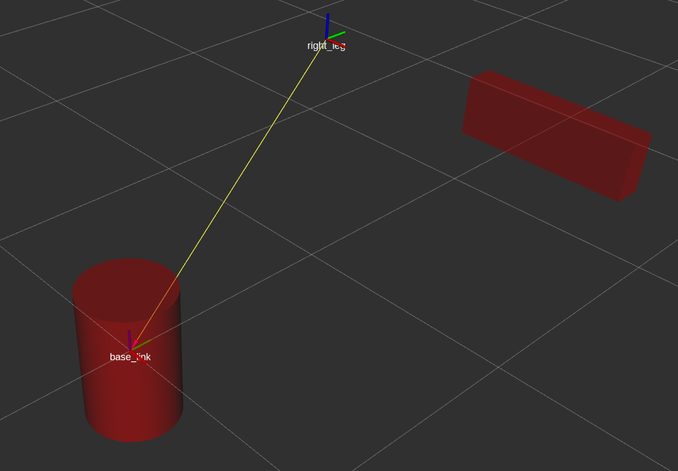
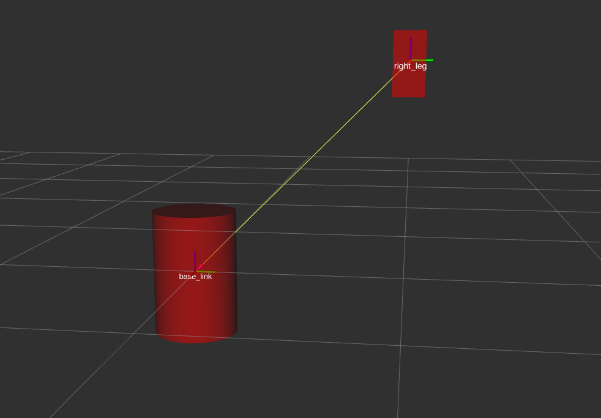
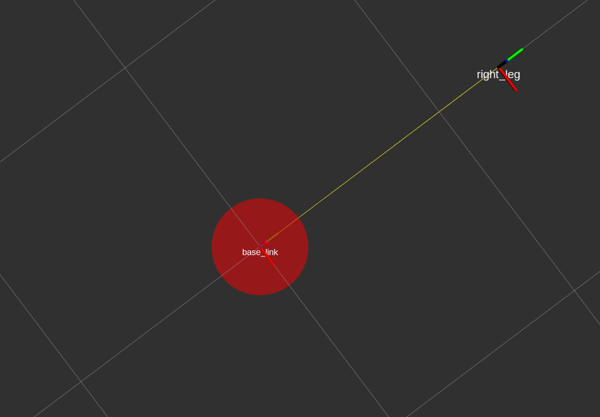
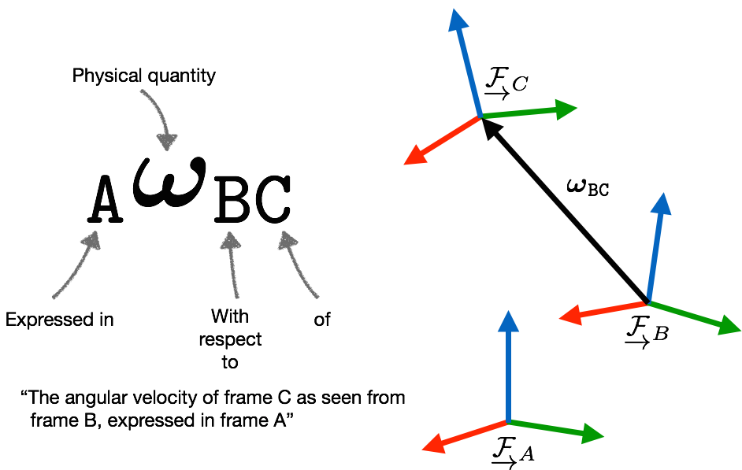

# 1. Names
## 1.1 Graph Resource Names
Graph Resource Names provide a hierarchical naming structure that is used for all resources in a ROS Computation Graph, such as:
- Nodes
- Parameters
- Topics
- Services
### 1.1.1 Resolving Name
There are four types of Graph Resource Names in ROS with the following syntax

- base
- relative/name
- /global/name
- ~private/name


## 1.2 Package Resource Names
Package Resource Names are used in ROS with Filesystem-Level concepts to simplify the process of referring to files and data types on disk. Examples:

- Message (msg) types. For example, the name "std_msgs/String" refers to the "String" message type in the "std_msgs" Package.
- Service (srv) types
- Node types

# 2. Remapping Arguments
Any **Graph Resource Names** within a node can be remapped when it is launched at the command-line, This  lets you launch the same node with multiple configurations from the command-line. 
 syntax is `name:=new_name`
 
 
This will remap the topic chat to chatter 
```
rosrun tutorials talker  chat:=/chatter
```

remapping so that the new node ends up subscribing to `/needed_topic `when it thinks it is subscribing to `/different_topic`
```
<remap from="/different_topic" to="/needed_topic"/>
```


Refs: [1](https://wiki.ros.org/roslaunch/XML/remap)
 
## 3. Special keys 

- __name: name of the node
- __log: designates the location that the node's log file
- __ip: and __hostname: substitutes for `ROS_IP` and `ROS_HOSTNAME`.
- __master: substitute for `ROS_MASTER_URI`.
- __ns: substitute for `ROS_NAMESPACE`. The `ROS_NAMESPACE` lets you push down a Node into a namespace. All of the names in the Node will be resolved relative to this value, including remapped names.


Example: This let you launch robot1 and robot2 start sedning their message (i.e. their position)
```
rosrun tutorials talker  __ns:=robot1  
rosrun tutorials talker  __ns:=robot2

rosrun tutorials listener __ns:=robot1
rosrun tutorials listener __ns:=robot2
```

or you can run a node in a namespace, simply add the `ns` attribute to a <node> tag. For example

```
<node pkg="foo" type="bar" name="my_node" ns="my_namespace" />
```

Refs: [1](https://wiki.ros.org/Names)

# NodeHandles


1.  public: /namespace/topic
```cpp
ros::NodeHandle nh=ros::NodeHandle();
```

This will look for your parameter in the global namespace,it will find /my_param


2. private: /namespace/node/topic
```cpp
ros::NodeHandle nh=ros::NodeHandle("~my_private_namespace");
```


This will look under the nested namespaces of the node itself and will find /namespace/my_node_name/my_param.


3. namespaced: /namespace/node/topic
```cpp
ros::NodeHandle nh=ros::NodeHandle("my_namespace");
```

4. global: /topic
```cpp
ros::NodeHandle nh=ros::NodeHandle("/my_global_namespace");
```


Refs: [1](http://wiki.ros.org/roscpp/Overview/NodeHandles), [2](http://wiki.ros.org/roscpp_tutorials/Tutorials/AccessingPrivateNamesWithNodeHandle), [3](http://wiki.ros.org/roscpp/Overview/NodeHandles)

## Publishers and Subscribers

Refs: [1](http://wiki.ros.org/roscpp/Overview/Publishers%20and%20Subscribers#Callback_Signature)

# Roslaunch

```
roslaunch tutorials display.launch model:=urdf/01-myfirst.urdf
```

# URDF


```
rosrun xacro xacro path/to/file.xacro > model.urdf
```

```
check_urdf model.urdf
```


Frames are attached to the links. Every link has an origin located in its center of mass which is called **link origin **. For instance for a cylinder it is in the center of that. 
Visual, inertia and collision can have offset relative to that.
If a link is child of a joint, the **link origin ** is the ** joint origin **. joint origin is its parent link origin.

For instance here we have `right_leg` 

```
    <link name="right_leg">
        <visual>
            <geometry>
                <box size="0.6 0.1 0.2"/>
            </geometry>
            <origin rpy="0 0 0" xyz="1 0 0"/>
        </visual>
    </link>
```

and 


```
    <joint name="base_to_right_leg" type="fixed">
        <parent link="base_link"/>
        <child link="right_leg"/>
        <origin rpy="0 0 0" xyz="0 1 1"/>
    </joint>
```



<br/>


<br/>


<br/>


<br/>


<br/>


```
roslaunch tutorials complete_model.launch
```

Refs: [1](https://wiki.ros.org/roslaunch), [2](https://github.com/ros/urdf_sim_tutorial), [3](https://github.com/ros/urdf_tutorial) , [4](http://wiki.ros.org/urdf/Tutorials/Using%20a%20URDF%20in%20Gazebo) 

# Publishing the State

Refs: [1](http://wiki.ros.org/urdf/Tutorials/Using%20urdf%20with%20robot_state_publisher), [2](http://wiki.ros.org/robot_state_publisher/Tutorials/Using%20the%20robot%20state%20publisher%20on%20your%20own%20robot)

# Differential Drive Wheel Systems

Refs: [1](https://github.com/ros-controls/ros_controllers/tree/noetic-devel/diff_drive_controller), [2](http://wiki.ros.org/diff_drive_controller)


# Gazebo

Refs: [1](https://classic.gazebosim.org/tutorials?tut=ros_gzplugins#IMU(GazeboRosImu))


# ROS best practices

Refs: [1](https://github.com/leggedrobotics/ros_best_practices/tree/master/ros_package_template), [2](https://github.com/leggedrobotics/ros_best_practices/wiki)


# move_base

Refs: [1](http://wiki.ros.org/move_base)


## ROS Odometery Model

Refs: [1](https://answers.ros.org/question/359950/is-ros-using-velocity-motion-model-or-odometry-motion-model/), [2](https://github.com/ros-planning/navigation/blob/melodic-devel/amcl/src/amcl/sensors/amcl_odom.cpp#L113), [3](https://www.mathworks.com/help/nav/ref/odometrymotionmodel.html#d124e109215)


# ROS State Estimation
Refs: [1](https://kapernikov.com/the-ros-robot_localization-package/), [2](https://automaticaddison.com/sensor-fusion-using-the-ros-robot-pose-ekf-package/), [3](http://wiki.ros.org/robot_pose_ekf), [4](https://github.com/ros-planning/robot_pose_ekf/blob/master/include/robot_pose_ekf/odom_estimation.h), [5](https://github.com/ros-planning/robot_pose_ekf/blob/master/src/odom_estimation.cpp), [6]()


# tf2 with ROS

ROS1

```
rosrun tf static_transform_publisher x y z qx qy qz qw parent_frame child_frame period_in_ms 
```


ROS2

```
ros2 run tf2_ros static_transform_publisher 1 2 3 0.5 0.1 -1.0 <parent-frame> <child-frame>
```

Refs: [1](https://docs.ros.org/en/eloquent/Tutorials/tf2.html)


# EKF Implementations

Refs: [1](https://github.com/Sina-Baharlou/Pose-Estimation-EKF), [2](https://orocos.org/bfl.html)


# Filtering ROS bag
To extract a part of a ROS bag:
```
rosbag filter example.bag sliced.bag "t.secs >= 1702474496 and t.secs <= 1702474660"
```


# Representing Robot Pose




Refs: [1](https://web.archive.org/web/20161029231029/https://paulfurgale.info/news/2014/6/9/representing-robot-pose-the-good-the-bad-and-the-ugly)


