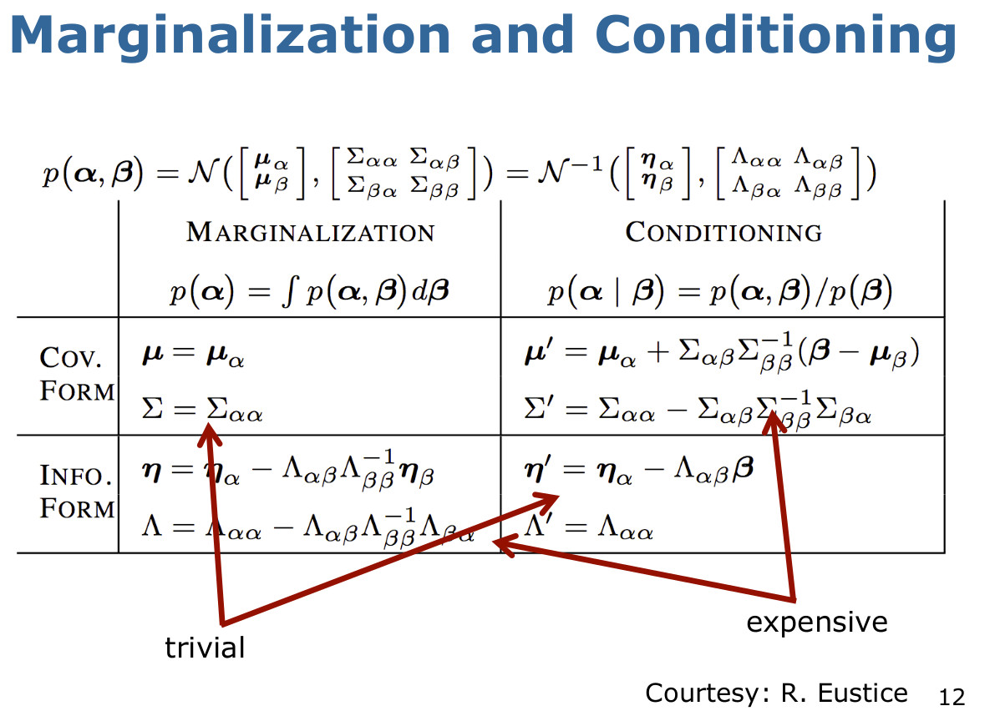

- SLAM Loop Closure
In Simultaneous Localization and Mapping (SLAM), a closure is an observation that is made about the environment that closes a loop in the estimated trajectory of the robot. When a closure is detected, the system can correct for accumulated drift in the estimated position of the robot and improve the accuracy of the map.

Here is an example of how you could implement loop closure detection in SLAM using Python:

```
import numpy as np

class LoopCloser:
    def __init__(self, max_distance=0.1, max_angle=np.pi / 6):
        self.max_distance = max_distance
        self.max_angle = max_angle
        self.keyframes = []
        self.loop_closure = None

    def process_frame(self, frame):
        # Calculate the relative pose between the current frame and the last keyframe
        relative_pose = calculate_relative_pose(frame, self.keyframes[-1])
        distance, angle = calculate_distance_and_angle(relative_pose)

        # If the distance and angle are within the threshold, consider it a loop closure
        if distance < self.max_distance and angle < self.max_angle:
            self.loop_closure = (len(self.keyframes) - 1, frame)
            return True
        else:
            self.keyframes.append(frame)
            return False

    def get_loop_closure(self):
        return self.loop_closure

def calculate_relative_pose(frame1, frame2):
    # Calculate the relative pose between two frames using motion models,
    # feature matching, or other methods
    relative_pose = ...
    return relative_pose

def calculate_distance_and_angle(relative_pose):
    # Calculate the distance and angle between two poses
    distance = ...
    angle = ...
    return distance, angle
```
In this example, LoopCloser is a class that implements the loop closure detection algorithm. The class has a member process_frame which takes a new frame as input and checks if it is a loop closure. If the distance and angle between the current frame and the last keyframe are within the threshold, it is considered a loop closure. The class also has a member get_loop_closure which returns the current loop closure, if any. The loop closure is stored as a tuple of the index of the keyframe and the current frame.

The function calculate_relative_pose takes two frames as input and calculates the relative pose between them. The function calculate_distance_and_angle takes a relative pose as input and calculates the distance and angle between the two poses.

This is a simple example of how you could implement loop closure detection in SLAM. In practice, there are many variations and optimizations that can be made to the algorithm, such as using more sophisticated methods for detecting loop closures, using a bag-of-words representation for features, and using pose graph optimization to correct for drift in the estimated trajectory.


Refs: [1](http://www.cds.caltech.edu/~murray/courses/me132-wi11/me132a_lec16.pdf)


  
- Matrix Lie Groups for Robotics
Refs: [1](https://www.youtube.com/watch?v=NHXAnvv4mM8&list=PLdMorpQLjeXmbFaVku4JdjmQByHHqTd1F&index=8)   


# GraphSLAM

## Multivariate Gaussians

### Moments parameterization


## Canonical Parameterization
Alternative representation for Gaussians


<br/>



<br/>


