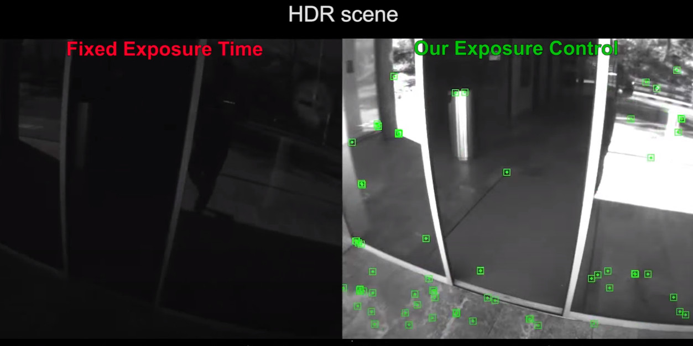

# Active Exposure Control for Robust Visual Odometry in HDR Environments

A very detailed explanation by Davide Scaramuzza from [Airlab YouTube](https://youtu.be/3oqTGrnSkrY?t=1692)

Ref: [1](https://www.ifi.uzh.ch/dam/jcr:cc5c71f1-3491-4c7e-9490-bb16278aa75e/ICRA17_Zhang_updated.pdf)
