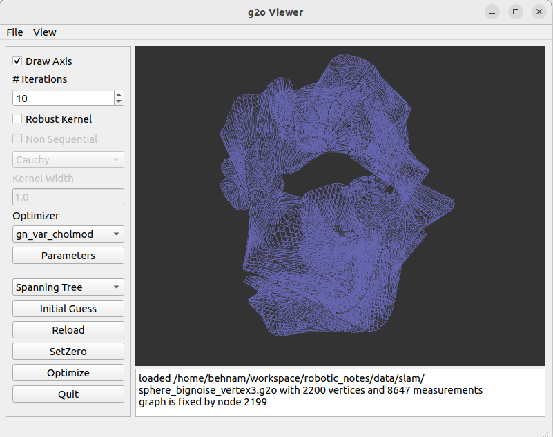

## g2o

## Installing C++ library

Dependencies:

```shell
sudo apt install libsuitesparse-dev qtdeclarative5-dev qt5-qmake libqglviewer-dev-qt5
```

spdlog:

```shell
git clone https://github.com/gabime/spdlog.git
cd spdlog
cmake -S . -B build -DCMAKE_INSTALL_PREFIX=/home/$USER/usr -DSPDLOG_BUILD_SHARED=ON
cmake --build build --parallel
cmake --install build
```


clone the main repository:

```shell
git clone https://github.com/RainerKuemmerle/g2o/
cd g2o
cmake -S . -B build -DCMAKE_INSTALL_PREFIX=/home/$USER/usr -DSPDLOG_BUILD_SHARED=ON
cmake --build build --parallel
cmake --install build
```


## Installing Python library
First clone this repository and update the submodule:

```shell
git clone https://github.com/miquelmassot/g2o-python
git submodule update --init
```

Then in the **activated conda** environment: 

```shell
pip install -U -v .
```

or if you want to install it locally:

```shell
pip install -U --user -v .
```

Refs: [1](https://github.com/miquelmassot/g2o-python)

## g2o Format

In a graph-based optimization problem, you typically have a set of variables (also known as nodes) and constraints (also known as edges) between these variables. The g2o format provides a way to express these variables and constraints in a text-based file.

The g2o file consists of several sections, each indicated by a specific keyword:


### Vertices
syntax: 

`TAG ID CURRENT_ESTIMATE`

Examples:


### 2D Robot Pose

`VERTEX_SE2 i x y theta`


`VERTEX_SE2 4 0.641008 -0.011200 -0.007444`

### 2D Landmarks / Features

`VERTEX_XY i x y`


### 3D Robot Pose

`VERTEX_SE3:QUAT i x y z qx qy qz qw`

`VERTEX_SE3:QUAT 0 0 0 0 0 0 1`

### 3D Point


`VERTEX_TRACKXYZ i x y z`

## Edges / Constraints

The odometry of a robot connects subsequent vertices with a relative transformation which specifies how the robot moved according to its measurements. For a compact documentation we employ the following helper function.

`TAG ID_SET MEASUREMENT INFORMATION_MATRIX`


`ID_SET`: is a list of vertex IDs which specifies to which vertices the edge is connected.

`MEASUREMENT` : The information matrix or precision matrix which represent the uncertainty of the measurement error is the inverse of the covariance matrix. Hence, it is symmetric and positive semi-definite. We typically only store the upper-triangular block of the matrix in row-major order. For example, if the information matrix  is a `3x3`  


### 2D data

`EDGE_SE2 i j x y theta info(x, y, theta)`

since information matrix is symmetric we only keep upper triangular part:

`EDGE_SE2 i j x y theta I11 I12 I13 I22 I23 I33`


Where  is the measurement moving from   to , i.e. 


For instance:
`EDGE_SE2 24 25 0.645593 0.014612 0.008602 11.156105 -3.207460 0.000000 239.760661 0.000000 2457.538661`

means:

```bash
i: 24
j: 25
x: 0.645593
y: 0.014612
theta: 0.008602
I11 I12 I13 I22 I23 I33: 11.156105 -3.207460 0.000000 239.760661 0.000000 2457.538661
```

### 3D data

The format of an `EDGE_SE3:QUAT` element in a g2o file generally follows this structure:

```
EDGE_SE3:QUAT id1 id2 x y z qx qy qz qw information_matrix
```

Where:
- `EDGE_SE3:QUAT` is the keyword specifying the type of the edge.
- `id1` and `id2` are the integer identifiers of the two connected vertices (poses). The edge represents a constraint from `id1` to `id2`.
- `x y z` represent the translation component of the relative pose from `id1` to `id2` in the world coordinate system.
- `qx qy qz qw` represent the rotation component of the relative pose in the form of a quaternion. Quaternions are used to avoid singularities and gimbal lock problems associated with other representations like Euler angles.
- `information_matrix` is a 6x6 matrix, flattened into a vector, representing the information (or the inverse of the covariance) associated with this measurement. This matrix quantifies the certainty of the relative pose measurement. It is typically a symmetric matrix, so only the upper triangular part is provided, which includes 21 elements in the order: `info_11 info_12 info_13 info_14 info_15 info_16 info_22 info_23 info_24 info_25 info_26 info_33 info_34 info_35 info_36 info_44 info_45 info_46 info_55 info_56 info_66`.

Here is an example of an `EDGE_SE3:QUAT` element:

```
EDGE_SE3:QUAT 1 2 0.5 -0.1 0.2 0.0 0.0 0.0 1.0 500.0 0.0 0.0 0.0 0.0 0.0 500.0 0.0 0.0 0.0 0.0 500.0 0.0 0.0 0.0 500.0 0.0 0.0 500.0 0.0 500.0 500.0
```

In this example, the edge connects vertices 1 and 2, with a relative pose indicating a translation of (0.5, -0.1, 0.2) and a rotation represented by the quaternion (0.0, 0.0, 0.0, 1.0). The information matrix elements are provided following the rotation elements, indicating a high degree of certainty in this measurement.


### Python Examples

more [Here](https://github.com/RainerKuemmerle/g2o/tree/pymem/python/examples)


### g2o_viewer

You can use the viewer installed at home directory, first:

```
export PATH="/home/$USER/usr/bin:$PATH"
export LD_LIBRARY_PATH="/home/$USER/usr/lib:$LD_LIBRARY_PATH"
```
Now:
```
g2o_viewer  sphere_bignoise_vertex3.g2o
```





