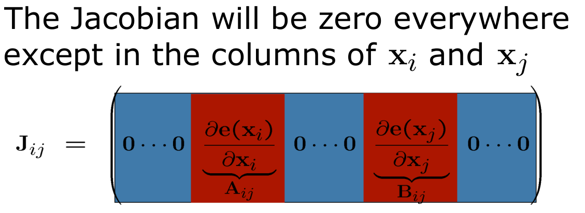
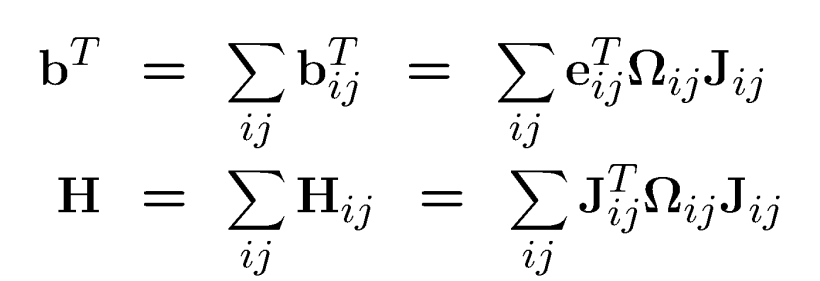
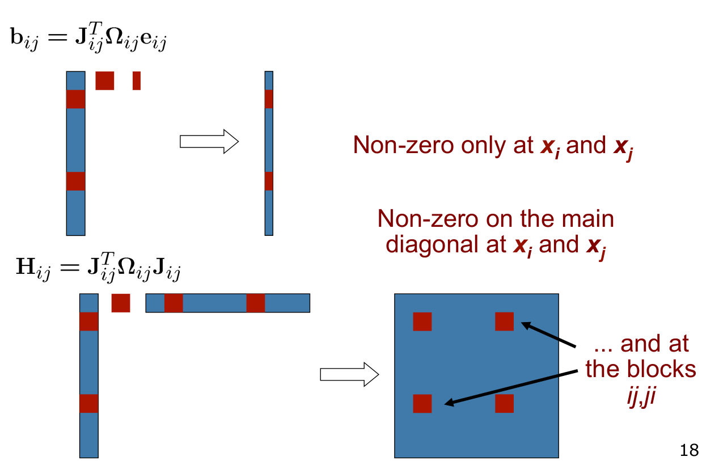
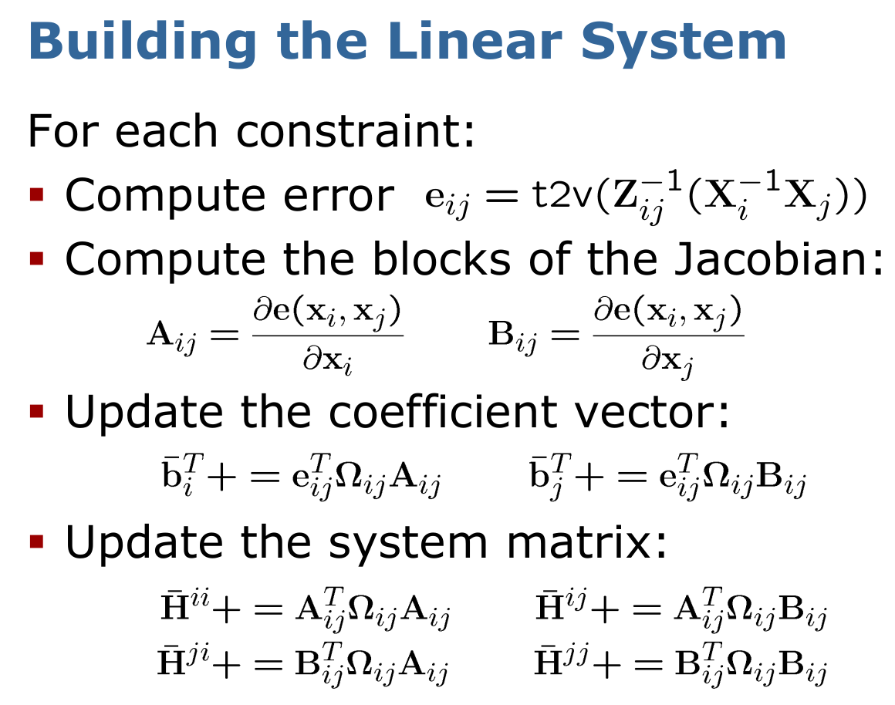

# GraphSLAM


 

<br/>
<br/>

 


<br/>
<br/>


<br/>
<br/>


which gives us: 


<br/>
<br/>


our state is:
<br/>


<br/>

our error function is:
<br/>


<br/>
<br/>


<br/>
<br/>


<br/>
<br/>


<br/>
<br/>




<br/>
<br/>


<br/>
<br/>


<br/>
<br/>



Install the python packages:

```
conda install -c conda-forge opencv
pip install graphslam
conda install conda-forge::gtsam
conda install conda-forge::matplotlib
conda install conda-forge::plotly
```

git submodule update --init


To create a symlink at `destination` which references the original file `<original-ref>`, use:

ln -s <original-ref> <destination>


ln -s ~/workspace/robotic_notes/scripts ~/anaconda3/envs/robotic_notes/


Refs: [1](https://python-graphslam.readthedocs.io/en/stable/), [2](https://github.com/goldbattle/simple_2d_slam)


download g2o examples from [here](https://lucacarlone.mit.edu/datasets/)


