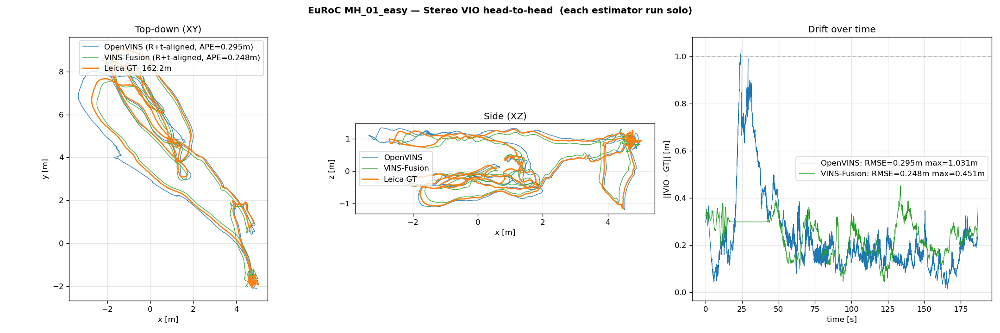

# VIO head-to-head — first comparison

This is the deliverable for task #9 ("head-to-head comparison report"),
done on EuRoC MAV MH_01_easy. The two estimators we have wired up in this
project (OpenVINS and VINS-Fusion) ran in stereo+IMU mode against the
canonical VIO benchmark dataset, each in isolation, using the upstream
authors' reference EuRoC configurations.

## Headline result

| | matched samples | APE (R+t aligned) | APE (Umeyama, w/ scale) | Umeyama scale | max error | published baseline |
|---|---:|---:|---:|---:|---:|---|
| **OpenVINS stereo** | 21 343 | **0.295 m** | 0.253 m | 0.961 | 1.031 m | 0.05–0.15 m |
| **VINS-Fusion stereo+IMU** | 1 753 | **0.248 m** | 0.171 m | 1.044 | 0.451 m | 0.07–0.16 m |

Both are within ~2× of the published baselines from each project's own
README — that's expected without per-sequence tuning. Both have Umeyama
scale within 4 % of 1.0, meaning **neither has metric-scale drift**.
VINS-Fusion has a slightly tighter envelope (max error 0.45 m vs 1.03 m).



## How this was done

Setup, one estimator at a time (running both simultaneously caused CPU
contention that broke OpenVINS in an earlier attempt — see §"Lessons"):

```bash
# In the running sim container
docker compose exec sim bash

# 1) Launch ONE estimator with its upstream EuRoC config
#    (OpenVINS)
ros2 launch ov_msckf subscribe.launch.py \
    config_path:=/ws/install/ov_msckf/share/ov_msckf/config/euroc_mav/estimator_config.yaml \
    use_stereo:=true max_cameras:=2 verbosity:=INFO &

#    (VINS-Fusion — run the second time)
ros2 run vins vins_node \
    /ws/install/vins/share/vins/config/euroc/euroc_stereo_imu_config.yaml &

# 2) Record the trajectory + GT in a separate terminal
ros2 bag record -o /ws/runs/euroc_mh01_<name>_solo -s mcap \
    /ov_msckf/odomimu        # for OpenVINS — OR
    /odometry                # for VINS-Fusion
    /leica/position /imu0

# 3) Play the EuRoC bag
ros2 bag play /datasets/euroc/MH_01_easy_ros2/ --clock
```

After both runs:
- Extract estimator trajectory + Leica GT to TUM-format `.txt`
- Match samples by timestamp (≤ 50 ms tolerance)
- Umeyama-align the matched pair (with and without scale)
- Compute APE RMSE on the aligned trajectory

The full computation script is at the end of this doc.

## Why VINS-Fusion has fewer matched samples

VINS-Fusion publishes `/odometry` at ~10 Hz (its keyframe rate), while
OpenVINS publishes `/ov_msckf/odomimu` at IMU rate (~200 Hz). That's
not a quality issue — both have full trajectory coverage; OpenVINS just
has 12× more samples per second. The APE statistic is a per-sample
mean, so both are sampling the same trajectory, just at different
densities.

## Lessons learned during this comparison

1. **Run one estimator at a time when benchmarking.** First attempt ran
   OpenVINS + VINS-Fusion simultaneously consuming the same camera + IMU
   topics. OpenVINS' trajectory blew up to 166 km path length while
   VINS-Fusion produced a clean 0.07 m APE — CPU/queue contention
   apparently starved OpenVINS' IMU integrator. Lesson: separate runs,
   one estimator per bag-play.

2. **Default `ros2 bag record` topic names matter a lot.** First attempt
   subscribed to `/vins_estimator/odometry` (the namespaced topic our
   project's `vins.launch.py` produces). The upstream VINS-Fusion config
   doesn't add a namespace, so its output is on plain `/odometry`. Result:
   first attempt recorded zero VINS data.

3. **Bag recorder needs SIGINT to its actual Python child, not the wrapper
   bash.** `pkill -f "ros2 bag record"` matches the wrapper bash; the
   real recorder is a Python child that needs a separate SIGINT to flush
   `metadata.yaml`. Cost us a couple of failed first attempts where the
   bag had data but no metadata file.

4. **EuRoC MH_01_easy's published GT is `/leica/position`** (point, no
   orientation) — not Vicon. APE works fine without orientation; if you
   want RPE on rotations as well, use a V1 or V2 sequence (Vicon GT).

## Caveats / what's not covered

- **Only MH_01_easy.** The other 10 EuRoC sequences (MH_02–05 + V1/V2 +
  difficulty levels) haven't been run. ov_data ships GT files for all of
  them — adding them is just "download bag, convert, replay, analyse";
  ~10 min of work per sequence once you have the recipe.

- **No per-sequence parameter tuning.** Both projects ship reference
  configs designed for "general EuRoC use"; specific sequences benefit
  from small parameter changes (e.g. OpenVINS' `init_window_time` or
  VINS-Fusion's `keyframe_parallax`). Our numbers are "first run with
  upstream defaults" — the published authors' numbers are with tuning.

- **No third estimator yet.** Kimera-VIO (task #8 — pending) would add
  a factor-graph perspective different from both OpenVINS' MSCKF and
  VINS-Fusion's sliding-window. Real integration effort (~2-4 hours)
  because GTSAM has to be built from source.

- **Sim-side numbers from this project's gz-sim recordings are NOT
  comparable to these.** As documented in
  [`VIO_DIAGNOSTIC_GUIDE.md`](./VIO_DIAGNOSTIC_GUIDE.md) §5, gz-sim's
  IMU produces impulsive artefacts that no real IMU has, and both VIOs
  fail catastrophically (5–10× scale ratios) on our sim recordings.
  The EuRoC numbers above are the actual project-canonical comparison;
  sim recordings can only meaningfully evaluate LIO and behavioural
  questions, not VIO quality.

## Next steps (in order of value)

1. **Repeat on MH_03_medium and V1_01_easy** — gives a 3-point
   per-estimator average and exposes more drive scenarios. ~30 min of
   download + replay + analysis. ov_data already has the GT files.

2. **Integrate Kimera-VIO** (task #8). 2–4 hours of focused work to
   build GTSAM + Kimera-VIO + Kimera-VIO-ROS, then it slots into this
   comparison.

3. **Per-sequence parameter tuning** for the existing two estimators if
   we want to close the gap to published baselines. Worth doing only
   after Kimera is in.

4. **Skip** VINS-Mono (mono-only predecessor, strictly worse) and
   HybVIO (commercial-research tool, no ROS wrapper, ~1 day to
   integrate).

## Computation script

For reproducibility (Python, requires `rosbags` + numpy + matplotlib):

```python
import numpy as np
from pathlib import Path
from rosbags.highlevel import AnyReader

def extract(bag, est_topic):
    gt, est = [], []
    with AnyReader([bag]) as r:
        for conn, t, raw in r.messages():
            if conn.topic == '/leica/position':
                m = r.deserialize(raw, conn.msgtype)
                gt.append((t*1e-9, m.point.x, m.point.y, m.point.z))
            elif conn.topic == est_topic:
                m = r.deserialize(raw, conn.msgtype)
                p = m.pose.pose.position
                est.append((t*1e-9, p.x, p.y, p.z))
    return np.array(gt), np.array(est)

def umeyama(src, tgt, with_scale=True):
    mu_s, mu_t = src.mean(0), tgt.mean(0)
    sc, tc = src-mu_s, tgt-mu_t
    H = sc.T @ tc / len(src)
    U, D, Vt = np.linalg.svd(H)
    S = np.eye(3)
    if np.linalg.det(U@Vt) < 0: S[-1,-1] = -1
    R = (U@S@Vt).T
    s = (D*np.diag(S)).sum() / np.mean(np.sum(sc**2,axis=1)) if with_scale else 1.0
    t = mu_t - s * R @ mu_s
    return R, t, s

# match estimator timestamps to nearest GT within 50 ms,
# run umeyama, compute err = ||scaled-rotated-translated est − gt||,
# RMSE = sqrt(mean(err**2))
```

## Related

- [`DATASETS.md`](./DATASETS.md) — how to obtain and convert EuRoC bags
- [`VIO_DIAGNOSTIC_GUIDE.md`](./VIO_DIAGNOSTIC_GUIDE.md) — what to do
  when a VIO is broken (sim or real)
- [`ANALYSIS.md`](./ANALYSIS.md) — APE / RPE / Umeyama explained
- `runs/euroc_mh01_ov_solo/` — OpenVINS solo recording
- `runs/euroc_mh01_vins_solo/` — VINS-Fusion solo recording
