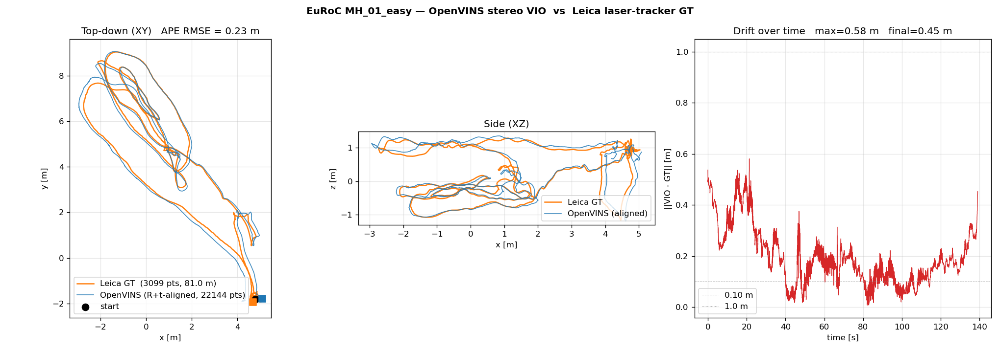

# Real VIO/LIO datasets — how to use them with this stack

A short, opinionated guide to running the project's VIO/LIO estimators
against real-world public datasets instead of gz-sim. Real data isolates
algorithm/build issues from simulation artefacts and gives you numbers
that are directly comparable to published baselines.

This document focuses on **EuRoC MAV**, the de-facto VIO benchmark.
Adding TUM-VIO or KITTI later follows the same pattern.

## Why use real datasets at all

This project's gz-sim setup has a known issue:
`gz-sim-diff-drive` steps wheel velocities in a single timestep when
`/cmd_vel` changes, generating impulsive ground-contact forces. The
`gz-sim-imu-system` sensor has no bandwidth model and reports those
impulses as 50–200 m/s² single-sample spikes. Real MEMS IMUs are
physically bandwidth-limited and never produce signals like that, so
VIO algorithms tuned on real data fail in sim for reasons unrelated to
their actual behaviour. See `VIO_DIAGNOSTIC_GUIDE.md` §5.

Running on real data lets you:
- Confirm your estimator build is correct.
- Get numbers comparable to published baselines.
- Tune parameters that matter for real hardware rather than fighting
  sim artefacts.

## Quick result on this stack (2026-05-15)

Stereo OpenVINS, upstream EuRoC calibration, no parameter tuning, on
EuRoC MH_01_easy (80.99 m laser-tracker GT path):

```
Path length ratio (estimated / GT) : 0.9762
Umeyama scale factor                : 0.9875
APE RMSE (rotation+translation)     : 0.226 m
APE RMSE (with scale, Umeyama)      : 0.221 m
Max error                           : 0.581 m
```

For context, in the gz-sim recordings of this same project, path-length
ratios were 3.55× to 10.94×. Same OpenVINS binary, same build flags.
The trajectory plot is in `docs/euroc_mh01_trajectory.png`.



## EuRoC MAV — download and prep

11 sequences across two environments:

| environment | difficulties | GT type |
|---|---|---|
| Machine Hall  (MH_01–05) | easy → difficult | Leica laser tracker on `/leica/position` |
| Vicon Room 1  (V1_01–03) | easy → difficult | Vicon mocap on `/vicon/...` |
| Vicon Room 2  (V2_01–03) | easy → difficult | Vicon mocap on `/vicon/...` |

Start with **MH_01_easy** — slow indoor flight, the easiest sequence,
the one every paper reports first.

### Download — use the OpenVINS mirror

**The official ETH server (`robotics.ethz.ch`) was unreachable on
2026-05-15.** wget hung silently; curl returned no response. The
OpenVINS team maintains a **Google Drive mirror** of all 11 sequences
that's been the reliable alternative — and bonus, **their mirror bags
are already in rosbag2 (ROS 2) format**, so the conversion step below
becomes unnecessary.

Full list at https://docs.openvins.com/gs-datasets.html. Direct links:

```
Machine Hall
  MH_01_easy       https://drive.google.com/file/d/1UP4nkuSEOQECZTswwh9BPgfMl-dnDstA/view
  MH_02_easy       https://drive.google.com/file/d/1wWZgZCqYz6zzzTXS0iqvQCP-cWfFuGLK/view
  MH_03_medium     https://drive.google.com/file/d/1er07gZ8rso8R3Su00hJMm_GZ4z1n9Rpq/view
  MH_04_difficult  https://drive.google.com/file/d/1eC8joRXo1rh0wzOpq3e-B4dQ8-w6wZYz/view
  MH_05_difficult  https://drive.google.com/file/d/1zoN94K1Afrp7HXSduRLkJBiEjPKdk1UA/view

Vicon Room 1
  V1_01_easy       https://drive.google.com/file/d/1LFrdiMU6UBjtFfXPHzjJ4L7iDIXcdhvh/view
  V1_02_medium     https://drive.google.com/file/d/1rlGSy7h38ucm8jr8ssH-sJPX84JfkBtX/view
  V1_03_difficult  https://drive.google.com/file/d/1Gy1zc4LaMlwsLpXBqOIci6Y3cV_5r-0k/view

Vicon Room 2
  V2_01_easy       https://drive.google.com/file/d/1KAkE8Ptq3eSQlXMozJgzNIAVUBH3h0FP/view
  V2_02_medium     https://drive.google.com/file/d/1Gj4psmvcAwYwCp4T4CQH-d2ZVJ09d3x2/view
  V2_03_difficult  https://drive.google.com/file/d/1ohWd0JqDvVhTqjOS5MqHafit5MPdlbff/view
```

Download via browser, drop into `~/datasets/euroc/`. Verify each bag
with `ros2 bag info <dir>` — if it's already a rosbag2 mcap directory,
skip the conversion step. If it's an .bag file, follow the conversion
below.

Original ETH source (use if you can reach it):

```bash
mkdir -p ~/datasets/euroc
cd ~/datasets/euroc
wget http://robotics.ethz.ch/~asl-datasets/ijrr_euroc_mav_dataset/machine_hall/MH_01_easy/MH_01_easy.bag
# replace path/filename for other sequences. ROS 1 format; convert below.
```

ETH bags are in ROS 1 format and need conversion. OpenVINS mirror
versions skip this step.

### Convert ROS 1 → ROS 2 (mcap)

Using `rosbags` (Python library, no ROS install required):

```bash
pip install rosbags
rosbags-convert \
    --src ~/datasets/euroc/MH_01_easy.bag \
    --dst ~/datasets/euroc/MH_01_easy_ros2 \
    --dst-storage mcap
```

The `--src` / `--dst` flags are required as named arguments in recent
rosbags versions (≥0.10); the older positional form is rejected.

Result is a directory with `metadata.yaml` and `MH_01_easy_ros2_0.mcap`,
playable with `ros2 bag play <dir> --clock`.

### What's inside

```
/imu0               196 Hz  sensor_msgs/Imu          (ADIS16448)
/cam0/image_raw      20 Hz  sensor_msgs/Image        (752×480 grayscale, MT9V034)
/cam1/image_raw      20 Hz  sensor_msgs/Image        (right of stereo pair)
/leica/position      17 Hz  geometry_msgs/PointStamped  (Leica tracker GT, position only)
```

Vicon-room sequences additionally publish `/vicon/firefly_sbx/firefly_sbx`
as `geometry_msgs/TransformStamped` (with orientation).

## Plumbing it through the container

Add a host-mounted dataset volume to `docker-compose.yml`:

```yaml
volumes:
  - ~/datasets:/datasets:ro
```

Restart the sim container. The bag is now visible inside at
`/datasets/euroc/MH_01_easy_ros2/`.

## Running OpenVINS on it

OpenVINS ships an upstream EuRoC reference configuration at
`/ws/install/ov_msckf/share/ov_msckf/config/euroc_mav/`. Use that
directly — don't try to convert our sim's calibration. Its key files:

- `estimator_config.yaml` — filter parameters tuned for EuRoC
- `kalibr_imu_chain.yaml` — IMU noise + topic (`rostopic: /imu0`)
- `kalibr_imucam_chain.yaml` — stereo intrinsics + extrinsics, topics
  (`rostopic: /cam0/image_raw`, `/cam1/image_raw`)

End-to-end run:

```bash
docker compose exec sim bash
# 1) Kill the project's OpenVINS (it expects /rs_front/image, not /cam0/image_raw)
pkill -f run_subscribe_msckf

# 2) Launch a fresh OpenVINS with EuRoC config
ros2 launch ov_msckf subscribe.launch.py \
    config_path:=/ws/install/ov_msckf/share/ov_msckf/config/euroc_mav/estimator_config.yaml \
    use_stereo:=true \
    max_cameras:=2 \
    verbosity:=INFO &

# 3) Start recording output + GT
ros2 bag record -o /ws/runs/euroc_mh01_run -s mcap \
    /ov_msckf/odomimu /ov_msckf/pathimu \
    /leica/position \
    /imu0 &

# 4) Play the bag
ros2 bag play /datasets/euroc/MH_01_easy_ros2/ --clock

# 5) After playback ends, ctrl-C the recorder
```

## Analysing the recording

Outside the container:

```bash
python3 << 'EOF'
import numpy as np
from rosbags.highlevel import AnyReader

with AnyReader([Path('runs/euroc_mh01_run')]) as r:
    gt, vio = [], []
    for conn, t, raw in r.messages():
        if conn.topic == '/leica/position':
            m = r.deserialize(raw, conn.msgtype)
            gt.append((t*1e-9, m.point.x, m.point.y, m.point.z))
        elif conn.topic == '/ov_msckf/odomimu':
            m = r.deserialize(raw, conn.msgtype)
            p = m.pose.pose.position
            vio.append((t*1e-9, p.x, p.y, p.z))
# ... metric computation, plotting, Umeyama alignment, APE/RPE
EOF
```

The full version of this script (with rotation-only and scale-allowed
Umeyama alignment, APE/RPE, top-down + side + drift-over-time plots)
was used to generate `docs/euroc_mh01_trajectory.png`.

For published-standard metrics, use the upstream `evo` tool:

```bash
# Convert /ov_msckf/odomimu to a TUM-format trajectory file, run evo_ape
evo_ape bag2 runs/euroc_mh01_run /leica/position /ov_msckf/odomimu -va
```

## Expected results

| dataset | OpenVINS-stereo APE RMSE (published) | what we got |
|---|---|---|
| MH_01_easy | ~0.05–0.15 m | 0.226 m (no tuning) |
| MH_03_medium | ~0.10–0.20 m | not run yet |
| V1_01_easy | ~0.05–0.10 m | not run yet |

Our 0.226 m on MH_01_easy is ~2× the published baseline — likely
because we used the upstream config out of the box without
per-sequence parameter tuning. The order of magnitude is right, the
trajectory shape is right, the scale is right (Umeyama scale 0.988).
Confirms the OpenVINS install is sound.

If you want to chase the gap from 0.22 m → 0.05 m, OpenVINS' upstream
README documents the per-sequence parameter recipes. That's tuning,
not debugging.

## Caveats / things to know

- **MH_01–05 ground truth (Leica) is POSITION ONLY** — no orientation.
  Vicon-room sequences (V1, V2) have full pose. evo's APE handles both,
  but if you want RPE you need pose pairs.
- **Time alignment matters** between estimator output and GT. The
  EuRoC bag's IMU and camera timestamps are already hardware-synced;
  the `/leica/position` timestamps are accurate. OpenVINS publishes
  timestamps tied to the IMU stream. evo handles the cross-source
  timestamp matching with `--t_max_diff`.
- **`/leica/position` and `/ov_msckf/odomimu` are in different world
  frames.** OpenVINS' "global" frame is wherever the dynamic-init
  algorithm chose at startup; Leica's frame is the room's. APE
  computation must SE(3)-align them first — that's what `evo_ape -a`
  or `-va` does, and what the script above does with Umeyama.

## When to bring the sim back in

Run real data first to **establish that the estimator works at all**.
Once that's confirmed (path-length ratio close to 1.0, APE close to
published baselines), bring sim recordings in for things that real
datasets don't cover:

- Different worlds / terrains
- Different sensor configurations
- Different motion profiles
- Stress tests with controlled perturbations
- Cases where you control ground truth perfectly

But for "is this estimator good?", real data is canonical and sim is
secondary.

## Other VIO datasets worth adding (ranked)

| dataset | platform | what it adds | gotcha |
|---|---|---|---|
| **TUM-VIO** ([dataset.in.tum.de/visual-inertial-dataset](https://vision.in.tum.de/data/datasets/visual-inertial-dataset)) | handheld | 26 sequences, different IMU (Bosch BMI160), proves estimator generalizes across hardware | big downloads (~7 GB total) |
| **M2DGR** ([github.com/SJTU-ViSYS/M2DGR](https://github.com/SJTU-ViSYS/M2DGR)) | ground robot | closest public dataset to a SubT-style rover (ground vehicle + LiDAR + camera + IMU) | ROS 1 format, needs conversion |
| **4Seasons** ([www.4seasons-dataset.com](https://www.4seasons-dataset.com/)) | BMW autonomous car | day/night/weather/seasonal variation — stress test conditions | huge (hundreds of GB if all sequences) |
| **NTU-VIRAL** ([ntu-aris.github.io/ntu_viral_dataset](https://ntu-aris.github.io/ntu_viral_dataset/)) | UAV | multi-modal: LiDAR + IMU + cameras, comparable across VIO and LIO | smaller community |

### Skip for VIO benchmarking

- **KITTI** — IMU is only 10 Hz (OXTS GPS-INS, not a high-rate MEMS). Designed for stereo VO, not VIO. Most VIO papers don't report on KITTI.
- **Cityscapes / nuScenes / Waymo** — no high-rate IMU.
- **TUM-RGBD** — no IMU at all.

### Suggested order if you want to expand beyond EuRoC

1. Finish all 11 **EuRoC** sequences (smallest marginal cost — same pipeline, more data points).
2. Add **TUM-VIO** — different hardware validates generalization.
3. Add **M2DGR** — closest to your project's ground-rover use case.
4. **4Seasons** only if you need to test extreme conditions.


## Related

- [`VIO_DIAGNOSTIC_GUIDE.md`](./VIO_DIAGNOSTIC_GUIDE.md) — full
  diagnostic procedure for broken VIO + the sim-IMU-realism analysis
- [`ANALYSIS.md`](./ANALYSIS.md) — APE / RPE / Umeyama explained
- [`SESSION_2026-05-15.md`](./SESSION_2026-05-15.md) — narrative log
  of the debug session that produced this work
